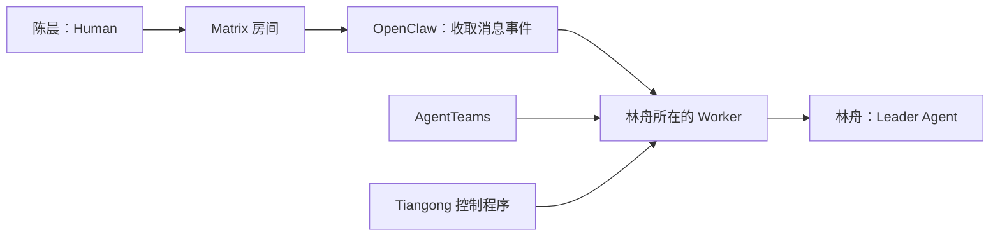

# 单元 01：一条消息怎样走到 AI 团队

[返回课程目录](README.md) | [下一单元：先给整件事一个不会混淆的身份](02-one-request-one-work.zh.md)

## 本单元只回答一个问题

陈晨在聊天窗口里输入需求，按下发送：

> 给商城增加取消订单功能。只有未发货订单可以取消；取消后恢复库存并记录原因；不要改变现有下单接口。先在测试环境验证，上线生产前让我确认。

接下来，究竟是谁收到这句话？是大模型、一个后台进程、一个聊天室，还是一个“AI 团队”？

这些东西平时经常被一句“Agent 收到消息了”带过，但它们承担的责任完全不同。本单元先不谈后续怎样记录目标、怎样正式委托或怎样保存机器记录，只把消息沿途经过的角色认清。

## 先从最容易看见的两端开始

一端是陈晨。她知道业务需要什么，也能决定生产环境是否可以上线。

另一端是林舟。林舟不是坐在办公室里的人，而是一个由程序和模型共同驱动的团队负责人。它会阅读需求、提问、安排其他成员，并判断团队是否已经交付了足够的结果。

在 Tiangong 文档里，陈晨这种作出业务请求和确认的人叫 **Human**。

林舟这种能够理解上下文、作出判断并调用受控工具的程序角色叫 **Agent**。

先记住：

```text
Human = 系统外作出业务请求或确认的人
Agent = 系统内由模型驱动、但受程序边界约束的角色
```

Agent 不是“大模型”的另一个名字。模型只负责一次次生成判断或文本；Agent 还包括身份、上下文、工具入口、会话状态和运行规则。

## Agent 不能只存在于一段提示词里

假设林舟要读取消息、保存进度、调用模型和使用工具，就必须有一个真正运行程序的地方。

这个运行位置可以是一个进程，也可以在容器里。它需要文件系统、网络策略、配置和凭据边界。我们先把它想成团队成员各自的“工位电脑”。

Tiangong 把承载 Agent 的运行单元叫 **Worker**。

```text
Agent 是“谁在思考和承担职责”
Worker 是“这个角色实际在哪里运行”
```

同一个概念不能混成一句“AI 在运行”：

- 模型回答了一次，不等于 Agent 的整个工作已经结束；
- Agent 有某项专业职责，不等于它天然拥有所有工具；
- Worker 进程存在，不等于它已经被 Tiangong 接纳进某个团队；
- Worker 能连接聊天室，不等于聊天室里的任何一句话都能给它授权。

## 谁来准备这些工位

如果团队有林舟、周明和乔安三个 Agent，就可能需要三个 Worker、对应容器、存储目录以及聊天身份。

负责创建、连接和管理这些平台资源的是 **AgentTeams**。

可以把 AgentTeams 想成办公楼的设施与人事系统。它负责：

- 某个 Worker 是否实际存在；
- 它运行在哪个容器里；
- 它使用哪个平台身份；
- 哪些 Worker 组成一个平台团队；
- 聊天和共享存储怎样接到 Worker。

但 AgentTeams 不替 Tiangong 判断下面这些事：

- 陈晨这次到底想完成什么；
- 周明应该收到哪一项具体委托；
- 乔安的测试是否足以支持代码交付；
- 某次部署是否需要 Human 批准；
- 整件事能不能宣布完成。

这就是“资源存在”和“业务控制”之间的第一条边界。

## 消息走在哪条路上

陈晨和团队需要一个消息网络。案例使用 **Matrix**。

第一次接触 Matrix 时，可以把它理解成一种开放的团队消息协议和服务器网络。它提供房间、消息事件、成员身份、同步和加密等通信能力。

Matrix 知道：

- 哪个账号向哪个房间发送了哪条消息；
- 这条消息在平台上的事件标识是什么；
- 某个账号是否能加入房间；
- 客户端怎样同步新消息。

Matrix 不知道：

- 这条消息应该新建一件工作还是补充旧工作；
- 一句“可以上线”是不是精确批准了某次部署；
- 某个 Agent 是否有权写生产数据库；
- 一份代码结果是否经过独立验证。

所以，Matrix 是消息道路，不是 Tiangong 的业务大脑，也不是最终授权系统。

## Worker 怎样使用 Matrix

Worker 还需要一个实际登录 Matrix、收发事件和处理同步的客户端边界。在当前设计里，这部分可以由 **OpenClaw** 承担。

继续用办公室类比：

- Matrix 像电话和邮件网络；
- OpenClaw 像收发室与通信终端；
- AgentTeams 像负责工位、人员账号和容器的设施系统；
- Worker 像一台受管理的工位电脑；
- Agent 像使用这台电脑工作的专业角色；
- Tiangong 像团队内部关于委托、权限、验证和交付的工作制度与控制程序。

OpenClaw 负责通信动作，并不因为自己看见一句文字就拥有 Tiangong 权限。比如 Human 在普通消息里写“我批准了”，这仍然只是一条消息。以后我们会看到，真正能授权外部操作的批准必须绑定一件精确的待执行操作。

## 什么叫 Team

现在已经有三个 Agent：

- 林舟负责理解目标和协调；
- 周明负责实现；
- 乔安负责独立验证。

他们共同组成一个 **Team**，也就是为了持续协作而被配置在一起的一组成员。

Team 中恰好有一个负责整体语义判断和协调的人。Tiangong 把这个成员叫 **Leader**。案例中的 Leader 是林舟。

其他成员不需要被切成几十种固定角色。周明可以承担一组完整的实现职责，乔安可以承担一组完整的验证职责。Tiangong 不要求“一项技能对应一个 Agent”。

Leader 能判断“这个结果对业务是否有用”，但它不能凭自己的文字绕过机器权限。后面的课程会反复看到这条分工：

```text
需要理解业务含义的判断，由 Leader 作出。
绝不能依赖模型自觉的边界，由代码执行。
```

## 把消息完整走一遍

现在可以看第一张全景图了：



沿着箭头逐步读：

1. 陈晨发送一条 Matrix 消息；
2. Matrix 为它保存平台事件身份；
3. OpenClaw 同步并交付这条事件；
4. AgentTeams 保证对应 Worker 和平台身份实际存在；
5. Worker 内的 Tiangong 边界认证来源并决定怎样处理；
6. 林舟才在受控上下文里看到这条请求并开始理解。

注意，第六步结束时仍然没有人开始改代码。现在只有一条经过认证来源的输入。

## 为什么要把这些层分开

看三个具体故障就明白了。

### Matrix 房间管理员不等于 Tiangong 管理员

某人在 Matrix 中拥有房主标记，只能说明平台授予了房间能力。它不能自动让这个人获得部署生产环境的权限。

### Worker 存在不等于成员被接纳

AgentTeams 里可能还有一个实验 Worker。它真实存在，也能运行模型，但如果 Tiangong 没把它列入当前 Team，它不能接收这件工作的正式委托。

### Agent 的职责不等于机器权限

周明被描述为“后端工程师”，可以帮助 Leader 判断把实现工作交给谁。但这句自然语言不能自动给周明生产数据库凭据。

## 本单元只需要记住六句话

1. Human 提出请求或作出必要确认。
2. Agent 是受程序边界约束的模型驱动角色。
3. Worker 是 Agent 实际运行的地方。
4. AgentTeams 管平台资源的存在和生命周期。
5. Matrix 与 OpenClaw 负责消息传输，不负责 Tiangong 的业务授权。
6. Tiangong 在 Worker 内负责目标、委托、工具、验证、批准和关闭等控制语义。

## 本单元自检

读完后，尝试不用英文名回答：

1. “负责思考的角色”和“承载程序的运行位置”为什么不是同一件事？
2. Matrix 能证明一条消息来自哪个账号，但为什么不能证明这条消息已经批准部署？
3. AgentTeams 与 Tiangong 分别管理哪类事实？
4. Leader 有语义判断权，为什么仍然不能给自己增加工具权限？

如果能回答，就继续进入[下一单元](02-one-request-one-work.zh.md)：这条消息怎样变成一件不会和其他聊天混在一起的长期事务。
