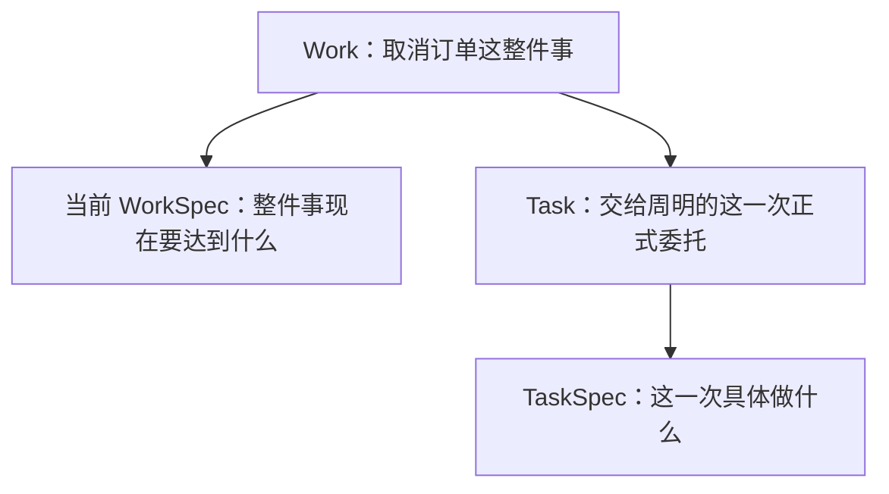

# 单元 04：从整件事中拿出一次明确委托

[上一单元：把模糊要求整理成共同目标](03-clarify-the-goal.zh.md) | [返回课程目录](README.md) | [下一单元：为什么收到委托仍不能随便使用工具](05-team-tools-and-workspace.zh.md)

## 整件事已经说清，下一步仍不是“大家一起做”

当前目标已经明确：实现取消订单能力、恢复预占库存、保留取消原因，让同一份代码先经过独立检查和测试环境验证，并在生产上线前取得陈晨确认。

林舟现在要把其中一部分交给周明。

最随意的做法是在群里说：

> 周明，你把取消订单做一下。

人类小团队有时可以靠默契补全这句话。但 Agent 团队不能把下面这些关键信息全部留给猜测：

- 从仓库的哪个提交开始？
- 只实现接口，还是也要部署？
- 能不能改变下单接口？
- 需要提交什么可接手的输出？
- 这项工作属于哪一件 Work？
- 由哪个成员负责，其他成员能不能替它提交结果？

我们先不引入对象，先把委托写完整。

## 写一张只服务于这一次工作的委托单

```text
这一次要完成什么
  在 service-a 中实现取消未发货、未开始拣货订单的接口和库存恢复。

从什么开始
  仓库 service-a 的提交 4f1c2d。

必须遵守什么
  不改变下单接口；
  用户原因只能使用预设值；
  不执行生产部署。

交给谁
  周明。

在哪里工作
  为这次委托单独准备的工作区。
```

它和上一单元的目标卡很像，但粒度不同。

目标卡覆盖整件事，还包括独立验证、测试环境验证和生产确认。眼前这张委托单只要求周明实现代码，不要求他同时扮演验证者，也不允许他顺手部署测试或生产环境。

## 先给委托内容起名字

Tiangong 把“这一次具体要做什么、使用哪些输入、遵守哪些必要约束”叫 **TaskSpec**。

```json
{
  "objective": "在 service-a 中实现订单取消接口和预占库存恢复",
  "inputRefs": [
    {
      "kind": "git-commit",
      "repositoryId": "service-a",
      "commitSha": "4f1c2d..."
    }
  ],
  "constraints": [
    "不改变现有下单接口",
    "用户取消原因只能使用预设值",
    "本次委托不包含生产部署"
  ]
}
```

按三组读：

| 字段 | 回答的问题 |
|---|---|
| `objective` | 这一次具体想得到什么 |
| `inputRefs` | 从哪些精确输入开始 |
| `constraints` | 完成过程中不能违反什么 |

TaskSpec 不复制整份 WorkSpec。它只保留完成这次委托所需的语义。

## 有了说明，还缺少正式身份和负责人

一张没有编号、没有负责人、没有所属 Work 的说明，仍然不能被系统持续跟踪。

因此 Tiangong 再用一条 **Task** 记录把这些信息绑定起来：

```json
{
  "taskId": "task-implement-cancel-01",
  "workId": "work-order-cancel-001",
  "assigneeId": "member-zhou",
  "taskSpec": {
    "objective": "在 service-a 中实现订单取消接口和预占库存恢复",
    "inputRefs": [
      {
        "kind": "git-commit",
        "repositoryId": "service-a",
        "commitSha": "4f1c2d..."
      }
    ],
    "constraints": [
      "不改变现有下单接口",
      "用户取消原因只能使用预设值",
      "本次委托不包含生产部署"
    ]
  },
  "executionContext": {
    "workspaceId": "workspace-task-implement-cancel-01",
    "baseRef": {
      "kind": "git-commit",
      "repositoryId": "service-a",
      "commitSha": "4f1c2d..."
    }
  },
  "createdAt": "2026-08-10T09:40:00Z"
}
```

现在可以精确辨析：

```text
TaskSpec = 委托内容
Task     = 这一次正式委托的身份、归属、负责人和执行边界
```

Task 不是一个“正在运行的进程”。它可以刚创建、等待资源，也可以已经结束。运行状态由其他机器事实推导，不靠修改 Task 本身。

## 为什么 Task 一创建就算正式派发

当前设计不先创建一个模糊待办，再由另一个流程决定它是否成为正式委托。

林舟选择“创建 Task”时，系统在同一个原子动作中完成：

- 创建 Task 身份；
- 保存完整 TaskSpec；
- 绑定唯一负责人；
- 记录是 Leader 作出的派发决定；
- 推进 Work 的并发计数。

要么这些事实一起成功，要么一个都不出现。系统不会留下“有 Task 但不知道谁派的”或“记录了派发决定但 Task 不存在”的半成品。

如果暂时没有 Worker 容量，Task 可以排队。排队表示已正式委托但还没有活跃执行，不表示 Leader 需要重新派一次。

## 为什么一个 Task 只有一个负责人

如果周明和另一名成员都可以随意以负责人身份提交最终结果，系统很难回答：

- 谁承担这次委托？
- 谁的工具记录属于这次执行？
- 独立验证时谁算生产者？
- 两份互相冲突的结果哪一份有效？

所以 Task 固定一个 `assigneeId`。其他成员可以提供消息或资料，但只有被委托者能提交该 Task 的正式终态交接。第六单元会再给这种交接正式命名。

并行工作不靠一个 Task 多负责人实现，而是创建多个边界清楚的 Task，并给它们独立工作区。

## 为什么 Task 和 TaskSpec 创建后不能修改

假设周明已经改了一小时代码，林舟把 `objective` 从“实现取消接口”直接改成“顺便部署生产”。

如果系统允许原地修改，事后就无法准确回答：

- 周明开始时收到的到底是哪份委托？
- 生产权限是何时出现的？
- 之前的工具调用是否仍在原范围内？
- 最终结果针对的是修改前还是修改后的目标？

因此 Task 和 TaskSpec 在派发后保持不变。

如果要改变负责人或实质目标，Leader 创建新 Task。旧 Task 如果尚未产生终态交接，可以在安全停止执行后取消。

这不是为了保存漂亮历史，而是为了让“当时被委托的内容”始终只有一个答案。

## WorkSpec 更新后，周明看什么

周明执行期间，当前 WorkSpec 可能增加“大额客服取消需要主管确认”。

系统给周明重新组装上下文时，会明确区分：

```text
你的正式委托
  当前 TaskSpec：实现取消接口和库存恢复，不部署生产。

整件事的最新背景
  当前 WorkSpec：新增大额客服取消的主管确认约束。
```

TaskSpec 仍是这次委托的权威说明。当前 WorkSpec 只是标明来源的背景，不能悄悄改写 TaskSpec。

如果新增约束使原 Task 已经不合适，林舟需要明确处理：让周明提交一份“无法安全继续”的终态交接，或者安全取消尚无终态交接的 Task，再派一个新 Task。

## Task 中为什么没有工具权限列表

TaskSpec 可以写“不执行生产部署”，这种自然语言能够缩小预期行为；它不能写“允许访问生产数据库”来扩大机器权限。

真正能用哪些工具，由团队准入、成员配置、控制规则、工作区范围和注册工具共同决定。下一单元会逐层展开。

把工具权限复制进每个 Task 会产生另一个问题：管理员后来收紧权限时，旧 Task 可能继续拿着过期许可。所以机器权限在每次受控动作发生时按当前配置重新计算。

## Task 中为什么没有可修改的 `status`

用户界面当然可以显示：

- 已排队（queued）；
- 正在执行（running）；
- 等待 Human 对某项精确外部动作作决定；
- 已提交终态交接（submitted）；
- 交接已接受（accepted）；
- 交接已拒绝（rejected）；
- 委托已取消（cancelled）。

但这些词来自其他事实：有没有活跃执行、有没有待批准的外部动作、有没有终态交接、Leader 作了什么决定。

如果同时把 `status` 写进 Task，就可能出现“终态交接已经提交，但 status 仍是 running”的两套答案。当前设计让界面按事实推导状态。

## Work、WorkSpec、Task 和 TaskSpec 放在一起



用项目经理熟悉的语言类比：

- Work 像一个持续存在的项目事项；
- WorkSpec 像当前项目目标卡；
- Task 像一次已经签发、有负责人的工作单；
- TaskSpec 像工作单上的具体说明。

类比只帮助入门，最终仍以数据关系为准。

## 本单元自检

1. WorkSpec 和 TaskSpec 的粒度有什么不同？
2. 为什么 TaskSpec 不能只写“把取消订单做一下”？
3. 为什么修改负责人要创建新 Task，而不是更新 `assigneeId`？
4. 当前 WorkSpec 改变后，为什么不能自动改写已有 TaskSpec？
5. Task 没有 `status` 时，界面怎样知道它是否正在运行？

下一单元会回答一个很现实的问题：周明已经收到正式委托，为什么仍不能直接使用任意工具、目录和凭据？
