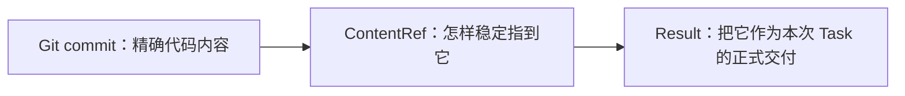

# 单元 06：“我做完了”怎样变成可接手的交付

[上一单元：为什么收到委托仍不能随便使用工具](05-team-tools-and-workspace.zh.md) | [返回课程目录](README.md) | [下一单元：为什么必须让另一个成员检查同一份代码](07-independent-verification.zh.md)

## 从一句很常见的话开始

周明在自己的工作区完成修改并运行了测试，然后告诉林舟：

> 做完了，测试都过了。

这句话有用，但还不够让系统继续判断。

林舟至少需要知道：

- “做完”指的是哪个 Task；
- 最终代码到底是哪一个提交；
- 周明声称的结果是完成、遇阻还是失败；
- 哪些工具调用支持“测试过”这句话；
- 这是不是周明最后一次正式交付；
- 以后能否在不依赖当前聊天会话的情况下查回来。

## 先把代码固定到一个明确位置

周明工作区里有很多中间状态：未保存的文件、失败的实验、临时日志、修改后又撤回的代码。

“看我的工作区”不能作为稳定交接，因为工作区还会继续变化，也可能在清理时消失。

所以在正式提交代码结果前，周明创建 Git commit：

```text
repository: service-a
commit:     9ab73e...
```

这个提交回答“到底是哪一份代码”，但不回答“代码是否正确”。

Tiangong 把指向这类精确内容的轻量结构叫 **ContentRef**，也就是内容引用。代码提交的引用可以这样写：

```json
{
  "kind": "git-commit",
  "repositoryId": "service-a",
  "commitSha": "9ab73e..."
}
```

## 非代码文件怎样交接

假设 Task 产出的是一份验证报告。只写 `reports/verification.md` 不够，因为另一个工作区可能也有同名路径。

稳定引用会同时指出存储位置、对象身份和内容指纹：

```json
{
  "kind": "file",
  "storeId": "work-content",
  "objectId": "work-order-cancel-001/reports/verification.md",
  "displayPath": "reports/verification.md",
  "sha256": "6f61c0..."
}
```

逐项理解：

| 字段 | 作用 |
|---|---|
| `storeId` | 去哪个受控内容存储查找 |
| `objectId` | 该存储中的稳定对象身份 |
| `displayPath` | 给人看的友好名称，不负责权威定位 |
| `sha256` | 取回后确认内容没有变成另一份；SHA-256 是这里用来计算内容指纹的算法 |

Tiangong 不把每段文字、每条消息都变成 ContentRef。只有跨边界稳定交接或精确确认对象时才使用它。

## 再把“最后一次交付”写清楚

Tiangong 把这份 Task 的终态交付叫 **Result**。

不要把英文 `Result` 直接理解成“成功”。它表示这次委托最终怎样结束、交接了什么。

除了交付内容，Result 还会引用两类机器支持材料：一类是受控工具调用留下的回执，字段叫 `toolResultRefs`；另一类是运行时代码验证后建立的机器事实索引，字段叫 `machineEvidenceRefs`。第十二单元会分别给它们正式命名并展开。现在先把它们读成“机器回执引用”和“机器证据引用”。

现在周明可以准备一份结构化 Result：

```json
{
  "resultId": "result-implement-cancel-01",
  "taskId": "task-implement-cancel-01",
  "outcome": "completed",
  "summary": "实现订单取消、预占库存恢复和取消原因记录",
  "deliverableRefs": [
    {
      "kind": "git-commit",
      "repositoryId": "service-a",
      "commitSha": "9ab73e..."
    }
  ],
  "toolResultRefs": ["tool-result-unit-test-21"],
  "machineEvidenceRefs": ["machine-evidence-test-08"],
  "verification": null,
  "submittedBy": "member-zhou",
  "createdAt": "2026-08-10T12:00:00Z"
}
```

## Result 的字段分成四组

### 它属于谁

`resultId` 给交付本身稳定身份，`taskId` 指回原委托，`submittedBy` 由受控运行时确认提交者。

### 执行者声称发生了什么

`outcome` 和 `summary` 是交付者的正式声明。它们仍然属于声明，不会因为被放进 JSON 就自动变成机器事实。

### 精确交付了什么

`deliverableRefs` 指向团队以后真正要接手的代码或文件。当 ContentRef 被放进这里，它才与这个 Result 形成“正式交付物”关系。

### 哪些机器记录提供支持

`toolResultRefs` 和 `machineEvidenceRefs` 指向受控工具实际观察到的事实。第十二单元会逐层解释它们；现在只把它们理解成可查询的机器回执。

## 三种 outcome 不要混淆

### `completed`

周明声称已经完成 TaskSpec 要求。例如代码已经实现并形成提交。

它仍然不是客观正确证明。Result 还要经过机器条件检查、独立验证和 Leader 判断。

### `blocked`

周明无法安全或有意义地继续。例如库存服务根本没有释放预占的接口，需要另一个团队决定新的边界。

`blocked` 是诚实的终态交接，不是“先挂起，明天继续写同一个 Result”。Result 一旦创建就结束该 Task；后续工作使用新 Task。

### `failed`

这次尝试达到一个已知失败的终点。例如迁移工具在未产生外部效果时确定失败，当前实现路线无法继续。

它与 `blocked` 的区别在于：`blocked` 更强调缺少外部决定、依赖或安全继续条件；`failed` 表示这次执行本身得到了已知不成功结果。

## 等待 Human 批准是不是 blocked

不是。

以后部署生产时，Task 可能等待 Human 对某项精确外部动作作出批准。此时 Task 只是暂停，仍然是同一个委托，并没有提交终态 Result。第十单元会给这种精确批准正式命名。

因此“正在等批准”是一种临时投影，不应伪装成 `blocked` Result。批准到达后，同一个 Task 可以恢复。

## 为什么一个 Task 最多只有一个 Result

如果同一 Task 可以同时有三份“最终结果”，Leader 就必须猜哪份才是正式交接，独立验证也不知道该绑定哪一个生产结果。

所以周明可以在提交前反复修改候选内容，但正式 Result 一旦创建：

- 不可修改；
- 不可再提交第二份；
- 后续修正通过新 Task 完成。

这与 Git 很相似：工作区可以反复编辑，但一次被团队当作正式交接的 commit 身份不会在原地变化。

## 不是任意 JSON 都能成为 Result

周明提交候选 Result 时，代码会先检查：

- 提交者是不是当前 Task 的负责人；
- 该 Task 是否还没有 Result，也没有被取消；
- outcome 和字段结构是否合法；
- ContentRef 是否存在、可访问并匹配声明内容；
- 引用的工具结果是否属于当前 Task、成员和同一份内容；
- 引用的机器证据是否真由运行时创建；
- 对外部操作的声明是否与机器状态一致。

这个提交前硬检查叫 **ResultGuard**。

如果检查失败，系统返回缺少什么，但不会创建 Result。周明仍可留在同一个 Task 中补充测试、修正引用，再次提交候选。

ResultGuard 不判断设计是否优雅、产品是否满意。它只检查机器能够确定的条件。

## Git commit、ContentRef 和 Result 的关系



- commit 是内容身份；
- ContentRef 是结构化引用；
- Result 是执行者对这次 Task 的终态声明和交接。

它们没有一个单独证明代码正确。

## 现在能接受周明的代码了吗

还不能。

当前设计要求正式 Git commit 结果在被接受前，由另一名成员在独立工作区验证同一个 commit。周明自己的测试可以支持他的声明，却不能满足“独立”二字。

此时周明的 Result 保持 `submitted`。下一单元由乔安接手。

## 本单元自检

1. 为什么“做完了”这句话不能替代 Result？
2. Git commit 能证明什么，不能证明什么？
3. ContentRef 什么时候才成为正式交付物？
4. `completed` 为什么仍然只是一项执行者声明？
5. 等待 Human 对精确外部动作作决定，为什么不是 `blocked` Result？
6. ResultGuard 失败时为什么不创建一个 failed Result？

下一单元会把周明的提交交给乔安，并仔细区分“验证 Task 完成了”和“被验证代码通过了”。
