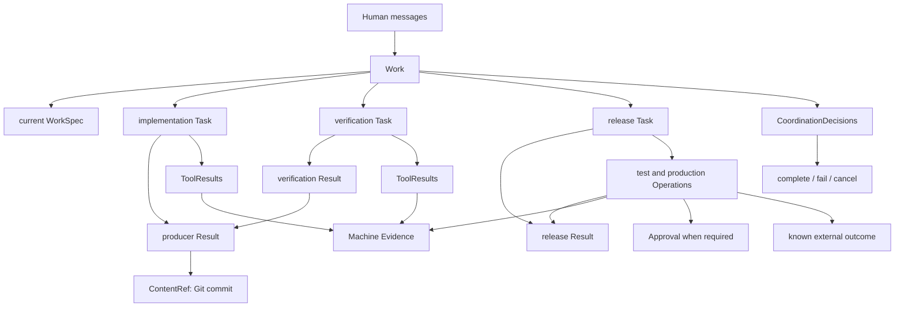

# 单元 14：把整个案例从头走到尾

[上一单元：两个执行者、重试和恢复怎样不互相覆盖](13-concurrency-and-resume.zh.md) | [返回课程目录](README.md)

## 先不看对象，重新讲一遍故事

陈晨在团队房间提出取消订单需求。林舟没有立刻让所有成员自由发挥，而是先把它当成一件独立事务保存。

林舟通过普通对话问清“未发货”、仓库拣货和取消原因的含义，把当前共同理解整理成目标说明。目标说清后，林舟才把实现交给周明。

周明在自己的隔离工作区修改代码、运行测试，并用 Git commit 固定最终内容。他提交一份终态交接，但系统没有因为“completed”就接受代码。

林舟让乔安在另一个干净工作区验证同一个 commit。乔安提交验证交接，机器确认成员不同、工作区独立、工具记录与 commit 匹配。林舟先接受通过的验证结果，再接受周明的代码结果。

代码被接受后，林舟另外派发一次发布委托，避免把周明原来的“只实现代码”悄悄扩大成部署权限。发布成员先把同一 commit 部署到测试环境，系统确认版本并保留测试回执；这些步骤通过后，才为生产部署建立另一张精确操作单。陈晨看见能判断风险的预览并批准同一个 operation digest 后，Gate 在执行前重新检查当前生产版本、成员权限、验证结果和 Approval。

执行开始前先持久化记录。Adapter 调用后端并确认生产已经运行目标 commit，于是 Operation 进入 succeeded。所有 Task 都已有终态处置、所有外部操作结果已知、Human 对当前目标的关闭确认仍有效，CloseGuard 通过。最后由林舟判断当前 WorkSpec 已满足，并提交 complete-work。

这就是整套设计的主线。正式对象只是为了让每一步可以准确写入、查询、恢复和限制。

## 第一阶段：从消息到当前目标

### 1. 平台交付经过认证的消息

```text
Human 陈晨
→ Matrix 消息事件
→ OpenClaw 同步
→ AgentTeams 管理的 Worker
→ Tiangong 入口
```

平台消息 ID 用于防止同一输入重放时创建两份事务。

### 2. 创建 Work

```json
{
  "workId": "work-order-cancel-001",
  "teamId": "commerce-team",
  "epoch": 1,
  "workSpec": null
}
```

Work 先承认“有这整件事”，不编造尚未澄清的目标。

### 3. 通过普通消息澄清

Human 消息和 Leader 问答进入 Work timeline。普通消息可以改变团队理解，不能自动增加机器权限。

### 4. 形成 WorkSpec

系统追加含完整快照的 `work-spec-changed` 事件，同时更新当前投影并推进 epoch。

非 null WorkSpec 之后，Leader 才能派发正式 Task。

## 第二阶段：从目标到一次委托

### 5. Leader 选择成员和委托范围

Leader 结合专业职责判断由周明实现，但机器还要确认：

- 周明在 AgentTeams 中真实存在；
- TeamConfig 接纳周明；
- MemberConfig 允许相应专业与工具范围；
- ControlProfile 没有禁止；
- Task 工作区和仓库范围有效。

### 6. 原子创建 Task

Task、不可变 TaskSpec、唯一 assignee 和 create-task Decision 一起提交。

TaskSpec 是这次委托的完整语义。当前 WorkSpec 以后只作为标注清楚的背景，不会自动改写它。

### 7. 在隔离工作区执行

周明只能通过注册工具和 Adapter 访问允许范围。Skill 可以提供方法，不能授予权限。检索结果是参考材料，不能覆盖 TaskSpec 和代码边界。

## 第三阶段：从自报完成到独立验证

### 8. 固定交付内容

周明把最终代码提交为：

```text
service-a @ 9ab73e...
```

### 9. ResultGuard 检查并创建生产 Result

Result 的 completed 是周明声明。ContentRef 指向精确 commit，ToolResult 和 Machine Evidence 提供机器观察支持。

生产 Result 暂时保持 submitted。

### 10. 创建独立验证 Task

乔安在不同工作区检出同一仓库和 commit。

### 11. 提交 verification Result

```text
producerResultId = result-implement-cancel-01
subject          = service-a @ 9ab73e...
outcome          = completed
verdict          = pass
```

outcome 描述验证 Task 是否执行完成，verdict 描述目标 commit 是否通过。

### 12. 按顺序接受

林舟先接受乔安的验证 Result。机器随后允许林舟接受精确匹配的周明 Result。

只有 accepted completed Result 能支持 Work 完成。accepted blocked 或 failed Result 仍是真实交接，但没有完成资格。

## 第四阶段：从本地结果到外部效果

### 13. 创建单独的发布 Task

林舟把已经接受并独立验证的 commit 交给发布成员。TaskSpec 明确要求先验证测试环境，再申请生产部署；它不会修改周明原来的实现 Task。

### 14. 分类工具调用

本地构建仍是普通工具调用。推送共享仓库、合并、发布和部署被分类为 Operation。

模型不能自己把外部写操作改名为只读。

### 15. 先创建并执行测试环境 Operation

测试环境部署拥有独立的 Operation 身份和 digest。即使当前 ControlProfile 把它分类为 auto allowed，它仍要经过 Gate、先写 `execution_started`，并确认测试环境实际运行的是目标 commit。

### 16. 在测试环境验证同一份内容

受控测试工具针对测试环境执行验收，ToolResult 和 Machine Evidence 绑定同一个 commit。测试环境状态或验收结果不符合预期时，生产 Operation 不会继续形成。

### 17. 创建不可变的生产 Operation

Operation 绑定：

- Work、Task 和受控 tool-call invocation；
- Adapter 及版本；
- 动作、目标和参数；
- 精确 commit；
- 目标前置状态；
- 预授权回滚；
- 受保护 payload 引用与 digest；
- 整体 operation digest。

同一工具调用重放回到同一 Operation，新调用才代表新意图。

### 18. 对生产 Operation 再作规则分类

测试环境操作已经按 auto allowed 路径完成。生产环境得到 approval required；如果目标或动作无法识别，则直接 denied。

### 19. Adapter 生成安全预览

Human 看见目标环境、commit、当前预期版本、回滚范围和有效期。任何无法展示但会改变风险的字段都会阻止 exact Approval。

### 20. Human 批准

Approval 绑定 operation identity、digest、授权 Human、实际展示内容和有效期。

普通聊天中的“可以”不能代替这一动作。

### 21. Gate 重新检查

执行前重新验证当前成员、ControlProfile、目标前置状态、Task、workspace、独立验证、payload digest 和 Approval。

## 第五阶段：执行、恢复与关闭

### 22. 先写 execution_started

持久化成功后才调用外部后端。崩溃后不会把可能已发送的请求误判成未开始。

### 23. Adapter 确认外部状态

```text
后置条件确认达到 → succeeded
确认完全无效果   → failed_no_effect
无法确定         → uncertain
```

### 24. uncertain 时只读对账

原正向阶段永不自动重试。确认无效果后，如仍需执行，创建新的 Operation 并重新授权。

uncertain 会阻止冲突 Operation、Task 取消和 Work 关闭，直到机器事实得到解决。

### 25. 处理所有 Task

发布成员在测试和生产结果都已知后提交发布 Task 的终态 Result，其中的外部效果声明必须与 Operation 机器状态一致。Leader 对它作出唯一 accept 或 reject；无 Result 的其他 Task 明确取消；没有 Task 仍在运行或等待 Approval。

### 26. 检查当前 Human confirmation

如果 ControlProfile 要求关闭确认，必须存在最后一次 WorkSpec 变化之后、由授权 Human 通过认证动作写入的 applicable `human-confirmed` 事件。

### 27. CloseGuard 扫描整个 Work

它检查所有完成资格 Result、所有 Operation、验证、引用可访问性和当前硬规则，不信任调用者自己挑选一个安全子集。

### 28. Leader 提交 complete-work

林舟判断当前 WorkSpec 的业务含义已经满足。Decision 和 Work 终结原子提交，之后不可重新打开。

## 一张最终关系图



图中箭头表示可查询关系，不表示所有 Work 必须按固定顺序经过每一个节点。

## 拿到一个 ID 后怎样往回找

### 知道 Work ID，想知道当前在做什么

```text
Work 当前投影
→ 当前 WorkSpec
→ timeline
→ 所有 Task
→ Result 与 disposition
→ 所有 Operation 和当前状态
```

### 知道 Task ID，想知道成员被要求做什么

```text
Task
├─ immutable TaskSpec
├─ assigneeId
├─ executionContext
├─ 所属 Work
├─ ToolResults / Machine Evidence
└─ 最多一个 Result
```

### 知道生产 Result，想知道代码是否可接受

```text
Result.deliverableRefs 中的 commit
→ 查 verification.producerResultId 等于该 Result 的验证 Result
→ verifier 与 producer 不同
→ subject 是同一 commit
→ outcome completed
→ verdict pass
→ verification Result 已 accepted
→ producer Result 才可 accepted
```

### 知道 Operation，想知道 Human 批准了什么

```text
Operation
→ operationDigest
→ Approval.operationDigest
→ presentedView / secure ContentRef
→ channelMessageId
→ decidedBy / expiry
→ Gate 评估记录
→ execution / reconciliation / rollback events
```

### 看到“测试通过”，想知道机器依据

```text
Result 或 verification claim
→ machineEvidenceRefs
→ Machine Evidence.subjectRef
→ toolResultRefs
→ ToolResult 的 actor、Task、workspace、commit、命令和结果
```

## 最终术语表

这些词到现在应该是对已见问题的命名，而不是孤立定义。

| 名称 | 一句话解释 |
|---|---|
| Human | 系统外提出请求或作出必要确认的人 |
| Agent | 由模型驱动、拥有专业职责但受代码边界约束的程序角色 |
| Worker | Agent 实际运行的进程或容器边界 |
| AgentTeams | 管理 Team、Worker、容器、平台身份和集成资源的系统 |
| Matrix / OpenClaw | 消息网络以及使用它的通信客户端边界 |
| Work | 一整件持续事务的身份和上下文 |
| WorkSpec | 当前对整件 Work 目标、范围、约束和完成条件的理解 |
| Task | 一次已经正式派发、有唯一负责人的委托 |
| TaskSpec | 这次委托的具体目标、输入和约束 |
| Result | 一个 Task 最多一份的不可变终态交接 |
| ContentRef | 对精确 Git commit 或存储对象的轻量稳定引用 |
| CoordinationDecision | Leader 对派发、处置和关闭作出的正式不可变选择 |
| TeamConfig | Tiangong 对平台身份的团队准入、Leader 和路由授权 |
| MemberConfig | 成员职责、工具、资源、Skill、模型和容量范围 |
| ControlProfile | 企业控制、Guard、验证、Approval、预算和保留硬规则 |
| Skill | 帮助 Agent 做事的方法包，不授予权限 |
| Adapter | 把具体工具或后端接入统一输入、权限、记录和恢复合同的边界 |
| ToolResult | 一次受控工具调用的有界机器观察 |
| Machine Evidence | 运行时验证后，为关键机器事实建立的引用索引 |
| Operation | 可能改变隔离工作区之外共享或外部状态的受控动作 |
| Approval | Human 对一个精确 operation digest 作出的执行许可 |
| Gate | Operation 执行前的硬检查 |
| ResultGuard | Result 创建前的硬检查 |
| CloseGuard | Work 终结前扫描整个 Work 的硬检查 |
| uncertain | 外部效果可能发生、但当前无法确认的安全状态 |
| reconciliation | 使用受保护只读接口把本地记录与外部状态重新核对 |

## 这套设计故意不做什么

为了保持控制模型小而明确，Tiangong 不尝试：

- 为所有行业编码一套通用工作流；
- 把每份报告、测试计划和环境都强制建模；
- 对所有内容建立通用内容寻址归档平台；
- 让自然语言、Skill 或检索内容授予机器权限；
- 用模型判断代替幂等、路径限制和外部效果 Gate；
- 证明模型在认知意义上真正理解输入；
- 抵抗被明确纳入信任边界的数据库或主机管理员；
- 在无法确认外部效果时，用 Human 风险接受掩盖未知事实。

## 先知道这套保证建立在哪个信任范围内

一套 Tiangong 部署面向一个企业。企业内部可以有多个 Team，但当前设计不把同一部署当作互不信任企业之间的安全隔离边界。

企业管理员和主机管理员属于信任范围。普通成员和模型不能绕过权限、路径、Approval 与 Guard；但系统不声称能用密码学证明受信数据库管理员从未改过记录，也不声称能阻止主机管理员读取进程内存。

这不是一句附带免责声明，而是决定系统应该承诺什么、测试什么的重要边界。可信架构必须同时写清能防住的错误和明确不承诺的攻击者。

## 怎样继续阅读正式设计

现在再读正式文档时，建议按教程经历过的问题顺序，而不是硬背章节：

1. [范围、所有权和设计原则](../evidence-backed-team-control.md#2-scope-and-deployment-assumptions)
2. [Work 与 Human communication](../evidence-backed-team-control.md#5-work-and-human-communication)
3. [Task、Result 与 handoff](../evidence-backed-team-control.md#6-task-delegation-and-result-handoff)
4. [Decision 与 Work closure](../evidence-backed-team-control.md#7-coordination-decisions-and-work-closure)
5. [Team、Skill、Context 与 ContentRef](../evidence-backed-team-control.md#8-team-and-configuration)
6. [ToolResult 与 Machine Evidence](../evidence-backed-team-control.md#11-execution-records-and-machine-evidence)
7. [Operation 与 exact Approval](../evidence-backed-team-control.md#13-operations-and-exact-approval)
8. [ResultGuard 与 CloseGuard](../evidence-backed-team-control.md#14-verification-resultguard-and-closeguard)
9. [并发、存储、恢复和安全模型](../evidence-backed-team-control.md#15-sessions-models-budgets-and-concurrency)
10. [最终系统不变量](../evidence-backed-team-control.md#18-system-invariants)

正式设计是目标架构，不是当前代码已完全符合的声明。实现时应先选择一个最小纵向切片，同时补齐数据、Guard、事务、恢复和确定性测试，不能只创建几个同名 class 就声称完成迁移。

## 全课程最终自检

尝试完整回答：

1. 一条 Matrix 消息为什么先创建 Work，而不是直接创建 Task？
2. WorkSpec 更新后，为什么已有 TaskSpec 仍保持不变？
3. 一个 Agent 为什么不能通过 Task 文字或 Skill 给自己增加权限？
4. Result completed、ToolResult success、verification pass 和 Leader accept 分别表示什么？
5. 为什么正式代码 Result 必须等匹配的独立验证 Result 被接受后才能接受？
6. 本地编辑与 Operation 的边界在哪里？
7. Approval 为什么不能由普通聊天替代？
8. 后端超时时，为什么必须进入 uncertain 而不是立即重试？
9. requestId、Work epoch 和单活执行上下文分别防止哪一种重复？
10. CloseGuard 能检查什么，又为什么不能替 Leader 判断业务是否完成？

如果这些问题都能用案例回答，你已经不再只是记住对象名，而是建立了这套架构最重要的因果关系。
