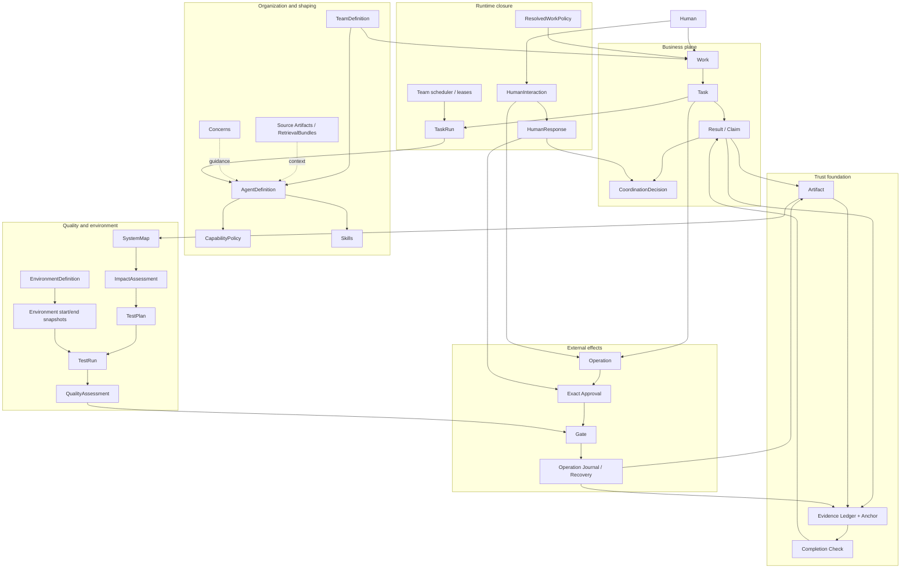

# Tiangong 控制架构总览

> 状态：非规范性翻译快照。本文是已采纳的取代性目标架构的执行摘要；合同规范仍在闭合中。公开 v0.2 仍是当前实现基线。本摘要不授权任何交付声明。唯一规范性目标来源是 [`evidence-backed-team-control.md`](evidence-backed-team-control.md)（英文）。

## 定位

Tiangong 是一个自主 AI 团队的证据支持控制架构：Leader 决定团队应该做什么，专业 Agent 决定如何完成其被指派的工作，而确定性的运行时边界执行身份、权限、授权、证据、完成与恢复。

它**约束而非编排**。没有固定的交付流水线，也没有通用工作流 DSL。

## 当前与目标边界

目标取代固定的五角色、四类 TaskKind、TeamPlaybook 路径，作为未来架构，但不假装它已经实现。公开 v0.2 的五个角色仍是第一方 `software-change-delivery` 配置，而非 Kernel 枚举。当前的 WorkRun 和平台 Project/Task 集成只会被垂直完整、fail-closed 的目标切片所取代。

AgentTeams 拥有实际的 Team/Worker/容器生命周期和平台存储集成；OpenClaw 拥有 Matrix 机制。Tiangong 拥有专业的 Work/Task/Result 控制、TeamDefinition 准入、Capability、Context、Gate、Evidence、Completion、Approval、质量与恢复。平台状态证明一个资源存在；TeamDefinition 决定其精确代际是否被准入。平台文件和消息是载体或投影，绝不是第二套语义权威。

除非能证明跨身份、Matrix、存储、容器、网络、凭证、Runner、知识、模型 Provider 和管理的端到端隔离，否则部署即为单租户。

## 核心哲学

- **两个自主循环** —— 一个 Agent 自主完成一个 Task；Leader 自主规划并调整团队的 Work。
- **唯一权威，可重入执行** —— 一个 Leader 是唯一的协调权威，但隔离的 Leader turn 和 Task 可以在限定容量内跨多个 Work 推进。
- **并发是受约束的机器状态** —— 不可变的 Work 上限、活的团队容量、公平性、租约、fencing 和 run 级隔离约束执行，而不引入工作流图。
- **简单的业务平面** —— 用户和 Leader 围绕 `Work -> Task -> Result` 推理。
- **单一真相源** —— 不可变记录和精确 digest 取代可变的重复状态。
- **Claim 不是 Evidence** —— 模型叙述、Artifact、机器观察、Decision、Approval 和外部效果仍是不同的事实。Evidence 只确立一个被授权的 Recorder 记录了其定义的有界观察。
- **含义、合法性与策略是分离的** —— 一个代码拥有的 action 说明一条记录的含义，一个 Guard 决定它是否合法，Leader 决定为何以及何时选择它。
- **一个 Task 永不等待 Human** —— 缺失输入或授权产生一个终态 blocked Result；Leader 与 Human 交互并创建新的 Task。
- **不确定性被保留** —— 结果未知的外部效果不会被重试或描述为成功，直到特权对账证明它。
- **知识权威被保留** —— 精确的源 Artifact 和 slice 保持权威；索引、向量、排序、检索到的叙述和模型摘要是派生的不可信数据。

## 概念分层



### 业务平面

- **Work** 是一个演进中的 Human 事务，由不可变 revision 表示。
- **Task** 是对一个负责 Agent 的一次不可变委托。
- **Result** 是 Task 唯一的不可变终态交接：completed、blocked 或 failed。
- **CoordinationDecision** 记录验收、拒绝、替换、carry-forward、取消、关闭和显式撤销。
- **Finding** 是 Result 内的一个轻量结构化字段，不是独立的 aggregate。
- 没有通用的 Change 对象；代码、配置、文档和测试是 Artifact 种类。

### 运行时闭合

- **TaskRun** 是一个已派发 Task 的唯一不可变运行时绑定；动态 Context 和工具事实仍是 Evidence 或 Artifact。每个活的 Run 隔离 Session、Context、Workspace、工具、预算、取消、Completion 和恢复状态。
- 一个有效的未派发 **Task 是持久的调度权威**。调度器容量不足不创建 TaskRun 或 blocked Result；确定性重试不需要 DispatchIntent 或 Leader 轮询。
- Leader turn、调度器队列、容量、slot、租约和 fencing epoch 是机器状态和 Evidence，不是新的业务 aggregate。
- **HumanInteraction** 是一个不可变的 Leader-to-Human 合同，具有权威的 `inform`、`decide` 或 `authorize` 语义。HumanResponse 是独立的 Artifact，永不修改请求。
- **ResolvedWorkPolicy** 在 Work 执行前完全物化团队默认值和合法的 Work 覆盖；运行时永不读取可变的当前默认值。
- **Operation Journal** 保持 append-only 的幂等性、attempt、replay 和对账状态，与 Evidence 分离。

### 信任基础

- **Artifact** 标识精确的交付字节及其 provenance。
- **Evidence** 记录一个被授权的 Recorder 在精确的 EventDefinition 下做了一次有界观察；它不独立证明语义真相或外部效果。
- **Completion** 确定性地检查最低的机器可证明 Task 合同。一个有效的 Leader 或 Human 支持的 Decision 是精确策略下的权威语义处置，不是客观正确性的证明。
- 每个 Work 一个逻辑 Evidence Ledger 给多 Agent 事实一个共同顺序。签名 Anchor 相对可信密钥保护关键 frontier 免受后期重写；它们不让被攻陷的 Recorder 变得可信。
- Human ingress 和跨 Work 容量观察使用命名空间限定的管理 ledger，具有相同的 genesis、Recorder、anchoring 和 fail-closed 规则；Work 事件引用其精确的 EvidenceRef。

### 质量与环境

- **SystemMap** 将精确的源快照链接到代码、API、数据、journey、部署、测试和环境 subject，同时保留已知缺口。
- **ImpactAssessment** 结合确定性的依赖传播与显式源支持的语义推断和未知边界。
- **TestPlan** 将已接受的 impact 转换为精确的质量义务、Core 测试、选定测试、环境和覆盖缺口。
- **TestRun** 将精确的 TestDefinition 和 subject Artifact 绑定到配置、数据边界以及起止 EnvironmentSnapshot。
- **QualityAssessment** 确定性地检查一个语义上已接受的 TestPlan 是否用新鲜的通过证据执行。
- **EnvironmentDefinition** 是权威和策略；EnvironmentSnapshot 是时间点的机器观察状态。环境类别不规定固定的发布流水线。

### 外部效果

- **Operation** 是源自一个 Task 或正式 HumanInteraction 交付的一个精确外部效果意图。
- **Approval** 授权一个精确的 Operation。Human 的有界授权和 standing policy 首先派生一个精确 Approval；它们从不直接执行。
- **Gate** 在执行前检查 capability、策略、Approval、幂等性、恢复状态和即时前置条件。
- **Operation Journal** 提供 exactly-once 协调和安全 replay。
- 一个不确定的效果在模型不可访问的工具之外对账。外部补偿是一个新的 Operation，不是隐藏的回滚回调。

### 组织与行为塑造

- **TeamDefinition** 将恰好一个 Leader 和任意数量的已批准专业成员绑定到精确的 Agent 定义。多个预绑定的精确 Worker 可以共享一个 AgentDefinition 以获得水平容量；roster 变更需要新的 TeamDefinition 和 Work revision。
- **AgentDefinition** 结合稳定的职责指令、硬 CapabilityPolicy 和允许的 Skill 目录。
- **Skill** 教授方法而不改变 profession 或权限。经典的多 Agent 方法是 Leader 协调 Skill。
- **RAG** 通过绑定到一个 TaskRun 或 fenced Leader turn 的策略过滤 RetrievalBundle 提供精确的带 provenance 的源 slice。物理索引和 embedding 是可重建的缓存；生成的输出在没有单独的受治理 promotion 之前不是可重用的组织知识。
- **Concern** 给出 Agent 或 Team 范围的早期指导。它们是建议性的；任何必须阻断的规则属于 Gate 或 Completion。

## 端到端信任链

```text
Human 请求
  -> 在精确的平台或租户 IngressPolicy 下记录 human-request.received
  -> 拒绝，或预留 workId 和 Work ledger
  -> 原子地 / outbox 等价地提交 Work + work.recorded + admitted Evidence
  -> replay 返回那个精确的 Work；执行饱和永不丢弃它

Leader 规划
  -> 一个 fenced 的 Work 范围 turn 和 Work-head CAS
  -> 精确 Work 策略下的可选或必需 Leader-subject 检索
  -> 绑定到 Work、assignee、inputs 和已解析策略的不可变 Task
  -> 精确的 TeamDefinition 和 AgentDefinition
  -> 调度器将 Work 上限与活的团队和 Worker 容量求交
  -> 派发原子地预留 slot 并打开 Task 的唯一 TaskRun

Agent 自主工作
  -> 精确的 TaskRun-subject 知识策略和活的撤销检查
  -> 精确的源快照 + 可重建的搜索缓存 -> 密封的 RetrievalBundle
  -> 选定的 Skill + 限定的不可信检索 + Agent Concern
  -> 受 Capability 和 Task 策略约束的工具
  -> 被授权的 Recorder 在精确定义下捕获有界观察
  -> 输出成为不可变 Artifact

Agent 提议 Result
  -> 确定性的 Completion Check
  -> 通过：密封 Result + completion Evidence
  -> 失败：在 Task 内继续
  -> 外部依赖：密封 blocked Result 并返回 Leader

Leader 审核
  -> Completion Check 通过是必需的
  -> 语义验收 / 拒绝是策略下的不可变 CoordinationDecision
  -> Human 输入使用不可变的 inform / decide / authorize 交互
  -> scope 变更创建新的 Work revision，永不修改

质量关闭交付声明
  -> SystemMap 绑定当前源和已知系统关系
  -> ImpactAssessment 识别直接、传递、推断和未知 impact
  -> TestPlan 选定 Core、impacted、regression 和风险必需的义务
  -> 每个 TestRun 绑定精确的 subject、test、config、data 和起止 environment 状态
  -> QualityAssessment 聚合新鲜的 run 而不隐藏失败或缺口

外部效果（当需要时）
  -> Prepare Task 密封精确的 Operation 和 Proposal Artifact
  -> authorize HumanInteraction 呈现精确效果
  -> 已认证的 HumanResponse 或 standing policy 产生精确 Approval
  -> 新的 Execute Task 调用 Gate
  -> Journal 在后端调用前开始
  -> receipt、postcondition、Evidence 和 Artifact 确立有界结果
  -> 不确定结果阻断重试并进入特权对账

Work 终止
  -> 当前 scope 已验收的 Result 和新鲜的 anchored Evidence
  -> 成功完成或取消没有活的或不确定的效果
  -> 失败可以显式保留恢复必需的不确定性
  -> 不可变的 completion、failure 或 cancellation Decision
  -> 基于已验收 Artifact 和事实的面向 Human 报告
```

## 六个合同包

| 包 | 核心问题 | 核心边界 |
| --- | --- | --- |
| 协调核心 | 团队如何在没有固定工作流的情况下协作？ | Work、Task、Result、CoordinationDecision；不可变 scope 和本地 Guard |
| 信任与完成 | 团队如何证明发生了什么、产出了什么？ | Evidence、Anchor、Artifact、确定性 Completion 和新鲜度 |
| 效果与授权 | Agent 如何安全地触及真实系统？ | Operation、精确 Approval、Gate、Journal、对账与补偿 |
| 组织与塑造 | Agent 是谁、能做什么、行为如何被引导？ | TeamDefinition、AgentDefinition、Capability、TeamPolicy、Skill、RAG、Concern |
| 质量与环境 | 一个可信的测试或晋升声明意味着什么？ | SystemMap、ImpactAssessment、TestPlan、精确 TestRun 环境绑定、QualityAssessment |
| 运行时闭合 | 不可变合同如何在运行时被组合并安全恢复？ | TaskRun、HumanInteraction、ResolvedWorkPolicy、正式 Operation Journal、有界调度、租约与 fencing |

各包互相引用但不折叠权威：

```text
Skill / RAG / Concern 塑造行为
Capability / Gate 约束动作
Evidence 捕获事实
Completion 认证最低事实
Leader / Human 决定语义
Approval 授权精确效果
```

## 不可协商的不变量

1. 一个 Team 恰好一个 Leader；专业 Agent 定义可扩展，不硬编码为五个角色。
2. Work、Task、Result、Decision、Artifact、Operation、Approval、TaskRun 和 HumanInteraction 不可变。
3. Task 有一个 assignee 和至多一个密封 Result；每个已派发的 Task 恰好一个不可变 TaskRun。
4. 一个 Task 永不等待 Human 输入或授权。
5. Actor 和可信时间来自 Evidence，不是自报告的对象字段。
6. Claim、Artifact、Evidence、Decision、Approval 和 Operation 永不互相替代。
7. 所有权威引用绑定精确的 content digest。
8. Capability 默认拒绝，按交集计算；Prompt、Skill、RAG 和 Concern 不能扩展它。
9. Completion Checker 确定性、无副作用、无模型；不确定时 fail closed。
10. Result 密封后不能接收新 Evidence；过期证明需要新的验证 Task。
11. 每个外部执行对精确的 Operation 有精确的 Approval。
12. Approval-required 永不挂起 Task 或 Matrix turn。
13. 执行在后端调用前持久开始，并使用以 Operation 为中心的幂等键。
14. Started-without-terminal 意味着结果不确定并阻断自动重试。
15. 外部补偿是另一个显式 Operation。
16. Evidence 链被验证和 anchored；篡改永不静默修复或截断。
17. TestRun 绑定精确的 subject Artifact、TestDefinition、TestPlan、配置、数据边界和起止 EnvironmentSnapshot。
18. 清理失败保持 TestRun 为红；重试创建新 Run 并永不抹除更早的失败。
19. Promotion 使用相同的不可变 Artifact 和新鲜的、满足的 QualityAssessment；重建是新的 Artifact，需要新的证明。
20. Work 绑定完全物化的 ResolvedWorkPolicy；可变的当前默认值永不改变既有权威。
21. HumanInteraction 和 HumanResponse 是分离的；decide 永不替代 authorize。
22. 恢复从不可变记录重建权威，不是模型记录。
23. 面向 Human 的 claim 永不超过已验收的 Result、可用的 Artifact 和已验证的 Evidence。
24. 每个独立的可准入 Human 目标，即使执行饱和，也被持久捕获为独立的 Work。
25. 一个 Work 至多一个当前 fenced Leader-turn 租约；租约所有权永不替代 Work-head CAS。
26. 一个有效的未派发 Task 是调度权威；容量不足不创建 TaskRun，也没有独立的 DispatchIntent。
27. 不可变的 Work 并发上限和活的团队全局容量是分离的权威；活状态可以收窄但永不超过 Work 策略。
28. 并发 TaskRun 隔离所有可变运行时轴，过期的 fencing epoch 不能追加可信输出或回收当前资源。
29. 共享的可变资源使用隔离的 Workspace、确定性集成、租约或 Operation 前置条件——永不依赖模型协作或最后写者胜。
30. KnowledgeSourceSnapshot、KnowledgeIndexManifest 和 RetrievalBundle 是 typed Artifact；物理索引、embedding 和排序是可重建的派生状态。
31. 检索绑定一个精确的 TaskRun 或当前 fenced Leader turn。它永不引入 LeaderRun、扩展权限或替代对当前可变 Workspace 状态的直接访问。
32. Agent 或模型输出在没有精确的管理 promotion Policy、审核和 Evidence 之前永不成为可重用的组织知识。
33. Context 在活的撤销和确定性权威保留的 packing 下只准入精确的已授权源 slice；检索到的指令仍是不可信数据。
34. 必需的检索失败终止精确的 TaskRun 或中止精确的 Leader turn；重启复用密封的 Bundle，永不将最新检索替代为等价。
35. AgentTeams 平台状态和 Tiangong TeamDefinition 是互补的：实际资源存在永不意味着准入，准入永不制造平台存在。
36. 每个命令绑定精确的 CommandEnvelope 和 replay 身份；哈希和签名的 JSON 使用固定的版本化 JCS 和 digest 合同。
37. Task 的 MemberRef 通过其 Work 的 TeamDefinition 解析精确的 Worker 和 AgentDefinition。所有 input 在 Task 创建前已提交；没有待处理的调度器依赖图。
38. Decision 撤销是 action 特定的、仅限 open Work、做 reverse-dependency 检查，且不能重开终态 Work 或抹除 TaskRun、Human、Approval、Operation、Receipt、Artifact 或 Evidence 历史。
39. Evidence 和 Anchor 提供有界的 Recorder 与完整性保证，不是语义真相；未知的 Recorder、密钥、隔离或效果状态 fail closed。
40. Typed 知识 payload 使用其外层 ArtifactRef 作为正式身份；内层逻辑索引坐标永不创建第二个 Artifact 身份。

## 为什么这不是工作流平台

| 工作流中心的设计 | Tiangong 控制设计 |
| --- | --- |
| 把工作建模为阶段的预定义图 | Leader 随事实出现而创建和调整 Task |
| 复杂性积累在工作流 DSL 和转移状态中 | 业务平面保持 `Work -> Task -> Result` |
| 一个流程类型决定接下来必须发生什么 | 本地 Guard 只决定一个提议的动作是否合法 |
| 模板成为运行时权威 | Leader Skill 和 RAG 提供非权威方法 |
| 灵活性需要给引擎加分支和循环 | 新的不可变 Task 自然表达并行和修订 |
| 并行需要工作流调度器 | 合格的 Task、有界 slot、公平性、租约和本地 Guard 提供调度，无需业务流权威 |
| 完成往往是一个阶段转移 | Completion 把 Claim 与机器事实交叉核对 |
| 授权附着于一个阶段 | Approval 绑定一个精确的外部 Operation |
| 恢复猜测流程停在哪里 | 不可变记录、Evidence 和 Journal 重建已知状态 |

Tiangong 确实有可观的信任基础设施，因为安全地允许 AI 修改真实系统需要证据捕获、不可变 Artifact、精确授权、幂等性和不确定性恢复。这些是逻辑持久化职责，不一定是分离的物理数据库。物理存储拓扑是一个实现决策，必须保留上述合同。
