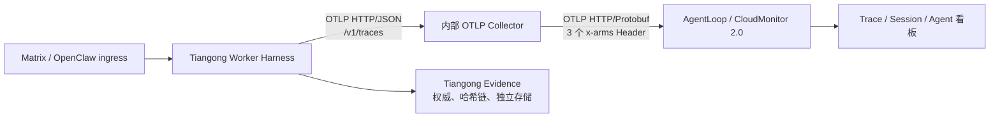

# Tiangong 接入阿里云 AgentLoop 方案

> 状态：调研与接入设计（未实施）
>
> 调研基线：2026-08-08。外部产品会演进；正式实施前必须重新核对本文中的版本、Endpoint、计费和权限。

## 结论先行

建议把 AgentLoop 作为 Tiangong 的一个可替换观测后端，第一阶段采用：

```text
Tiangong Worker
  └─ 已有的受限 OTLP Trace（Worker -> 内部 Collector）
       └─ Collector 注入 AgentLoop 鉴权 Header，并转为 OTLP/HTTP-Protobuf
            └─ AgentLoop / CloudMonitor 2.0 AI Agent Observability
```

第一阶段不在 Worker 内安装阿里云的 `opentelemetry-instrumentation-openclaw`、`diagnostics-otel` 或 LoongSuite Pilot。原因是：

- Tiangong 已经拥有自己的 Harness、Tool、Gate、Evidence 和恢复语义；AgentLoop 的诊断数据不能成为这些语义的第二权威。
- Tiangong 当前明确只导出脱敏、白名单 Span，不导出 Prompt、Completion、Tool 参数/结果、凭证或原始异常；AgentLoop 的默认能力则会展示输入输出、工具参数、会话和完整 Trajectory。直接安装官方 OpenClaw 插件会扩大数据边界。
- AgentLoop 的 OpenClaw 接入要求 OTLP/HTTP-Protobuf、三个鉴权 Header 和特定 URL；Tiangong 当前 Worker exporter 的公开契约是无 Header 的 `/v1/traces`，直接把云端凭证塞进 Worker 会破坏现有边界。
- 内部 Collector 能接收当前 Node exporter 的 OTLP/HTTP-JSON，再以 AgentLoop 要求的 OTLP/HTTP-Protobuf 转发，并把云凭证限制在观测基础设施中。

第一阶段的产品承诺是“安全的 Trace 观测”，不是“完整复刻 AgentLoop 的原始推理回放”。只有在脱敏策略、Schema 映射和业务合规确认后，才讨论输入输出内容或日志采集。

## 1. AgentLoop 的事实总结

### 1.1 产品定位和能力

阿里云将 AgentLoop 定义为面向企业级 Agent 的一站式观测、审计、评估、实验和持续优化平台，围绕“观测与审计 → 评估与实验 → 持续优化”形成数据飞轮。官方列出的生态包括 LangChain/LangGraph、AgentScope、Dify、OpenClaw、Hermes、Claude Agent SDK，以及 AgentTeams、ACS 等运行时；接入协议包括 OpenTelemetry、ARMS 自动探针、Python/Java SDK 手动埋点和 MCP。

对于可观测性，CloudMonitor 2.0 的 AI Agent Observability 提供：

- Agent、模型和框架维度的调用量、错误、延迟、TTFT、TPOT、输入/输出 Token；
- Trace 列表、Span 树、Trace Graph、Timeline、Reasoning Trajectory 和 Trace Analysis；
- Tool Call、Skill load、LLM call 的耗时和数量分析；
- Session 维度的会话时长、轮次、用户和 Token 汇总；
- 后续可将 Trace 转成数据集，执行 Agent-as-a-Judge 评估、实验和 Bad Case/Golden Dataset 沉淀。

这些能力是 AgentLoop/控制台的产品事实，不代表 Tiangong 必须上传同样完整的数据。

### 1.2 接入前提和资源

官方接入文档要求：

1. 开通 CloudMonitor 2.0 并创建 Workspace。
2. 在 Integration Center 的 AI Application Observability 中创建/选择接入资源。
3. 获取以下四类运行时配置：
   - OTLP Trace Endpoint；
   - `x-arms-license-key`；
   - `x-arms-project`（SLS Project）；
   - `x-cms-workspace`（CloudMonitor 2.0 Workspace）。
4. 为应用设置 `serviceName`，用它区分同一环境中的多个应用实例。

官方 AI Agent 接入流程还使用 AgentLoop Workspace/AgentSpace 组织资源。文档示例中的 Workspace 名称为 `agentloop-` 加 32 位编码；实际值以控制台生成的安装命令为准。

对 OpenClaw，官方示例的 Trace Endpoint 形如：

```text
https://<project>-xtrace-<region>.log.aliyuncs.com/apm/trace/opentelemetry/v1/traces
```

建议同一 VPC 内优先使用 `privateDomain`；跨公网时必须单独评估出口、TLS、地域和数据合规。

### 1.3 官方 OpenClaw 接入的边界

官方 OpenClaw 方案由两个插件组成：`opentelemetry-instrumentation-openclaw` 上报 Trace，`diagnostics-otel` 上报运行时指标。当前文档列出的限制是：

- OpenClaw 需要 v26.2.19 或更高版本；
- 只支持 OTLP/HTTP-Protobuf，不支持 HTTP/JSON 或 gRPC；
- 支持 Trace 和 Metric，不支持 Log；
- 安装器会修改 `openclaw.json` 并重启 Gateway；新版本还会加入 `hooks.allowConversationAccess: true`；
- 运行参数至少包括 `endpoint`、LicenseKey、Project、Workspace、ServiceName；可选 Batch Size、Flush Interval、Sample Rate。

这条路径适合“标准 OpenClaw 应用直接接入”。Tiangong 的 OpenClaw 进程承载的是 Tiangong 自有 Harness，且外部扩展、自动工具和上下文发现被代码禁用，因此不能未经验证地照搬。

### 1.4 数据、安全、留存和费用

官方 FAQ 明确列出 AgentLoop 可能采集完整 Trajectory、模型输入输出、Token、Tool 参数/返回值、会话和异常；官方文档还说明默认 Trace 留存 30 天，可调整。AgentLoop 目前没有独立的 Session 查询 SDK，会话聚合可通过 SLS SQL 按 `attributes.gen_ai.session.id` 完成。

权限方面，官方提供 `AliyunAgentLoopFullAccess` 和 `AliyunAgentLoopReadOnlyAccess`，也给出了 `agentloop:Get*`、`List*`、`Describe*`、`ExecuteQuery` 以及 CloudMonitor/SLS 查询权限的自定义策略示例。生产接入建议将“创建/配置接入资源”和“只读查看 Trace”分成不同 RAM 身份；Collector 运行时只需要数据写入 LicenseKey，不应持有阿里云 AccessKey/Secret。

费用不是只有 AgentLoop 本身：官方列出的按量计费项包括 AI credits、数据集存储和执行次数，Agent 观测还会产生 ARMS 费用，审计/评估结果会产生 SLS 费用。Trace 量、采样率、留存期和是否开启评估必须在上线前做预算。

## 2. Tiangong 当前基线

当前实现已经具备一条相当适合接入的后端无关观测边界：

| 现状 | 代码/文档位置 | 含义 |
|---|---|---|
| 默认关闭 | `docs/observability.md`、`worker/observability/tracing.mjs` | 未显式配置时不产生外发 Trace |
| 仅 OTLP HTTP Trace | `worker/observability/tracing.mjs` | 当前只创建 Trace，不创建 Metric/Log |
| Endpoint 严格为绝对 HTTP(S) `/v1/traces` | `parseEndpoint()` | 不接受内嵌凭证、Query、Fragment 或其他路径 |
| 不接受环境型 OTLP Header | `assertNoAmbientOtlpConfiguration()` | 防止凭证、证书路径或隐藏 exporter 选项绕过白名单 |
| 只导出白名单 Span/Attribute | `safeAttributes()`、操作/阶段集合 | 不发送 Prompt、Completion、Tool 参数、Tool 结果、凭证、Matrix 消息和原始异常 |
| Evidence 独立 | `docs/observability.md`、`worker/agent/evidence/recorder.mjs` | Trace 是诊断遥测，不是授权、外部副作用证明或哈希链 Evidence |
| 已有 Agent/Model/Tool 生命周期 | `worker/agent/runtime.mjs`、`worker/observability/pi-session-tracing.mjs`、`worker/agent/tools/wrapper.mjs` | 可在现有边界内补齐 GenAI 语义字段 |
| Model 使用受信 Provider hook | `worker/observability/provider-tracing.mjs` | 不读取 Provider payload、Header 或响应正文 |
| 当前 Node 依赖为 `@opentelemetry/exporter-trace-otlp-http` 0.221.0 | `worker/package.json` | 该包是 OTLP/HTTP-JSON exporter；它不是 AgentLoop 要求的 HTTP-Protobuf exporter |

当前 Trace 树大致是：

```text
tiangong.harness.attempt
├─ tiangong.lifecycle.checkpoint
├─ tiangong.runtime.setup
├─ tiangong.gateway.resolve
├─ tiangong.session.open_or_reuse
├─ tiangong.pi.agent_turn
├─ gen_ai.chat
└─ execute_tool
```

当前已有 `gen_ai.operation.name`、Provider、Model、Tool 名称、Gate 结果、Session/Turn/Attempt 的摘要或 Digest，但还没有 AgentLoop 需要的完整 GenAI 识别字段和 Token Usage 字段。

## 3. 差距和决策

| AgentLoop 要求/能力 | Tiangong 当前状态 | 处理决策 |
|---|---|---|
| Endpoint 是 `/apm/trace/opentelemetry/v1/traces` | 只接受 `/v1/traces` | Worker 仍指向内部 Collector；Collector 使用 `traces_endpoint` 转发到 AgentLoop，不扩张 Worker Endpoint 契约 |
| `x-arms-license-key`、`x-arms-project`、`x-cms-workspace` | Worker exporter 无 Header 配置，且拒绝 ambient OTLP headers | Header 只存在 Collector Secret/运行时内存；不进入 Worker、Session、Evidence、命令行和仓库 |
| OTLP/HTTP-Protobuf | 当前 exporter 是 HTTP/JSON | Collector 接收 HTTP/JSON，向云端 exporter 使用 HTTP/Protobuf；实施前用真实版本做编码验收 |
| Agent 应用和 Agent 名称 | `service.name` 固定为 `tiangong-worker`；无标准 Agent name | 第一阶段按应用/环境设置稳定 `service.name`；第二阶段增加低基数 `gen_ai.agent.name`（建议角色名，不用原始 Worker 名） |
| Session 查询按 `attributes.gen_ai.session.id` | 只有 `tiangong.session.id` Digest | 第二阶段增加 `gen_ai.session.id`，仍只发送不可逆 Digest，并在 AgentLoop/SLS 验收；保留 Tiangong 自有字段 |
| Agent/LLM/Tool 拓扑 | 有操作 Span，但 root 不是标准 `invoke_agent`，LLM 也缺 Usage | 第二阶段补标准 `gen_ai.operation.name` 和 `gen_ai.usage.*`；不补内容字段 |
| Prompt/Completion/Tool 参数/返回值 | 当前明确不导出 | 保持关闭。若以后需要评估，必须先新增脱敏、截断、用途、租户、留存和用户授权策略 |
| Runtime Metric | 当前无 Metric SDK | 第一阶段不声称 AgentLoop 的实时 QPS/队列指标；第三阶段再增加受限 Metric pipeline |
| Evidence/授权/恢复 | Tiangong 自有实现 | AgentLoop Trace 永远不能替代 Evidence 或 Gate；两者用 Digest/Trace ID 做关联即可 |

## 4. 目标架构和配置

### 4.1 数据流



Collector 是传输和凭证边界，不是业务语义权威。它可以做批处理、重试、限流和网络隔离；不得把 Prompt、Completion、Tool 参数或 Evidence 原文重新加入 Trace。

### 4.2 AgentLoop 侧一次性配置

在测试 AgentSpace/CloudMonitor Workspace 中完成：

1. 开通 AgentLoop 和 CloudMonitor 2.0，创建专用 Workspace。
2. 在 Integration Center → AI Application Observability 中选择 OpenClaw/OTel 接入入口，生成一次接入配置。
3. 保存以下非仓库、非日志的运行时 Secret/Config：

| 名称 | 是否 Secret | 用途 |
|---|---:|---|
| `AGENTLOOP_TRACES_ENDPOINT` | 否 | 完整 `/apm/trace/opentelemetry/v1/traces` URL |
| `AGENTLOOP_LICENSE_KEY` | 是 | `x-arms-license-key` |
| `AGENTLOOP_PROJECT` | 否 | `x-arms-project`，SLS Project |
| `AGENTLOOP_WORKSPACE` | 否 | `x-cms-workspace` |
| `AGENTLOOP_SERVICE_NAME` | 否 | AgentLoop 应用名，例如 `tiangong-worker-test` |
| `AGENTLOOP_REGION` | 否 | 用于选择 public/private Domain 和网络策略 |

4. 在同一 VPC/地域优先选择 private Domain；确认 Worker/Collector 到该 Endpoint 的 DNS、443/TLS 和 egress ACL。
5. 为控制台查看者使用只读 RAM 权限；为资源创建者使用单独的临时/管理员流程。不要把 RAM AccessKey 注入 Worker。

### 4.3 Collector 示例配置

下面是“概念配置”，上线前必须锁定 Collector 发行版、组件版本和镜像 Digest，并按该版本的 Schema 校验：

```yaml
receivers:
  otlp:
    protocols:
      http:
        endpoint: 0.0.0.0:4318

processors:
  memory_limiter:
    check_interval: 1s
    limit_mib: 128
  batch:
    send_batch_size: 64
    timeout: 1s

exporters:
  otlphttp/agentloop:
    # AgentLoop 控制台生成的完整 URL；不要让 exporter 自动改写路径。
    traces_endpoint: ${env:AGENTLOOP_TRACES_ENDPOINT}
    headers:
      x-arms-license-key: ${env:AGENTLOOP_LICENSE_KEY}
      x-arms-project: ${env:AGENTLOOP_PROJECT}
      x-cms-workspace: ${env:AGENTLOOP_WORKSPACE}
    compression: gzip
    timeout: 5s

service:
  pipelines:
    traces:
      receivers: [otlp]
      processors: [memory_limiter, batch]
      exporters: [otlphttp/agentloop]
```

部署要求：

- Collector 只监听 AgentTeams 内部网络或 loopback；不公开 `4318` 到宿主机或公网。
- Secret 由部署系统注入，禁止写入 Git、镜像层、命令行、Worker `openclaw.json`、Session 或 Evidence。
- 配置 `sending_queue`、有限重试和 Collector 自身健康检查；云端不可用时丢弃/排队只能影响诊断遥测，不能阻塞或改变 Tiangong 主业务结果。
- 第一阶段只开 Trace pipeline，不开 Log pipeline。若日后开 Metrics，必须使用独立的 metrics Endpoint 或按官方支持方式配置。
- Collector 镜像、配置文件和依赖按公开来源固定版本并做漏洞/许可证审查。

### 4.4 Tiangong Worker 侧配置

保持现有插件配置，只把 endpoint 指向内部 Collector：

```json
{
  "plugins": {
    "entries": {
      "tiangong-pi": {
        "enabled": true,
        "config": {
          "observability": {
            "enabled": true,
            "endpoint": "http://tiangong-otel-collector:4318/v1/traces"
          }
        }
      }
    }
  }
}
```

也可以继续使用已有的构建时 `TIANGONG_OTEL_EXPORTER_ENDPOINT`，但只允许非 Secret 的内部 URL。生产默认值仍应是关闭；测试、预发布和生产通过部署配置显式打开。

不要把下面这些值放进 Worker 配置：

```text
x-arms-license-key
x-arms-project
x-cms-workspace
AGENTLOOP_LICENSE_KEY
AGENTLOOP_TRACES_ENDPOINT（云端真实 URL）
```

## 5. Tiangong 需要的代码改造

### 阶段 P0：只打通安全传输

目标是证明“Worker 的脱敏 Trace 能到 AgentLoop”，尽量不改业务语义：

1. 新增一个 AgentTeams/部署层管理的 Collector 服务，复用现有 smoke 中 `agentteams-net` 的网络模式。
2. 用真实 AgentLoop 测试 Workspace 验证：Node HTTP/JSON → Collector → AgentLoop HTTP/Protobuf。
3. 加入 Collector 健康、HTTP 状态码和端到端数据到达的机器检查；不把凭证或原始云端响应写入 Evidence。
4. 保持 `docs/observability.md` 的禁用默认、失败不影响主流程、Evidence 独立和数据白名单。

### 阶段 P1：补齐 AgentLoop 可识别的 GenAI Schema

P0 验收通过后，再在 `worker/observability/tracing.mjs`、`pi-session-tracing.mjs`、`runtime.mjs` 和 `tools/wrapper.mjs` 中做最小字段扩展：

#### Harness/Agent 根 Span

- `gen_ai.operation.name = invoke_agent`；
- `gen_ai.agent.name = <低基数角色名>`，例如 `leader`、`designer`，不发送原始 Matrix/Worker 身份；
- `gen_ai.session.id = sha256(...)`，与 Tiangong 的 Session Digest 使用不同域前缀；
- `service.name = tiangong-<environment>` 或按部署配置指定，避免五个 Worker 全部挤在一个不可区分的应用条目中；
- 保留 `tiangong.attempt.id`、`tiangong.turn.id` 等内部相关字段的 Digest。

#### LLM Span

- 保留 `gen_ai.operation.name = chat`、Provider、Model；
- 在可信的 `message_end`/结果汇总处加入 `gen_ai.usage.input_tokens`、`gen_ai.usage.output_tokens`；
- Cache Token 是否作为自定义低基数字段，先与 AgentLoop 控制台验收，不要猜测产品字段名；
- TTFT 由真实 Provider response/stream 时间计算，不能用定时器心跳冒充；
- 不发送 `gen_ai.input.messages`、`gen_ai.output.messages` 或任何内容事件。

#### Tool Span

- 保留 `gen_ai.operation.name = execute_tool`；
- 增加经白名单校验的 `gen_ai.tool.name`（若 AgentLoop 当前 Schema 接受），同时保留 `tiangong.tool.name`；
- 用 `tiangong.gate.outcome`、`tiangong.approval.pending` 和终态表示 proposal、pending、execution、replay、error；
- 不发送 Tool 参数、返回值、写入内容或未清洗异常。

所有新增字段都必须进入：

- `safeAttributes()` 的白名单和长度/类型检查；
- smoke receiver 的白名单和反泄漏断言；
- 正向、负向、重启、Collector 不可用和 AgentLoop 4xx/5xx 测试；
- `docs/observability.md` 的公开数据政策。

### 阶段 P2：Metrics、评估和审计（另立决策）

不要把 P2 混进第一次接入：

- Metrics 需要新增 OTel MeterProvider、指标白名单、采样和批处理策略；可考虑 QPS、模型调用数、Tool 调用数、队列深度和 exporter 丢弃数。
- AgentLoop 的审计/评估可能读取完整输入输出和 Tool 上下文，必须先完成 PII/凭证脱敏、用途限定、租户隔离、留存、访问审计和用户授权。
- Tiangong 的 Evidence 仍然保留为执行权威；AgentLoop 审计链只能作为外部诊断/审计投影，不能直接替代本地 Gate、幂等或回滚证据。

## 6. 分阶段实施和验收

### P0 测试环境

使用独立的 AgentLoop Workspace、短留存和专用 `serviceName=tiangong-worker-agentloop-test`：

1. 先运行本地/CI OTLP receiver，证明当前脱敏合同未被破坏。
2. 再把相同 Worker endpoint 切到 Collector，Collector 的云端出口只使用测试凭证。
3. 触发一个普通模型对话、一个无副作用 Tool、一个 pending Gate 和一个错误/超时。
4. 在 AgentLoop Trace 页面确认：Trace 到达、Span 树完整、错误状态正确、Session 可聚合、Token 字段（P1 后）准确。

### 机器验收标准

必须同时满足：

- Worker 观测开关关闭时，AgentLoop 无新 Trace；
- Collector 停止、云端 4xx/5xx 或网络超时时，主 turn、Gate、Evidence、幂等和恢复结果不变；
- Worker/Session/Evidence/构建日志中没有 LicenseKey、三类 Header、Prompt、Completion、Tool 参数/结果或原始异常；
- AgentLoop 至少显示一个 `tiangong-worker-agentloop-test` 应用和一条完整的 Harness→Model→Tool Trace；
- 同一 Session 的多轮 Trace 能按 `gen_ai.session.id` 聚合，且只看到 Digest；
- pending approval 只显示为 pending/decision 诊断状态，不被 Trace 误报为已执行；
- 相同 Tool 的执行与 replay 可区分，且与 Tiangong Evidence 的 execution/replay 记录一致；
- Collector 的队列、重试、丢弃和上游状态可观察，但其日志不包含 Secret；
- 关闭 AgentLoop 或回滚 Collector 后，Worker 可以恢复到现有本地/无后端配置。

### P1 生产灰度

先只接一个低风险角色 Worker，观察至少一个完整业务周期：Trace 到达率、AgentLoop 端到端延迟、Collector CPU/内存、Exporter 丢弃率、模型 Token 偏差、AgentLoop 费用。确认无数据越界、无主流程回归后再扩到其他角色。

## 7. 运行和回滚

### 日常运行指标

- Worker exporter 失败次数和队列满次数；
- Collector `/health`、接收/发送 Span 数、retry、drop、queue depth；
- AgentLoop HTTP 2xx/4xx/5xx 和数据延迟；
- AgentLoop Trace 到达率与 Tiangong Harness attempt 数的比值；
- Token 汇总与 Tiangong 结果 Envelope 的差异；
- 按 Workspace/Project/ServiceName 的费用和留存量。

### 回滚顺序

1. 将 Worker `observability.enabled` 设为 `false`，确认主流程和 Evidence 不受影响。
2. 停止或隔离 Collector；不得删除 Tiangong Evidence 或状态目录来“清理”观测故障。
3. 撤销/轮换 AgentLoop LicenseKey，并从 Secret 管理系统清除旧值。
4. 通过 AgentLoop/CloudMonitor 控制台停用测试 Service/Workspace 的数据接入；按官方留存和删除流程处理云端数据。
5. 仅删除本次部署明确拥有的 Collector 容器、配置和临时测试资源，并保存脱敏的失败诊断。

## 8. 风险、未决项和 Go/No-Go

### 主要风险

- AgentLoop 产品和官方 OpenClaw 插件仍在快速演进，当前文档版本、OpenClaw 版本要求和 Schema 可能变化。
- AgentLoop 默认展示内容型 Trace；如果未来为了评估打开内容采集，数据合规和凭证泄漏风险会显著上升。
- Collector 会成为新的供应链、网络和凭证边界，必须固定公开镜像、版本和配置，做健康与资源上限控制。
- 当前 Tiangong 的 exporter 是 HTTP/JSON，虽然标准 Collector 可接收 HTTP/JSON，但必须用部署时的真实 Collector 版本做一次 Protobuf 转发验收，不能只靠配置文件推断。
- AgentLoop 的 `gen_ai.session.id`、Agent name 和 Token 字段识别逻辑以产品当前实现为准；P1 必须在测试 Workspace 中验证，不得把“Span 已到达”当成“Agent/Session/Token 看板正确”。

### 需要外部确认的问题

1. Tiangong 生产 AgentTeams/OpenClaw 的实际 OpenClaw 版本和是否允许增加独立 Collector 服务。
2. AgentTeams 生产部署的 Secret 注入和网络 egress 方式；Collector 由 AgentTeams 层拥有，不由模型或 Worker Tool 管理。
3. AgentLoop 目标地域的 privateDomain、SLS Project/Logstore、Trace 留存和 ARMS/SLS 费用。
4. AgentLoop 当前对 `gen_ai.agent.name`、`gen_ai.session.id`、`gen_ai.usage.*` 和 `gen_ai.tool.name` 的字段识别要求。
5. 是否仅做 Trace 观测，还是要单独立项做 Metrics、评估、审计或 Trace2Dataset。

### Go/No-Go

只有在以下条件都满足时才进入生产灰度：

- P0 OTLP/JSON → Collector → AgentLoop OTLP/Protobuf 已通过真实 Workspace 验收；
- P1 字段映射已在 AgentLoop UI/SLS 中看到正确 Agent、Session、Model、Tool、Token 和状态；
- 负向测试证明观测失败不影响主业务，且没有凭证/内容泄漏；
- RAM、Secret、网络、留存、费用和回滚责任人已明确；
- 运维可以在不依赖模型回复的情况下关闭、轮换凭证、查看 Collector 健康并恢复 Worker。

## 9. 官方资料

- [AgentLoop 产品概述](https://help.aliyun.com/en/document_detail/3033860.html)
- [AgentLoop AI Agent 可观测总览](https://help.aliyun.com/en/document_detail/3042588.html)
- [AgentLoop Trace](https://help.aliyun.com/en/document_detail/3042591.html)
- [AgentLoop Session Analysis](https://help.aliyun.com/en/document_detail/3042593.html)
- [通过 AI Agent 接入 AgentLoop 应用监控（Workspace、凭证、CLI、Endpoint、验证、回滚）](https://help.aliyun.com/en/document_detail/3046111.html)
- [Integrate OpenClaw Applications（插件、版本、OTLP/Protobuf、Header、配置）](https://help.aliyun.com/en/document_detail/3042581.html)
- [AI Coding Agent 接入 AgentLoop（LoongSuite Pilot）](https://help.aliyun.com/en/document_detail/3033878.html)
- [AgentLoop FAQ（Session、数据类型、留存和 Schema 相关注意事项）](https://help.aliyun.com/zh/document_detail/3042703.html)
- [AgentLoop Billing](https://help.aliyun.com/en/document_detail/3044490.html)
- [AgentLoop RAM 权限策略参考](https://help.aliyun.com/en/document_detail/3033852.html)
- [OpenTelemetry JavaScript exporters](https://opentelemetry.io/docs/languages/js/exporters/)
- [`@opentelemetry/exporter-trace-otlp-http`（OTLP/HTTP-JSON）](https://www.npmjs.com/package/%40opentelemetry/exporter-trace-otlp-http)
- [OpenTelemetry Collector OTLP receiver（支持 HTTP/JSON）](https://github.com/open-telemetry/opentelemetry-collector/blob/main/receiver/otlpreceiver/README.md)
- [OpenTelemetry GenAI semantic conventions](https://opentelemetry.io/docs/specs/semconv/registry/attributes/gen-ai/)

## 10. 与现有 Tiangong 文档/实现的对应关系

- 当前观测边界和数据政策：[docs/observability.md](../observability.md)
- Worker Trace 实现：[worker/observability/tracing.mjs](../../worker/observability/tracing.mjs)
- pi/Provider 生命周期：[worker/observability/pi-session-tracing.mjs](../../worker/observability/pi-session-tracing.mjs)、[worker/observability/provider-tracing.mjs](../../worker/observability/provider-tracing.mjs)
- Tool、Gate、Evidence 包装：[worker/agent/tools/wrapper.mjs](../../worker/agent/tools/wrapper.mjs)、[worker/agent/evidence/recorder.mjs](../../worker/agent/evidence/recorder.mjs)
- 现有 OTLP smoke receiver：[smoke-testing/support/otlp-smoke-receiver.mjs](../../smoke-testing/support/otlp-smoke-receiver.mjs)
