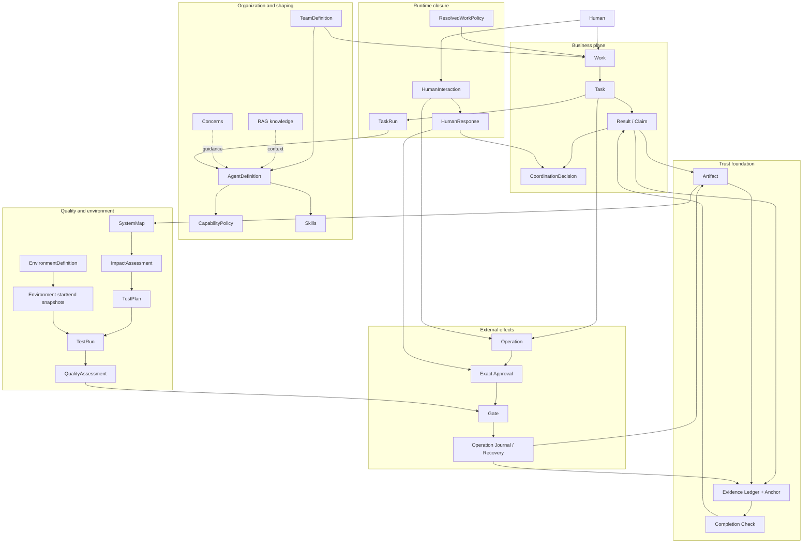

# Tiangong control architecture overview

> Status: executive summary of the agreed target design. It does not describe
> the current implementation and does not authorize a delivery claim. The
> normative contracts are in
> [`evidence-backed-team-control.md`](evidence-backed-team-control.md).

## Positioning

Tiangong is an evidence-backed control architecture for an autonomous AI team:
a Leader decides what the Team should do, professional Agents decide how to do
their assigned work, and deterministic runtime boundaries enforce identity,
permission, authorization, evidence, completion, and recovery.

It **constrains rather than orchestrates**. There is no fixed delivery pipeline
and no general workflow DSL.

## Core philosophy

- **Two autonomous loops** — an Agent autonomously completes one Task; the
  Leader autonomously plans and adapts the Team's Work.
- **Simple business plane** — users and the Leader reason about
  `Work -> Task -> Result`.
- **Single source of truth** — immutable records and exact digests replace
  mutable duplicated status.
- **Claim is not Evidence** — model prose, Artifacts, machine observations,
  Decisions, Approvals, and external effects remain separate facts.
- **Meaning, legality, and strategy are separate** — a code-owned action says
  what a record means, a Guard decides whether it is legal, and the Leader
  decides why and when to choose it.
- **A Task never waits for a Human** — missing input or authorization produces a
  terminal blocked Result; the Leader interacts with the Human and creates a
  new Task.
- **Uncertainty is preserved** — an external effect with unknown outcome is not
  retried or described as success until privileged reconciliation proves it.

## Concept layers



### Business plane

- **Work** is one evolving Human engagement, represented by immutable revisions.
- **Task** is one immutable delegation to one accountable Agent.
- **Result** is the Task's one immutable terminal handoff: completed, blocked,
  or failed.
- **CoordinationDecision** records acceptance, rejection, replacement,
  carry-forward, cancellation, closure, and explicit revocation.
- **Finding** is a lightweight structured field inside Result, not a separate
  aggregate.
- There is no universal Change object; code, configuration, documentation, and
  tests are Artifact kinds.

### Runtime closure

- **TaskRun** is the single immutable runtime binding for one dispatched Task;
  dynamic Context and tool facts remain Evidence or Artifacts.
- **HumanInteraction** is an immutable Leader-to-Human contract with authoritative
  `inform`, `decide`, or `authorize` semantics. HumanResponse is a separate
  Artifact and never mutates the request.
- **ResolvedWorkPolicy** fully materializes Team defaults and legal Work
  overrides before Work execution; runtime never reads mutable current defaults.
- **Operation Journal** keeps append-only idempotency, attempt, replay, and
  reconciliation state separate from Evidence.

### Trust foundation

- **Artifact** identifies the exact delivered bytes and their provenance.
- **Evidence** records bounded facts observed by trusted machine boundaries.
- **Completion** deterministically checks the minimum machine-provable Task
  contract. It is necessary, but Leader or Human semantic acceptance is
  sufficient.
- One logical Evidence Ledger per Work gives multi-Agent facts a common order.
  Signed Anchors protect critical Evidence frontiers from whole-chain rewrite.

### Quality and environment

- **SystemMap** links exact source snapshots to code, API, data, journey,
  deployment, test, and environment subjects while preserving known gaps.
- **ImpactAssessment** combines deterministic dependency propagation with
  explicitly source-backed semantic inference and unknown boundaries.
- **TestPlan** converts accepted impact into exact quality obligations, Core
  tests, selected tests, environments, and coverage gaps.
- **TestRun** binds exact TestDefinitions and subject Artifacts to configuration,
  data boundary, and both start and end EnvironmentSnapshots.
- **QualityAssessment** deterministically checks whether a semantically accepted
  TestPlan was executed with fresh passing evidence.
- **EnvironmentDefinition** is authority and policy; EnvironmentSnapshot is the
  point-in-time machine-observed state. Environment class does not prescribe a
  fixed release pipeline.

### External effects

- **Operation** is one exact external effect intent originating from a Task or
  formal HumanInteraction delivery.
- **Approval** authorizes one exact Operation. Human bounded grants and standing
  policy first derive an exact Approval; they never execute directly.
- **Gate** checks capability, policy, Approval, idempotency, recovery state, and
  immediate preconditions before execution.
- **Operation Journal** supplies exactly-once coordination and safe replay.
- An uncertain effect is reconciled outside model-accessible tools. External
  compensation is a new Operation, not a hidden rollback callback.

### Organization and behavior shaping

- **TeamDefinition** binds exactly one Leader and any number of approved
  professional members to exact Agent definitions.
- **AgentDefinition** combines stable responsibility instructions, a hard
  CapabilityPolicy, and an allowed Skill catalog.
- **Skills** teach methods without changing profession or permission. Classic
  multi-Agent methods are Leader coordination Skills.
- **RAG** supplies provenance-bearing project and organization knowledge as
  untrusted data, never authority.
- **Concerns** give Agent- or Team-scoped early guidance. They are advisory; any
  must-block rule belongs in Gate or Completion.

## End-to-end trust chain

```text
Human request
  -> authenticated input Evidence
  -> WorkSpec Artifact
  -> immutable Work revision

Leader plans
  -> immutable Task bound to Work, assignee, inputs, and resolved policies
  -> exact TeamDefinition and AgentDefinition
  -> dispatch atomically opens the Task's single immutable TaskRun

Agent works autonomously
  -> selected Skills + provenance-bearing RAG + Agent Concerns
  -> tools constrained by Capability and Task policy
  -> trusted wrappers capture Evidence
  -> outputs become immutable Artifacts

Agent proposes Result
  -> deterministic Completion Check
  -> pass: seal Result + completion Evidence
  -> fail: continue inside Task
  -> external dependency: seal blocked Result and return to Leader

Leader reviews
  -> Checkpoint pass is required
  -> semantic accept/reject is an immutable CoordinationDecision
  -> Human input uses an immutable inform/decide/authorize interaction
  -> scope change creates a new Work revision, never mutation

Quality closes the delivery claim
  -> SystemMap binds current source and known system relationships
  -> ImpactAssessment identifies direct, transitive, inferred, and unknown impact
  -> TestPlan selects Core, impacted, regression, and risk-required obligations
  -> every TestRun binds exact subject, test, config, data, and start/end environment state
  -> QualityAssessment aggregates fresh runs without hiding failures or gaps

External effect, when required
  -> Prepare Task seals exact Operation and Proposal Artifact
  -> authorize HumanInteraction presents the exact effect
  -> authenticated HumanResponse or standing policy produces exact Approval
  -> new Execute Task invokes Gate
  -> Journal begins before backend call
  -> receipt, postcondition, Evidence, and Artifact prove the outcome
  -> uncertain outcome blocks retry and enters privileged reconciliation

Work termination
  -> current-scope accepted Results and fresh anchored Evidence
  -> successful completion or cancellation has no live or uncertain effects
  -> failure may explicitly preserve recovery-required uncertainty
  -> immutable completion, failure, or cancellation Decision
  -> Human-facing report backed by accepted Artifacts and facts
```

## Six contract packages

| Package | Primary question | Core boundary |
| --- | --- | --- |
| Coordination core | How does the Team collaborate without a fixed workflow? | Work, Task, Result, CoordinationDecision; immutable scope and local Guards |
| Trust and completion | How can the Team prove what happened and what was produced? | Evidence, Anchor, Artifact, deterministic Completion and freshness |
| Effects and authorization | How can Agents safely touch real systems? | Operation, exact Approval, Gate, Journal, reconciliation and compensation |
| Organization and shaping | Who is an Agent, what may it do, and how is behavior guided? | TeamDefinition, AgentDefinition, Capability, TeamPolicy, Skills, RAG, Concern |
| Quality and environment | What does a credible test or promotion claim mean? | SystemMap, ImpactAssessment, TestPlan, exact TestRun environment binding, QualityAssessment |
| Runtime closure | How are immutable contracts composed and safely recovered at runtime? | TaskRun, HumanInteraction, ResolvedWorkPolicy, formal Operation Journal schema |

The packages reference one another but do not collapse authority:

```text
Skills/RAG/Concern shape behavior
Capability/Gate constrain actions
Evidence captures facts
Completion certifies minimum facts
Leader/Human decides semantics
Approval authorizes exact effects
```

## Non-negotiable invariants

1. One Team has exactly one Leader; professional Agent definitions are
   extensible and not hard-coded to five roles.
2. Work, Task, Result, Decision, Artifact, Operation, Approval, TaskRun, and
   HumanInteraction are immutable.
3. Task has one assignee and at most one sealed Result; every dispatched Task
   has exactly one immutable TaskRun.
4. A Task never waits for Human input or authorization.
5. Actor and trusted time come from Evidence, not self-reported object fields.
6. Claim, Artifact, Evidence, Decision, Approval, and Operation are never used as
   substitutes for one another.
7. All authoritative references bind exact content digests.
8. Capability is deny-by-default and computed as an intersection; Prompt,
   Skills, RAG, and Concerns cannot expand it.
9. Completion Checkers are deterministic, side-effect-free, and model-free;
   indeterminate fails closed.
10. Result cannot receive new Evidence after sealing; expired proof requires a
    new verification Task.
11. Every external execution has an exact Approval for the exact Operation.
12. Approval-required never suspends a Task or Matrix turn.
13. Execution begins durably before the backend call and uses an
    Operation-centric idempotency key.
14. Started-without-terminal means outcome-uncertain and blocks automatic retry.
15. External compensation is another explicit Operation.
16. Evidence chains are validated and anchored; tampering is never silently
    repaired or truncated.
17. TestRun binds exact subject Artifact, TestDefinition, TestPlan,
    configuration, data boundary, and start and end EnvironmentSnapshots.
18. Cleanup failure keeps a TestRun red; retries create new Runs and never erase
    earlier failures.
19. Promotion uses the same immutable Artifact and a fresh satisfied
    QualityAssessment; a rebuild is a new Artifact requiring new proof.
20. Work binds a fully materialized ResolvedWorkPolicy; mutable current defaults
    never alter existing authority.
21. HumanInteraction and HumanResponse are separate; decide never substitutes
    for authorize.
22. Recovery reconstructs authority from immutable records, not model
    transcripts.
23. Human-facing claims never exceed accepted Results, available Artifacts, and
    verified Evidence.

## Why this is not a workflow platform

| Workflow-centric design | Tiangong control design |
| --- | --- |
| Models work as a predefined graph of stages | Leader creates and adapts Tasks as facts emerge |
| Complexity accumulates in workflow DSL and transition state | Business plane stays `Work -> Task -> Result` |
| A process type decides what must happen next | Local Guards decide only whether a proposed action is legal |
| Templates become runtime authority | Leader Skills and RAG provide non-authoritative methods |
| Flexibility requires adding branches and loops to the engine | New immutable Tasks naturally express parallelism and revision |
| Completion is often a stage transition | Completion cross-checks Claims against machine facts |
| Authorization is attached to a stage | Approval binds one exact external Operation |
| Recovery guesses where the flow stopped | Immutable records, Evidence, and Journal reconstruct known state |

Tiangong does have substantial trust infrastructure, because safely allowing AI
to modify real systems requires evidence capture, immutable Artifacts, exact
authorization, idempotency, and uncertainty recovery. These are logical
persistence responsibilities, not necessarily separate physical databases. The
physical storage topology is an implementation decision that must preserve the
contracts above.
