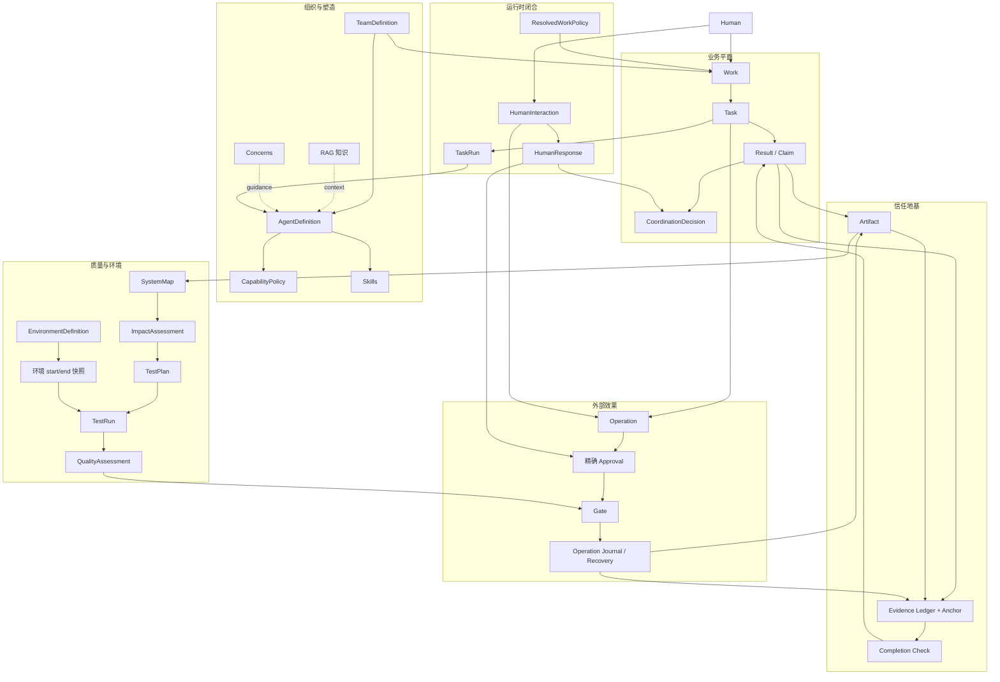

# Tiangong 证据型团队控制架构总览

> 状态：已达成共识的目标设计的执行摘要。本文不描述当前实现，也不授权任何交付声明。规范性合同见
> [`evidence-backed-team-control.zh.md`](evidence-backed-team-control.zh.md)。

## 定位

Tiangong 是面向自主 AI 团队的证据型控制架构：Leader 决定团队该做什么，专业 Agent 决定如何完成被委派的工作，确定性运行时边界负责执行身份、权限、授权、证据、完成认证与恢复。

它**约束而非编排**。没有固定的交付流水线，也没有通用工作流 DSL。

## 核心哲学

- **两个自主循环** —— Agent 自主完成一个 Task；Leader 自主规划并适应团队的工作。
- **简洁的业务平面** —— 用户和 Leader 主要围绕 `Work -> Task -> Result` 推理。
- **单一事实来源** —— 用不可变记录和精确 digest 替代重复的可变状态。
- **声明不等于证据（Claim ≠ Evidence）** —— 模型文本、Artifact、机器观测、Decision、Approval 和外部效果始终是不同的事实。
- **语义、合法性与策略分离** —— 代码拥有的 action 说明一条记录"是什么意思"，Guard 判断"现在是否合法"，Leader 决定"为什么、何时选它"。
- **Task 永不等待 Human** —— 缺输入或缺授权时产生终局 blocked Result；Leader 负责与人交互，之后创建新 Task。
- **不确定性被保留** —— 结果未知的外部效果在被特权 reconciliation 证明之前，不会被重试或描述为成功。

## 概念分层



### 业务平面

- **Work** 是一次持续演进的人类委托，由不可变的多个 revision 表示。
- **Task** 是对唯一责任 Agent 的一次不可变委派。
- **Result** 是 Task 唯一的不可变终局交付：completed、blocked 或 failed。
- **CoordinationDecision** 记录接受、拒绝、替换、带入（carry-forward）、取消、关闭和显式撤销。
- **Finding** 是 Result 内部的轻量结构化字段，不是独立的聚合对象。
- 没有通用的 Change 对象；代码、配置、文档和测试改动都是 Artifact 类型。

### 运行时闭合

- **TaskRun** 是一个已派发 Task 的唯一不可变运行时绑定；动态 Context 和工具事实仍是 Evidence 或 Artifact。
- **HumanInteraction** 是不可变的 Leader 到 Human 的合同，带有权威的 `inform`、`decide` 或 `authorize` 语义。HumanResponse 是独立的 Artifact，永远不修改请求。
- **ResolvedWorkPolicy** 在 Work 执行前完全物化 Team 默认值和合法的 Work override；运行时绝不读取可变的当前默认值。
- **Operation Journal** 以 append-only 方式维护幂等性、尝试、replay 和 reconciliation 状态，与 Evidence 分离。

### 信任地基

- **Artifact** 标识确切的交付字节及其 provenance。
- **Evidence** 记录受信机器边界观测到的有界事实。
- **Completion** 确定性检查 Task 的最低机器可证明合同。它是必要条件，但 Leader 或 Human 的语义验收是充分条件。
- 每个 Work 一个逻辑 Evidence Ledger，为多 Agent 事实提供统一顺序。签名 Anchor 保护关键 Evidence frontier 免受整链重写。

### 质量与环境

- **SystemMap** 将确切的源快照关联到代码、API、数据、业务旅程、部署、测试和环境 subject，同时保留已知缺口。
- **ImpactAssessment** 结合确定性依赖传播与显式带来源的语义推断及未知边界。
- **TestPlan** 将已接受的 Impact 转换为确切的质量义务、Core 测试、选定测试、环境和覆盖缺口。
- **TestRun** 绑定确切的 TestDefinition 和 subject Artifact 到配置、数据边界以及 start 和 end 两个 EnvironmentSnapshot。
- **QualityAssessment** 确定性检查一个语义上已接受的 TestPlan 是否用新鲜的通过证据被执行。
- **EnvironmentDefinition** 是权威和策略；EnvironmentSnapshot 是时间点的机器观测状态。环境 class 不规定固定发布流水线。

### 外部效果

- **Operation** 是一个确切的外部效果意图，来源于 Task 或正式的 HumanInteraction 投递。
- **Approval** 授权一个确切的 Operation。Human 有界授权和 standing policy 先派生出精确 Approval；它们绝不直接执行。
- **Gate** 在执行前检查 capability、policy、Approval、幂等性、恢复状态和即时前置条件。
- **Operation Journal** 提供 exactly-once 协调和安全 replay。
- 不确定的效果由模型不可访问的工具之外进行 reconciliation。外部补偿是一个新的 Operation，不是隐藏的回滚回调。

### 组织与行为塑造

- **TeamDefinition** 将恰好一个 Leader 和任意数量的已批准专业成员绑定到确切的 Agent 定义。
- **AgentDefinition** 组合稳定的责任指令、硬 CapabilityPolicy 和允许的 Skill 目录。
- **Skills** 教授方法，但不改变职业或权限。经典的多 Agent 方法是 Leader 协调 Skill。
- **RAG** 提供带 provenance 的项目和组织知识，作为不可信数据，永远不是权威。
- **Concerns** 提供 Agent 级或 Team 级的前瞻指导。它们是建议性的；任何必须阻断的规则属于 Gate 或 Completion。

## 端到端信任链

```text
Human 提出请求
  -> 认证输入 Evidence
  -> WorkSpec Artifact
  -> 不可变 Work revision

Leader 规划
  -> 绑定 Work、assignee、输入和已解析策略的不可变 Task
  -> 确切的 TeamDefinition 和 AgentDefinition
  -> dispatch 原子开启该 Task 唯一的不可变 TaskRun

Agent 自主工作
  -> 选定的 Skills + 带 provenance 的 RAG + Agent Concerns
  -> 受 Capability 和 Task 策略约束的工具
  -> 受信 wrapper 捕获 Evidence
  -> 产出成为不可变 Artifact

Agent 提交 Result
  -> 确定性 Completion Check
  -> 通过：封存 Result + completion Evidence
  -> 失败：在 Task 内继续
  -> 缺外部依赖：封存 blocked Result 并返回 Leader

Leader 审查
  -> Checkpoint 通过是必要条件
  -> 语义接受/拒绝是不可变的 CoordinationDecision
  -> Human 输入使用不可变的 inform/decide/authorize 交互
  -> 范围变化创建新的 Work revision，绝不修改原值

质量闭合交付声明
  -> SystemMap 绑定当前源和已知系统关系
  -> ImpactAssessment 识别直接、传递、推断和未知影响
  -> TestPlan 选择 Core、受影响、回归和风险要求的义务
  -> 每个 TestRun 绑定确切的 subject、test、config、data 和 start/end 环境状态
  -> QualityAssessment 聚合新鲜 Run，不隐藏失败或缺口

外部效果（需要时）
  -> Prepare Task 封存确切的 Operation 和 Proposal Artifact
  -> authorize HumanInteraction 呈现确切效果
  -> 认证的 HumanResponse 或 standing policy 产生精确 Approval
  -> 新的 Execute Task 调用 Gate
  -> Journal 在 backend 调用前开始
  -> receipt、postcondition、Evidence 和 Artifact 证明结果
  -> 不确定结果阻断重试并进入特权 reconciliation

Work 终结
  -> 当前 scope 已接受的 Result 和新鲜已 anchor 的 Evidence
  -> 成功完成或取消时无活跃或不确定的效果
  -> 失败可显式保留 recovery-required 不确定性
  -> 不可变的完成、失败或取消 Decision
  -> 面向 Human 的报告由已接受的 Artifact 和事实支撑
```

## 六个合同包

| 包 | 核心问题 | 核心边界 |
| --- | --- | --- |
| 协调核心 | 团队如何在没有固定工作流的情况下协作？ | Work、Task、Result、CoordinationDecision；不可变 scope 和局部 Guard |
| 信任与完成 | 团队如何证明发生了什么、产出了什么？ | Evidence、Anchor、Artifact、确定性 Completion 和 freshness |
| 效果与授权 | Agent 如何安全地触碰真实系统？ | Operation、精确 Approval、Gate、Journal、reconciliation 和补偿 |
| 组织与塑造 | 谁是 Agent、能做什么、行为如何被引导？ | TeamDefinition、AgentDefinition、Capability、TeamPolicy、Skills、RAG、Concern |
| 质量与环境 | 一个可信的测试或发布声明意味着什么？ | SystemMap、ImpactAssessment、TestPlan、确切的 TestRun 环境绑定、QualityAssessment |
| 运行时闭合 | 不可变合同在运行时如何组合和安全恢复？ | TaskRun、HumanInteraction、ResolvedWorkPolicy、正式 Operation Journal schema |

各包互相引用，但不合并权威：

```text
Skills/RAG/Concern 塑造行为
Capability/Gate 约束动作
Evidence 捕获事实
Completion 认证最低事实
Leader/Human 决定语义
Approval 授权确切效果
```

## 不可协商的不变量

1. 一个 Team 恰好有一个 Leader；专业 Agent 定义可扩展，不硬编码为五个角色。
2. Work、Task、Result、Decision、Artifact、Operation、Approval、TaskRun 和 HumanInteraction 不可变。
3. Task 有一个 assignee，至多一个封存的 Result；每个已派发 Task 恰好有一个不可变 TaskRun。
4. Task 永不等待 Human 输入或授权。
5. actor 和可信时间来自 Evidence，不是对象自报字段。
6. Claim、Artifact、Evidence、Decision、Approval 和 Operation 永远不能互相替代。
7. 所有权威引用绑定确切的 content digest。
8. Capability 默认拒绝，按交集计算；Prompt、Skills、RAG 和 Concern 不能扩大它。
9. Completion Checker 是确定性、无副作用、不调用模型的；indeterminate fail closed。
10. Result 封存后不能再接收新 Evidence；过期证明需要新的验证 Task。
11. 每次外部执行都有对应确切 Operation 的精确 Approval。
12. approval-required 永不挂起 Task 或 Matrix turn。
13. 执行在 backend 调用前持久化开始，并使用以 Operation 为中心的幂等键。
14. 已开始但无终局意味着结果不确定，并阻断自动重试。
15. 外部补偿是另一个显式 Operation。
16. Evidence 链经过验证和 anchor；篡改永远不被静默修复或截断。
17. TestRun 绑定确切的 subject Artifact、TestDefinition、TestPlan、配置、数据边界以及 start 和 end EnvironmentSnapshot。
18. cleanup 失败使 TestRun 保持红色；重试创建新 Run，永不抹去更早的失败。
19. 发布使用同一个不可变 Artifact 和新鲜的 satisfied QualityAssessment；重新构建是一个新 Artifact，需要新的证明。
20. Work 绑定完全物化的 ResolvedWorkPolicy；可变的当前默认值永远不改变既有权威。
21. HumanInteraction 和 HumanResponse 是分离的；decide 永远不替代 authorize。
22. 恢复从不可变记录重建权威，不依赖模型 transcript。
23. 面向 Human 的声明永远不超过已接受的 Result、可用的 Artifact 和已验证的 Evidence。

## 为什么这不是工作流平台

| 工作流中心设计 | Tiangong 控制设计 |
| --- | --- |
| 把工作建模为预定义的阶段图 | Leader 随事实涌现创建和调整 Task |
| 复杂度累积在工作流 DSL 和转换状态 | 业务平面保持 `Work -> Task -> Result` |
| 流程类型决定下一步必须做什么 | 局部 Guard 只判断提议的动作是否合法 |
| 模板成为运行时权威 | Leader Skills 和 RAG 提供非权威方法 |
| 灵活性需要给引擎加分支和循环 | 新的不可变 Task 自然表达并行和修订 |
| 完成常常是一个阶段转换 | Completion 用机器事实交叉检查 Claim |
| 授权附着在阶段上 | Approval 绑定一个确切的外部 Operation |
| 恢复靠猜测流程停在哪 | 不可变记录、Evidence 和 Journal 重建已知状态 |

Tiangong 确实有相当多的信任基础设施，因为安全地让 AI 修改真实系统需要证据捕获、不可变 Artifact、精确授权、幂等性和不确定性恢复。这些是逻辑上的持久化职责，不一定是分离的物理数据库。物理存储拓扑是实现决策，但必须保持上述合同。
