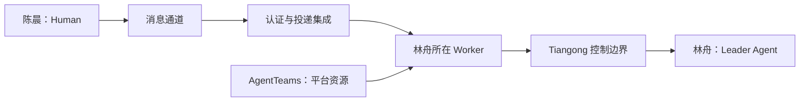

# 单元 01：一条消息怎样进入受控团队

[返回课程目录](README.md) | [下一单元：先给整件事一个稳定身份](02-one-request-one-work.zh.md)

> 本单元只解决入口和责任边界。此时还没有 Work、Task，也没有人开始改代码。

## 从陈晨按下“发送”开始

陈晨发出需求：

> 给商城增加取消订单功能。只有未发货、尚未开始拣货的订单可以取消；取消后恢复预占库存并记录原因；不要改变现有下单接口。先在测试环境验证，部署生产前让我确认。

日常说法通常是“AI 收到需求了”。这句话把五件不同的事压成了一件：

1. 消息平台保存了一个事件；
2. 通道集成认证并投递了它；
3. 某个 Worker 实际存在；
4. 一个模型驱动的 Agent 获得了受控上下文；
5. Tiangong 判断这个身份能否代表当前 Team 行动。

如果不拆开，后面很容易把“能看到消息”误当成“能调用工具”，或者把“房间管理员”误当成“生产批准人”。

## 先认清 Human、Agent 和模型

陈晨是系统外提出业务请求、补充事实或作出必要决定的人。Tiangong 把这类参与者称为 **Human**。

林舟是团队内负责理解整件事、按需派发工作并判断是否完成的模型驱动角色。Tiangong 把这类程序角色称为 **Agent**；其中负责整件 Work 语义协调的成员叫 **Leader**。

模型不是 Agent 的同义词：

```text
模型
  接收一次上下文并生成一次输出。

Agent
  具有身份、职责、会话、工具入口、运行边界和持续上下文，
  会多次调用模型，也可能在没有模型运行时等待 Human。
```

林舟可以理解“陈晨到底想要什么”，但不能靠一句模型输出给自己增加生产权限。

## Agent 在哪里运行

Agent 需要一个真正运行程序的地方，用来：

- 接收消息；
- 调用模型；
- 维护逻辑会话；
- 调用本地工具或外部 Adapter；
- 保存受控事实；
- 在等待时释放资源，并在之后恢复。

这个受管理的运行单元叫 **Worker**。

```text
Agent = 谁在承担职责和作判断
Worker = 这个 Agent 的控制程序实际在哪里运行
```

Worker 可以由进程、容器或其他隔离单元承载。物理形式不是本章重点；关键是“职责身份”和“运行位置”不能混淆。

## AgentTeams 与 Tiangong 各管什么

**AgentTeams** 管平台与集成层：

- Team、Worker 或容器是否真实存在；
- 平台身份和消息路由；
- 通道投递；
- 与共享存储的集成；
- 这些资源的生命周期。

**Tiangong** 管 Worker 内的专业控制：

- Human 的一条输入属于哪件 Work；
- 当前整件事怎样理解；
- Leader 把什么交给哪个成员；
- 每个成员实际可用哪些数据、工具和网络；
- 外部写入是否允许、是否需要精确 Approval；
- 发生超时后怎样恢复；
- 什么机器条件满足后才允许结束 Work。

一句话概括：

```text
AgentTeams 证明“这个平台资源和身份现在存在”。
Tiangong 决定“它在当前专业工作中能做什么”。
```

任何一边都不能假装替代另一边。

## 消息通道能证明什么

消息通道会提供经过认证的平台事件，例如：

```json
{
  "platformMessageId": "message-9001",
  "channelId": "room-commerce",
  "actorId": "human-chen",
  "text": "给商城增加取消订单功能……",
  "receivedAt": "2026-08-10T09:00:00Z"
}
```

它能帮助 Tiangong 确认：

- 谁通过哪个通道发送；
- 平台事件的稳定身份；
- 事件何时被接收；
- 同一事件是否因网络重试再次送达。

它不能单独证明：

- 这句话应该归入哪件业务事务；
- 陈晨是不是某类生产操作的当前授权人；
- 林舟有没有权访问某个仓库；
- 文字“可以上线”是否批准了某个精确部署。

通道身份是后续授权判断的输入，不是完整授权。

## 什么叫 Team

一组持续协作的 Agent 构成一个 **Team**。案例中可以有：

- 林舟：Leader，负责整体语义判断；
- 周明：可以承担实现、调试或集成；
- 乔安：可以承担 review、测试或 challenge。

这些专业描述帮助 Leader 选择成员，但 Kernel 不把它们编码成固定角色流程。周明也可以执行测试，乔安也可以写代码；是否这样安排由 Leader 根据当前 Work 判断。

每个 Team 恰好有一个 Leader。Leader 的权力是语义权力，不是万能机器权限。

## 消息走过的完整路径



逐步读：

1. 陈晨发送平台消息；
2. 通道保存稳定事件身份；
3. 集成层认证并投递；
4. AgentTeams 确认目标 Worker 和平台身份存在；
5. Tiangong 检查当前 Team 路由与身份；
6. 林舟在受控上下文中读取消息并开始理解。

走到这里，系统只得到一条经过认证来源的输入。没有 Task，没有 shell，也没有生产权限。

## 三个常见误解

### 误解一：房间管理员就是 Tiangong 管理员

房间权限只能说明通道能力。Tiangong 的成员能力、Approver 范围和 Operator 权限来自自己的当前配置与受控身份检查。

### 误解二：Worker 存在就能加入任意 Team

平台中可能有实验 Worker。没有当前 Team 的 MemberConfig 和路由，它不能开始受控行动。

### 误解三：Leader 负责最终判断，所以可以绕过代码

Leader 可以判断需求是否清楚、报告是否有用、Work 是否语义完成。路径、凭据、网络、并发和外部写入由代码硬控。两类权力故意分开。

继续阅读：[第 02 单元](02-one-request-one-work.zh.md)。
