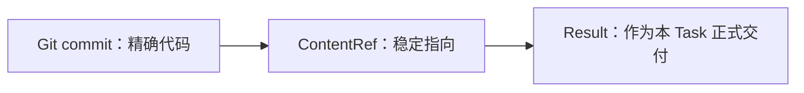

# 单元 07：“我做完了”怎样成为可接手报告

[上一单元：热执行环境、Bash 与网络边界](06-prepared-environment-and-bash.zh.md) | [返回课程目录](README.md) | [下一单元：机器实际看见了什么](08-tool-results-and-storage.zh.md)

## 一句“做完了”为什么不够

周明在 prepared environment 中完成实现、运行测试并创建本地 Git commit，然后对林舟说：

> 做完了，测试都通过了。

这句话仍然有几个缺口：

- 它属于哪个 Task；
- 最终代码是哪一个精确提交；
- 哪些测试调用实际发生；
- 有什么限制或已知缺口；
- 这是不是该 Task 唯一正式终态报告；
- session 被清理后怎样恢复交接。

Tiangong 不尝试把聊天中的一句自然语言自动升级成业务事实。Task assignee 必须通过受控入口提交正式 Result。

## 先固定真正要交接的内容

周明工作区包含很多临时状态：

- 未提交修改；
- 被撤回的实验；
- 构建产物；
- 本地数据库；
- 日志和缓存。

“看我的工作区”不是稳定交付，因为工作区会继续变化，也可能被回收。

代码先固定为精确 Git commit：

```text
repositoryId: service-a
commitSha:   def456
```

Tiangong 用 **ContentRef** 指向稳定内容。Git 内容引用是：

```json
{
  "repositoryId": "service-a",
  "commitSha": "def456"
}
```

它回答“是哪份代码”，不回答“代码是否正确”。

## 非 Git 内容怎样引用

假设另一个 Task 产出一份版本化调查报告。它由文档 Adapter 管理：

```json
{
  "adapter": "document-store@1",
  "ref": "document-42/version-4"
}
```

这里要求 Adapter 保证 `ref` 指向不可变或明确版本化的内容。Tiangong 不要求所有存储统一使用全局 SHA-256，也不建立通用内容归档平台。

普通可变路径：

```text
reports/latest.md
```

不能直接成为正式 deliverable。应先由对应 Adapter 创建快照或版本，再得到稳定 ContentRef。

显示名称和路径只帮助人阅读，不负责权威身份。

## Result 是 assignee 的唯一终态报告

周明提交：

```json
{
  "taskId": "task-implement-cancel-01",
  "summary": "实现取消条件检查、幂等释放预占库存和原因记录；单元测试通过。未执行共享仓库 push 或任何部署。",
  "deliverableRefs": [
    {
      "repositoryId": "service-a",
      "commitSha": "def456"
    }
  ],
  "toolResultRefs": [
    "tool-result-unit-test-21"
  ],
  "submittedBy": "member-zhou",
  "createdAt": "2026-08-10T12:00:00Z"
}
```

这份不可变终态报告叫 **Result**。

字段很少：

| 字段 | 含义 |
|---|---|
| `taskId` | 直接定位这次委托，也唯一定位它的 Result |
| `summary` | assignee 对做到了什么、没做到什么、限制与下一步的有界说明 |
| `deliverableRefs` | 可选，正式交付的稳定内容 |
| `toolResultRefs` | 可选，引用本 Task 中受控工具观察 |
| `submittedBy/createdAt` | 由受控 runtime 写入的 actor 和时间 |

## 为什么没有 Result ID

每个 Task 最多一个 Result。`taskId` 已经能够唯一定位：

```text
task-implement-cancel-01
→ 它的唯一 Result
```

再增加 `resultId` 只会产生第二个业务身份和更多引用转换，而没有解决新问题。

后续 Task 若要使用这份报告，可以引用原 Task ID；若要使用代码，则直接引用精确 ContentRef。

## 为什么没有 outcome 枚举

Result 是终态报告，不是平台判定的 success、blocked 或 failed 状态。

如果周明发现库存接口不存在，他仍可以提交：

```json
{
  "taskId": "task-investigate-inventory-01",
  "summary": "现有接口不支持按订单幂等释放。继续实现会产生重复释放风险；建议先由库存团队提供幂等接口。",
  "deliverableRefs": [],
  "toolResultRefs": ["tool-result-api-search-07"],
  "submittedBy": "member-zhou",
  "createdAt": "2026-08-10T10:30:00Z"
}
```

报告内容已经清楚表达未能继续及原因。平台不需要再维护一个容易与 prose 冲突的 outcome 字段。

Result 存在就表示这个 Task 的 assignee 已作终态交接。Leader可以派新 Task、换方案或停止 Work。

## 为什么没有 accept/reject

Result 保存“成员报告了什么”。林舟是否使用它，是后续语义判断，不需要再给 Result 加 disposition。

林舟可以：

- 认为报告足够，继续下一步；
- 认为有缺口，创建补充调查或修复 Task；
- 直接读取 commit 并选择 review/test Task；
- 判断目标无法继续并 `stop-work`；
- 在所有条件满足时 `complete-work`。

不修改 Result，也不建立通用“接受/拒绝报告”账本。

这样可以避免把 Leader 的判断、成员报告和机器观察混进同一个对象。

## 一个 Task 为什么最多一个 Result

如果同一 Task 可以提交多个“最终版本”，恢复时就不知道哪一份是正式交接。成员可以在提交前反复修改工作区和候选摘要；一旦 Result 创建：

- 不可修改；
- Task 不再继续执行；
- 不能提交第二份；
- 修正通过新 Task 完成。

这不是说第一次报告一定正确，而是让“当时的终态交接”只有一个稳定答案。

## ResultGuard 只检查机器能确定的事

`submitResult` 在数据库中创建 Result 前，代码检查：

- 当前 actor 是 assignee，且仍被 Team 接纳；
- Task 还没有 Result，也没有取消事实；
- summary 和引用满足有界 Schema；
- ContentRef 仍可访问且稳定；
- ToolResult 属于这个 actor 和 Task；
- 被引用 ToolResult 的 retention mark 已成功。

这段本地验证逻辑称为 **ResultGuard**。

它不判断：

- 代码质量是否足够；
- 测试是否全面；
- WorkSpec 是否满足；
- 产品体验是否正确；
- 是否必须再 review；
- summary 是不是“听起来像成功”。

这些要么由 Leader作语义判断，要么由 CI、仓库保护、Adapter 等最接近真实效果的代码检查。

## 为什么先做 ToolResult retention，再创建 Result

Result 若引用 `tool-result-unit-test-21`，而日志清理任务下一秒就删除它，引用会变成空壳。

安全顺序是：

```text
验证 ToolResult 归属和内容边界
→ 幂等增加 retention mark
→ 确认 retention 成功
→ 创建 Result
```

如果 retention 成功后、Result 创建前崩溃，只会多保留一点记录；重试仍安全。反过来先创建 Result，则可能留下无法追溯的引用。

ToolResult 的详细语义在下一单元展开。

## ContentRef 何时成为正式 deliverable

一个 commit 可能在工作区中存在，也可能被普通消息提到。只有当 Result 把它列入 `deliverableRefs`，它才成为这次 Task 的正式交付内容。



commit 证明内容身份；ContentRef 提供结构化定位；Result 说明成员把它作为哪次 Task 的交接。三者都不单独证明代码正确。

## 后续 review 或测试怎样使用它

林舟认为取消订单风险较高，于是创建普通 review Task：

```json
{
  "objective": "检查 def456 的幂等库存释放、权限和错误处理",
  "inputs": [
    {
      "repositoryId": "service-a",
      "commitSha": "def456"
    }
  ],
  "constraints": [
    "使用独立 worktree",
    "把明确问题和未覆盖风险写入最终 Result"
  ]
}
```

这不是 Kernel 强制验证链。Leader也可以创建测试 Task、challenge Task，或依赖 CI required check。每项专业工作仍提交普通 Result。

如果 review 发现问题，Leader创建修复 Task，产生新 commit 和新 Result。旧 Result 不删除也不改写。

## Result 与 Task 取消的区别

- assignee 提交 Result：说明这次 Task 有一份终态报告；
- Leader取消 Task：说明在没有 Result 的情况下终止委托。

两者在数据库中竞争：先提交 Result，取消失败；先取消，Result 提交失败。一个 Task 不会同时既有 Result 又被取消。

取消还必须先停止完整进程树、释放 writer，并安全处理 pending 或 started Operation。第 12 单元详细讲。

继续阅读：[第 08 单元](08-tool-results-and-storage.zh.md)。
