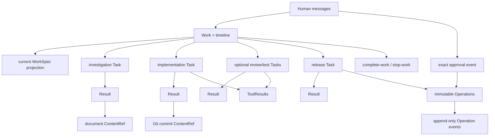

# 单元 14：把完整案例走一遍

[上一单元：谁决定整件事结束](13-work-closure.zh.md) | [返回课程目录](README.md)

## 先不用对象名，完整讲一遍故事

陈晨在团队通道提出取消订单需求。系统先确认消息来源、目标 Team 和平台事件身份，再把它作为一件独立事务保存。林舟没有让成员立刻开工，而是通过普通消息问清“未发货”、仓库拣货、库存类型和取消原因。

目标清楚后，林舟按当前需要把调查和实现交给周明。周明在自己的热执行环境里使用 Bash、Git 和测试工具，控制凭据与生产凭据始终不进入他的进程树。他用精确 Git commit 固定代码，再提交唯一终态报告。

林舟没有对报告写 accept/reject，也没有被固定流程强制安排下一阶段。考虑到库存幂等风险，他选择创建普通 review Task。乔安在另一个 worktree 检查精确 commit，发现一个并发缺口。林舟据此创建修复 Task，得到新的最终 commit；随后又按业务要求安排测试环境验证。

共享 Git push 以及测试、生产部署都会改变外部系统，因此不从 Bash 直接执行。版本化 Adapter 为每次写入创建不可变 Operation。新工作分支与测试环境按当前策略自动允许，但仍先记录执行开始并确认后置状态。生产 Operation 展示目标、精确 commit 和前置版本，陈晨通过认证动作只批准这一项 Operation。

Adapter 在调用生产后确认实际运行版本，写入成功 event。发布成员提交终态 Result。所有 Task 已有 Result 或取消事实，没有活跃进程、writer、pending Approval 或 unresolved Operation。CloseGuard 通过后，林舟判断当前 WorkSpec 已满足并执行 `complete-work`。

这条路径不是强制软件生命周期。它只是当前案例中 Leader根据风险作出的选择。另一个 Work 可以没有 review、没有代码、没有部署，甚至不需要创建任何 Task。

下面把故事逐步展开，并说明每一步怎样查询和恢复。

## 阶段一：消息进入并建立 Work

### 第 1 步：认证入口

```text
陈晨发送消息
→ 通道产生 platformMessageId = message-9001
→ AgentTeams 确认目标 Worker 与平台身份存在
→ Tiangong 检查 commerce-team route
→ 林舟在受控上下文中读取
```

同一个 `message-9001` 重放时返回同一处理结果。

### 第 2 步：原子创建 Work 与首条 timeline

```json
{
  "workId": "work-order-cancel-001",
  "teamId": "commerce-team",
  "epoch": 1,
  "workSpec": null,
  "createdBy": "human-chen",
  "createdAt": "2026-08-10T09:00:00Z"
}
```

此刻：

- 有稳定事务身份；
- 有原始 Human 消息；
- 没有 WorkSpec；
- 不能创建 Task；
- 没有任何机器能力因为消息而增加。

### 如果消息关联有歧义

系统会先创建占位 Work。Human确认属于另一个 open Work 后，原消息引用与确认追加到正确 Work，占位 Work 用 `work-stopped` 关闭。历史不删除，也不 merge 已产生的 Task 或外部效果。

主案例关联清楚，所以继续原 Work。

## 阶段二：澄清并形成当前 WorkSpec

### 第 3 步：普通消息澄清

林舟问清：

- 开始拣货是否禁止取消；
- 释放哪类库存；
- 用户和客服原因规则；
- 生产确认的范围。

等待陈晨时，系统可以释放 session 和计算资源，发送有界提醒，但不能自行填写答案。

### 第 4 步：追加完整 `work-spec-changed`

```json
{
  "goal": "允许取消未发货且尚未开始拣货的订单，并幂等释放预占库存",
  "scope": [
    "repository:service-a",
    "订单取消接口",
    "预占库存释放",
    "取消原因记录"
  ],
  "constraints": [
    "不改变现有下单接口",
    "用户原因只能使用预设值",
    "客服内部备注不返回普通用户",
    "生产部署需要陈晨批准精确 Operation"
  ],
  "doneWhen": [
    "合法取消只释放一次预占库存",
    "已发货或已开始拣货订单会被拒绝",
    "授权人员可以查询取消原因",
    "目标代码已在测试环境验证"
  ],
  "unresolvedAssumptions": [
    "库存服务支持按订单幂等释放"
  ]
}
```

timeline event、当前投影和 epoch `1 → 2` 原子提交。WorkSpec 是语义目标，不是权限表或机器 criterion。

## 阶段三：动态委托，而不是预建 DAG

### 第 5 步：调查 Task

林舟不知道库存接口能力，先创建普通调查 Task：

```json
{
  "taskId": "task-investigate-inventory-01",
  "workId": "work-order-cancel-001",
  "assigneeId": "member-zhou",
  "taskSpec": {
    "objective": "确认库存服务是否支持按订单幂等释放预占库存",
    "inputs": [
      {
        "repositoryId": "service-a",
        "commitSha": "abc123"
      }
    ],
    "constraints": ["只读调查", "不访问生产数据库"]
  },
  "createdBy": "leader-lin",
  "createdAt": "2026-08-10T09:40:00Z"
}
```

Task 创建与 `task-created` fact、理由和 epoch 更新一起提交。

### 第 6 步：当前能力交集

周明开始 turn 前，runtime 检查：

```text
AgentTeams 当前身份和 route
∩ enterprise ControlProfile
∩ 周明 enabled MemberConfig
∩ 当前 Task/cwd/root runtime binding
```

TaskSpec 的“只读调查”约束周明的语义行为，但不会给他生产访问权。

### 第 7 步：在 prepared environment 调查

周明进入已准备环境：

- 精确 fetch/checkout `service-a@abc123`；
- 复用匹配 image/toolchain/lockfile 的缓存；
- Bash 进程树看不到模型、通道、session、pending Operation、生产 credential 和 host control；
- 网络只允许精确 Git fetch、package 与命名测试服务；
- 工作区由当前 Task 单独持有 writer。

他发现库存服务已有合适接口，提交 Result：

```json
{
  "taskId": "task-investigate-inventory-01",
  "summary": "确认库存服务支持按 orderId 幂等释放预占库存；接口和错误语义见文档引用。",
  "deliverableRefs": [
    {
      "adapter": "document-store@1",
      "ref": "inventory-api-note/version-1"
    }
  ],
  "toolResultRefs": ["tool-result-search-07"],
  "submittedBy": "member-zhou",
  "createdAt": "2026-08-10T10:20:00Z"
}
```

没有 outcome，也不需要 Leader accept。

林舟使用这份报告时，不修改 Result，而是把当前 WorkSpec 中已经确认的假设清掉：追加一份完整 `work-spec-changed` 快照，其中 `unresolvedAssumptions` 变为 `[]`，同时更新当前投影并推进 epoch。这样当前目标卡不会继续把已确认事实显示成未知。

### 第 8 步：实现 Task

输入真正可用后，林舟创建实现 Task，引用调查内容和基线 commit。周明完成代码与本地测试，形成：

```text
service-a@def456
```

ToolResult 记录受控 Bash 的输入摘要、cwd、commit、exit code 和有界结果。Result 把 commit 列为 deliverable：

```json
{
  "taskId": "task-implement-cancel-01",
  "summary": "实现取消条件、幂等库存释放和原因记录；128 项测试通过，未执行任何共享写入。",
  "deliverableRefs": [
    {
      "repositoryId": "service-a",
      "commitSha": "def456"
    }
  ],
  "toolResultRefs": ["tool-result-unit-test-21"],
  "submittedBy": "member-zhou",
  "createdAt": "2026-08-10T12:00:00Z"
}
```

ResultGuard 只检查身份、唯一性、Schema、ContentRef、ToolResult 归属与 retention，不判定代码质量。

## 阶段四：按风险选择 review、修复与测试

### 第 9 步：Leader选择普通 review Task

库存释放有明显并发风险。林舟创建：

```text
objective
  review service-a@def456 的重复请求、并发更新、权限与错误处理

inputs
  精确 commit def456

constraints
  使用独立 worktree；报告明确问题和未覆盖风险
```

这不是 Kernel mandatory verification，也没有 verification Result 类型。

乔安在自己的 prepared environment 中 review，提交普通 Result：

```json
{
  "taskId": "task-review-cancel-01",
  "summary": "发现同一订单并发取消时，库存释放调用可能在状态写入前执行两次；建议用事务内状态转换和幂等键封住。其他检查未发现阻断问题。",
  "deliverableRefs": [],
  "toolResultRefs": ["tool-result-review-tests-31"],
  "submittedBy": "member-qiao",
  "createdAt": "2026-08-10T13:00:00Z"
}
```

### 第 10 步：修复产生新 commit

林舟认为问题重要，创建修复 Task。周明产生：

```text
service-a@fed789
```

旧 `def456` 和旧 Result 保持不变。后续只使用新 commit。

企业若要求 merge 前 review/CI，真实硬门由 branch protection、CI required check 或 Git Adapter检查 `fed789`，而不是由通用 Kernel假设所有 Work 都需要某种验证对象。

### 第 11 步：不预建尚无输入的验收 Task

此时 `fed789` 已经存在，但测试环境还没有运行它。林舟不会先创建一个只能猜测环境状态的等待节点。他先结合最新 Result 和当前 CI 观察决定进入发布；等 staging Operation 真正确认成功后，再创建测试环境验收 Task。

这正是动态委托与预建 DAG 的区别：计划可以先存在，正式 Task 等输入和责任边界真实可用时再创建。

## 阶段五：外部写入都变成 Operation

### 第 12 步：创建发布 Task

发布没有被偷偷塞进周明原实现 Task。林舟创建新 Task，输入是精确 `fed789`，约束先测试环境后生产，并要求生产动作走 exact Approval。

### 第 13 步：把 commit 写入共享 Git

本地 commit 已经是稳定 ContentRef，但共享 Git 写入仍是外部效果。发布成员先创建：

```json
{
  "operationId": "op-git-push-200",
  "taskId": "task-release-cancel-01",
  "adapter": "git-write@1",
  "action": "push",
  "request": {
    "repositoryId": "service-a",
    "targetRef": "refs/heads/tiangong/order-cancellation-001",
    "commit": "fed789",
    "expectedTargetCommit": null
  },
  "preview": "将 service-a@fed789 推送为新的共享分支 refs/heads/tiangong/order-cancellation-001；仅当该分支尚不存在时执行。",
  "createdBy": "member-release",
  "createdAt": "2026-08-10T14:05:00Z"
}
```

当前策略允许自动创建这个受限工作分支。Git Adapter 仍要先记录 execution start，再使用内部 credential 执行，并确认远端 ref 精确指向 `fed789` 后才能写 success。若企业要求 branch protection 或 required CI，后续合并/发布 Adapter会查询这些系统对同一 commit 的当前结果。

### 第 14 步：测试环境 Operation

```json
{
  "operationId": "op-stage-201",
  "taskId": "task-release-cancel-01",
  "adapter": "deploy@1",
  "action": "deploy",
  "request": {
    "target": "staging-a",
    "repositoryId": "service-a",
    "commit": "fed789",
    "expectedCurrentVersion": "staging-41"
  },
  "preview": "将 service-a@fed789 部署到 staging-a；仅当当前版本为 staging-41 时执行。",
  "createdBy": "member-release",
  "createdAt": "2026-08-10T14:20:00Z"
}
```

ControlProfile 当前分类为自动允许。自动允许仍执行：

```text
current Gate checks
→ append operation-execution-started
→ Adapter call with op-stage-201 idempotency key
→ Adapter read-back verifies staging-a runs fed789
→ append operation-succeeded
```

staging Operation 确认成功后，林舟才创建测试环境验收 Task，输入明确绑定 `staging-a` 与 `service-a@fed789`。乔安或其他成员通过受控只读/测试工具执行验收并提交普通 Result；角色名不影响 Kernel。

ToolResult 记录测试观察，Operation event 记录部署外部效果，两者不混写。林舟结合专业 Result、ToolResult 和当前 CI 观察决定是否继续生产 Operation。

### 第 15 步：创建生产 Operation

```json
{
  "operationId": "op-production-202",
  "taskId": "task-release-cancel-01",
  "adapter": "deploy@1",
  "action": "deploy",
  "request": {
    "target": "production-a",
    "repositoryId": "service-a",
    "commit": "fed789",
    "expectedCurrentVersion": "release-41"
  },
  "preview": "将 service-a@fed789 部署到 production-a；仅当当前版本仍为 release-41 时执行。",
  "createdBy": "member-release",
  "createdAt": "2026-08-10T15:00:00Z"
}
```

request 与 preview 包含所有效果字段。部署 credential 只在 Adapter 内认证，不进入 Operation、Bash、prompt 或 ToolResult。

### 第 16 步：exact Approval

runtime 把实际 bounded preview 发送给陈晨并保存 delivery metadata。陈晨通过认证 action批准：

```json
{
  "eventType": "operation-approved",
  "operationId": "op-production-202",
  "actorId": "human-chen",
  "createdAt": "2026-08-10T15:08:00Z"
}
```

普通聊天“可以上线”不具备这项权威。Approval只允许尝试，不证明部署成功。

### 第 17 步：再次检查并执行

执行前重新确认：

- 当前 identity、Team和 MemberConfig；
- 当前 ControlProfile 与 approver policy；
- runtime binding；
- Operation仍不可变且 pending；
- production-a 仍为 `release-41`；
- Approval未过期；
- Task和 Work仍打开。

然后先 append `operation-execution-started`，再调用后端。

## 阶段六：成功路径与未知路径

### 主路径：Adapter确认成功

部署 API 返回后，Adapter只读查询 production-a，确认所有实例运行 `fed789`，再 append：

```text
operation-succeeded
```

发布成员获得有界工具结果，提交发布 Task 的 Result：

```json
{
  "taskId": "task-release-cancel-01",
  "summary": "staging-a 验收完成；production-a 的 Operation op-production-202 已由 Adapter确认运行 service-a@fed789。",
  "deliverableRefs": [
    {
      "repositoryId": "service-a",
      "commitSha": "fed789"
    }
  ],
  "toolResultRefs": ["tool-result-stage-acceptance-45"],
  "submittedBy": "member-release",
  "createdAt": "2026-08-10T15:30:00Z"
}
```

Result 的文字不是部署权威；真实外部状态仍由 Operation events 给出。

### 备选路径：调用后 timeout

如果 started 后 timeout：

```text
无法确认状态
→ operation-uncertain
→ 阻止 production-a 冲突写、Task隐藏性取消和 Work termination
→ recovery controller/Operator 使用特权只读 reconciliation
```

可能结果：

- 确认 `fed789` 已运行：append succeeded；
- 确认未应用且无遗留效果：append safe-failure，若仍要部署则创建新 Operation；
- 确认部分应用：append recovery-needed，创建受控恢复 Operation；
- 仍未知：保持 uncertain并升级 Operator。

Human说“风险我承担”或工单已转 incident 都不能把未知变成已知。

## 阶段七：关闭 Work

### 第 18 步：检查所有 Task

当前 Task列表：

```text
调查库存接口        → Result
初次实现 def456     → Result
review def456        → Result
修复为 fed789       → Result
测试环境验收        → Result
发布                 → Result
```

若有不再需要且尚无 Result 的 Task，Leader必须先停止完整进程树并取消。Result与 cancellation不能同时存在。

### 第 19 步：CloseGuard

CloseGuard确认：

- 林舟仍是 Leader，Work仍打开；
- 当前 WorkSpec 非空；
- 每个 Task有 Result或 cancellation fact；
- 没有 active turn/process/writer；
- `op-git-push-200`、`op-stage-201` 和 `op-production-202` 都是 known terminal；
- 没有 pending Approval、uncertain、recovery-needed或 unresolved incident；
- `fed789` 和文档 ContentRef仍可解析。

它不判断取消订单体验是否好，也不判断林舟是否应该继续优化。

### 第 20 步：Leader作语义决定

林舟根据当前 WorkSpec、报告、工具观察和外部状态判断：

- 合法取消行为已交付；
- 拣货和发货限制已实现；
- 库存释放幂等缺口已修复；
- 原下单接口未改变；
- 测试环境完成验证；
- 陈晨批准的精确生产动作已确认成功。

于是提交：

```text
complete-work
reason: 当前 WorkSpec 已满足，目标 commit fed789 已完成测试环境验证并在 production-a 确认生效。
```

`work-completed` timeline fact、终结投影和 epoch 原子提交。Work不会重开；新需求创建新 Work。

## 最终关系图



箭头表示可查询关系，不表示每个 Work必须按固定顺序经过所有节点。

## 拿到一个 ID 后怎样查询

### 从 Work ID 开始

```text
Work current projection
├─ current WorkSpec
├─ timeline：Human/Leader消息、work-spec-changed、task-created、task-cancelled、terminal fact
├─ all Tasks
├─ each Task's Result
└─ all Operations and events
```

适合回答：当前目标是什么、谁派了哪些工作、为什么尚未关闭。

### 从 Task ID 开始

```text
Task
├─ immutable TaskSpec
├─ assignee
├─ current runtime/execution observation
├─ ToolResults
├─ Operations created by this Task
└─ zero or one Result / cancellation fact
```

适合回答：成员当时被委托什么、有哪些工具观察、最终如何交接。

### 从 commit 开始

```text
repositoryId + commitSha
→ 哪些 Task input 引用它
→ 哪些 Result deliverable 引用它
→ 哪些 review/test/release Task 使用它
→ 哪些 Operation request 准备或已经发布它
```

commit 只确定内容；质量、CI、报告和部署状态要沿各自来源查询。

### 从 ToolResult ID 开始

```text
ToolResult
├─ actor / Work / Task
├─ tool / requestSummary / resultSummary
├─ outputRef
├─ timestamps
└─ 哪个 Result 引用并延长 retention
```

适合回答受控工具直接观察了什么，不应外推成业务真理。

### 从 Operation ID 开始

```text
immutable Operation
├─ taskId / adapter@version / action
├─ typed request
├─ actual risk preview + delivery metadata
├─ approval/rejection event
├─ execution-started
├─ success / safe-failure / uncertain / recovery-needed
└─ reconciliation or recovery events
```

适合回答 Human批准了什么、外部调用是否开始、真实状态如何确认、是否仍有恢复责任。

## 最终术语表

| 名称 | 一句话解释 |
|---|---|
| Human | 系统外提出请求、补充事实或作精确决定的人 |
| Agent | 由模型驱动、有身份、职责、上下文和受控工具的程序角色 |
| Worker | Agent控制程序实际运行的受管理单元 |
| AgentTeams | 管平台 Team、Worker、身份、通道投递和存储集成 |
| Team | 持续协作的一组 Agent，恰好一个 Leader |
| Leader | 负责 Work 语义理解、动态委托和最终完成判断的 Agent |
| Work | 一整件持续事务的稳定身份和 timeline 容器 |
| WorkSpec | Leader对整件 Work当前目标的完整快照式理解 |
| Task | 一次已正式派发、绑定一个 assignee 的不可变委托 |
| TaskSpec | 该 Task 的 objective、inputs 和普通语言 constraints |
| TeamConfig | Team identity、Leader、route 与 ControlProfile选择 |
| MemberConfig | 成员实际职责、数据、网络、工具、Adapter、模型、预算和并发能力 |
| ControlProfile | 企业机器能力与 Operation policy 的上限，不是专业流程图 |
| runtime binding | 把当前 actor/Task/cwd/root/target 连接到实际能力的句柄 |
| Skill | 治理过的方法默认和可复用代码，不授予权限 |
| prepared environment | 与 Worker控制域隔离、可复用并可回收的本地执行环境 |
| ContentRef | 对精确 Git commit 或 Adapter-owned version 的稳定引用 |
| Result | 一个 Task最多一份的 assignee不可变终态报告 |
| ResultGuard | `submitResult` 内只检查机器可确定条件的本地验证逻辑 |
| ToolResult | 一次顶层工具调用的有界、不可变机器观察 |
| Adapter | 外部系统的版本化 typed、credential、scope、verification 与 reconciliation 边界 |
| Operation | 一项不可变、完整可展示的拟议外部写入 |
| exact Approval | 认证 Human针对一个 Operation ID 的批准或拒绝 event |
| reconciliation | 使用特权只读 Adapter把本地事件与外部状态对账 |
| Work epoch | 防止陈旧协调判断覆盖新事实的乐观并发 token |
| requestId | 协调命令响应丢失时返回原结果的重放身份 |
| CloseGuard | Work终结前扫描全部机器安全条件的代码检查 |

## 系统最重要的保证

不用背正式设计中的编号，也应能说清：

1. 每个 Work从认证、去重的 Human消息开始；
2. 歧义输入不会静默混入旧 Work，纠错不删除历史；
3. WorkSpec变化保存完整 timeline 快照；
4. WorkSpec为空不能创建 Task；
5. TaskSpec和 assignee不可变；
6. Kernel没有固定角色、阶段、DAG或 mandatory verification；
7. 每个 Task最多一个 active execution owner和一个 Result；
8. Result与 cancellation原子竞争；
9. prose、Skill、RAG、tool output和 MCP output不能授予能力；
10. Bash进程树读不到 control/production credential或 host control；
11. 同一 writable root永远只有一个 active writer；
12. 广泛搜索出口与核心私有源码不交给同一成员；
13. 每个外部写都是 request和风险 preview完整可见的不可变 Operation；
14. chat不是 Approval，Approval只绑定一个 Operation ID；
15. 外部调用前先记录 execution start；
16. success/safe-failure只有 Adapter确认后置事实后才能写；
17. unresolved Operation不能盲重试、隐藏取消或随 Work关闭；
18. 后续 retry或 rollback通常是新 Operation；
19. Operation events永久保留，被 Result引用的 ToolResult按 Work retention保留；
20. Work closure要求所有 Task、Operation、进程和 writer安全收口；
21. 语义完成只由 Leader判断；
22. 新硬控制必须证明具体威胁、机器可验证性和额外摩擦。

## 怎样继续读正式设计

建议按已经走过的因果顺序阅读：

1. [范围、信任边界与设计原则](../evidence-backed-team-control.md#2-scope-and-trust-boundary)
2. [Work、WorkSpec 与 Human communication](../evidence-backed-team-control.md#5-work-workspec-and-human-communication)
3. [Task 与 Result handoff](../evidence-backed-team-control.md#6-task-delegation-and-result-handoff)
4. [Team、能力、Skill 与上下文](../evidence-backed-team-control.md#7-team-capability-skills-and-context)
5. [prepared execution environment](../evidence-backed-team-control.md#8-prepared-execution-environments)
6. [Bash、网络与 Adapter](../evidence-backed-team-control.md#9-tools-network-and-adapters)
7. [Content 与 ToolResult](../evidence-backed-team-control.md#10-content-and-execution-records)
8. [Operation 与 exact Approval](../evidence-backed-team-control.md#11-operations-and-exact-approval)
9. [session、并发、预算与 closure](../evidence-backed-team-control.md#12-sessions-concurrency-budgets-and-closure)
10. [安全模型](../evidence-backed-team-control.md#13-security-model)
11. [系统不变量](../evidence-backed-team-control.md#14-system-invariants)

正式设计定义合同，教程只负责建立心智模型。实现时应按纵向切片同时落下数据、能力检查、事务、恢复和确定性测试，不能只创建同名对象就声称完成。

## 累积小结：现在可以从头讲完整套系统

完成全课程后，你应能不依赖术语表讲出：

1. 一条 Human消息如何经过认证通道、AgentTeams 和 Tiangong路由进入正确 Leader；
2. 为什么先创建 Work而不是直接执行，平台消息如何去重，歧义关联怎样用占位 Work纠正；
3. Leader怎样通过普通对话形成 WorkSpec，为什么未知答案保持未知，为什么完整快照与当前投影是同一事实；
4. 为什么 WorkSpec、TaskSpec、消息和 Skill都不能授予机器权限；
5. Leader怎样根据真实输入动态创建普通 Task，而不是让 Kernel规定固定角色、阶段、DAG和验证流程；
6. AgentTeams身份、ControlProfile、MemberConfig与 runtime binding怎样共同形成实际能力；
7. 为什么 Agent可以拥有好用的热环境和 Bash，同时完整进程树仍读不到 control state、生产 credential和任意网络；
8. 如何用精确 commit和 ContentRef交接内容，用唯一 Result表达成员终态报告，用 ToolResult表达机器观察；
9. 为什么这些事实不能互相代替，也不需要复制进第二套 evidence ledger；
10. 为什么所有外部写必须由 Adapter创建不可变 Operation，效果字段必须在 typed request和 preview中完整可见；
11. Human怎样对一个 Operation ID作 exact Approval，为什么普通聊天、WorkSpec和 Result都不能授权；
12. 为什么 external call必须 started-before-call，Adapter怎样区分 known terminal与 unresolved；
13. uncertain/recovery-needed为什么会阻止冲突写、取消和 Work终结，以及 reconciliation、Operator和新 recovery Operation怎样处理；
14. message ID、requestId、Work epoch、operationId、single active execution和 single writer分别防住哪一种重复或竞态；
15. Task cancellation、Result竞争、session释放、模型 fallback和 budget耗尽怎样不制造虚假业务事实；
16. CloseGuard怎样确认机器事实全部安全收口，Leader又怎样独立作出 complete-work或 stop-work的语义判断；
17. 为什么终结后的 Work不重开，为什么新硬 Gate必须先证明真实威胁与机器可验证性。

如果中间任何一步只能说出对象名、却说不出它防止的具体错误，请回到对应章节的“朴素做法为什么失败”和“累积小结”。

## 全课程最终自检

1. 平台认证身份为什么不等于 Tiangong能力？
2. 一条歧义消息错误新建 Work后，为什么不删除或 merge？
3. WorkSpec变化后，已经派发的 Task怎样得到必要背景，又为何不能自动改变？
4. 企业强制 review应该怎样在不膨胀通用 Kernel的情况下落地？
5. Bash可以运行任意本地命令，为何仍不能 push、部署或泄露核心源码？
6. ContentRef、Result、ToolResult和 Operation event分别是什么事实？
7. Result没有 outcome和 accept/reject时，Leader如何表达继续、修复或采用？
8. exact Approval为什么不需要第二个业务对象或 digest？
9. timeout 后为什么既不能立即重试，也不能直接报告失败？
10. safe-failure必须由什么确认？
11. Work epoch和 requestId为什么不能互相替代？
12. Task cancellation为什么必须先停止完整进程树并处理 Operation？
13. Human愿意承担风险为什么不能关闭 uncertain Work？
14. CloseGuard能检查什么，永远不该替 Leader判断什么？
15. 什么样的新硬控制才值得进入 Kernel？

如果这些问题都能用“取消订单”案例完整回答，你已经建立了这套目标架构的核心因果模型。
