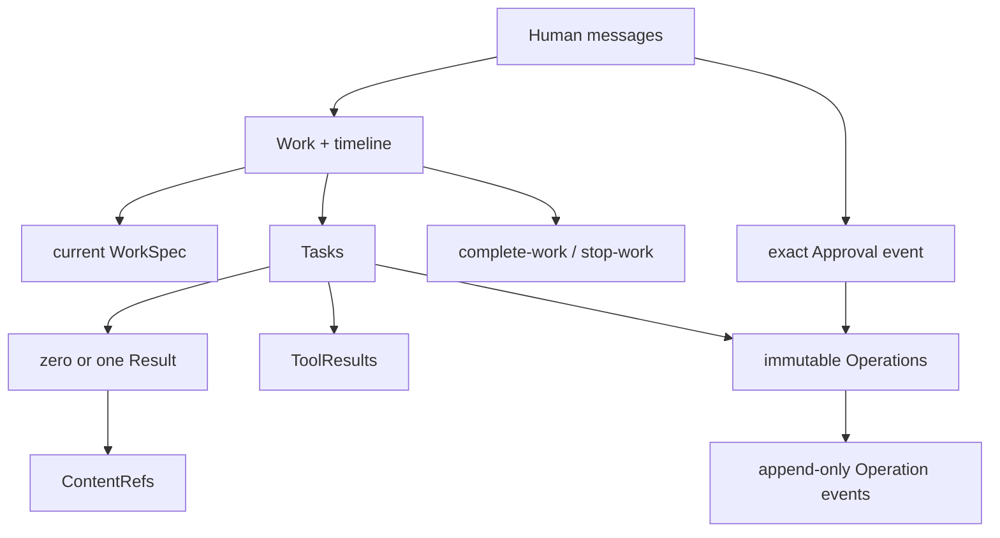

# 单元 14：把完整案例走一遍

[上一单元：谁决定整件事结束](13-work-closure.zh.md) | [返回课程目录](README.md)

本章把前面的对象串成一条路径。它不是强制软件生命周期：另一个 Work 可以没有 review、代码或部署，Leader 只在输入和风险需要时创建 Task。

## 1. 消息进入并建立 Work

陈晨发送取消订单需求后：

```text
认证消息事件（platformMessageId = message-9001）
→ AgentTeams 确认 Worker 与平台身份存在
→ Tiangong 检查 Team route
→ 林舟读取消息
→ 原子创建 Work 与第一条 timeline 记录
```

```json
{
  "workId": "work-order-cancel-001",
  "teamId": "commerce-team",
  "epoch": 1,
  "workSpec": null,
  "createdBy": "human-chen"
}
```

同一 `platformMessageId` 重放时返回原结果，不创建第二个 Work。此时系统只有稳定事务身份和原始消息；`workSpec` 为空，所以不能创建 Task，消息也没有增加任何机器能力。

若消息与旧 Work 的关联有歧义，系统先创建占位 Work。Human 确认后，把消息引用追加到正确 Work，并以 `work-stopped` 关闭占位 Work；不删除历史，也不把已经产生的 Task 或外部效果自动 merge。

## 2. 澄清并形成 WorkSpec

林舟通过普通消息问清拣货限制、库存类型、取消原因和生产确认要求。等待回复时可以释放 session 和计算资源，但不能自行补答案。

明确后，林舟追加完整 `work-spec-changed` 快照：

```json
{
  "goal": "允许取消未发货且尚未开始拣货的订单，并幂等释放预占库存",
  "scope": ["repository:service-a", "订单取消接口", "库存释放", "原因记录"],
  "constraints": [
    "不改变现有下单接口",
    "用户原因只能使用预设值",
    "客服内部备注不返回普通用户",
    "生产部署需要陈晨批准精确 Operation"
  ],
  "doneWhen": [
    "合法取消只释放一次库存",
    "已发货或已开始拣货的订单会被拒绝",
    "目标代码已在测试环境验证"
  ],
  "unresolvedAssumptions": ["库存服务支持按订单幂等释放"]
}
```

事件、当前投影和 epoch 更新原子提交。WorkSpec 表达当前语义目标，不授予仓库、网络或生产权限，也不会自动修改已派发的 Task。

## 3. 动态委托与本地执行

林舟先创建调查 Task，而不是预建“分析 → 实现 → review → 测试 → 发布”整张 DAG：

```json
{
  "taskId": "task-investigate-inventory-01",
  "workId": "work-order-cancel-001",
  "assigneeId": "member-zhou",
  "taskSpec": {
    "objective": "确认库存服务是否支持按订单幂等释放预占库存",
    "inputs": [{"repositoryId": "service-a", "commitSha": "abc123"}],
    "constraints": ["只读调查", "不访问生产数据库"]
  }
}
```

Task 与 TaskSpec 创建后不可变。每次 turn 和工具调用的有效能力是：

```text
AgentTeams 当前身份与 route
∩ ControlProfile
∩ MemberConfig
∩ 当前 runtime binding
```

TaskSpec 的文字只能约束委托，不能扩大这个交集。

周明在 prepared environment 中精确 checkout `service-a@abc123`。Bash 可以正常搜索、编译和测试，但整个进程树看不到模型、通道、session、pending Operation、生产凭据或宿主控制端点；网络和 writable root 也受当前 binding 限制。

调查确认接口可用后，周明提交唯一 Result。林舟据此更新 WorkSpec，把已确认假设从 `unresolvedAssumptions` 中移除，再创建实现 Task。实现产出精确 commit：

```text
service-a@def456
```

受控测试保存 ToolResult；周明的 Result 引用 commit 和测试观察：

```json
{
  "taskId": "task-implement-cancel-01",
  "summary": "实现取消条件、幂等库存释放和原因记录；128 项测试通过，未执行共享写入。",
  "deliverableRefs": [{"repositoryId": "service-a", "commitSha": "def456"}],
  "toolResultRefs": ["tool-result-unit-test-21"],
  "submittedBy": "member-zhou"
}
```

这里三类事实不能互换：

- commit/ContentRef 标识具体内容；
- Result 记录成员对该 Task 的终态报告；
- ToolResult 记录受控工具实际观察到什么。

ResultGuard 检查身份、唯一性、引用和 retention，不判断代码质量。

## 4. Leader 按风险追加工作

林舟认为库存并发风险较高，于是创建普通 review Task。乔安在独立 worktree 检查 `def456`，报告并发取消可能重复触发库存释放。林舟再创建修复 Task，得到：

```text
service-a@fed789
```

旧 commit 和旧 Result 保持不变，后续 Task 使用新 commit。Review 和修复不是 Kernel 固定阶段；若企业要求 required review 或 CI，真正硬门由 branch protection、CI 或目标 Adapter 检查精确 commit。

## 5. 外部写入、Operation 与 Approval

本地 commit 不会改变共享系统。Git push、staging 部署和 production 部署都必须通过版本化 Adapter 创建不可变 Operation。

例如生产部署：

```json
{
  "operationId": "op-production-202",
  "taskId": "task-release-cancel-01",
  "adapter": "deploy@1",
  "action": "deploy",
  "request": {
    "target": "production-a",
    "repositoryId": "service-a",
    "commit": "fed789",
    "expectedCurrentVersion": "release-41"
  },
  "preview": "将 service-a@fed789 部署到 production-a；仅当当前版本仍为 release-41 时执行。",
  "createdBy": "member-release"
}
```

所有决定效果的字段都在 typed request 中，并忠实显示在 bounded preview。部署凭据只在 Adapter 内认证，不进入 Bash、prompt、Operation 或 ToolResult。

ControlProfile 可以自动允许受限 Git push 和 staging 部署，但它们仍遵循：

```text
当前 Gate 检查
→ 持久化 operation-execution-started
→ Adapter 调用（operationId 作为后端幂等键）
→ 只读确认后置状态
→ 写入 known terminal event
```

生产 Operation 需要 exact Approval。runtime 把实际 preview 交付给陈晨并保存 delivery metadata；陈晨通过认证 action 追加：

```json
{
  "eventType": "operation-approved",
  "operationId": "op-production-202",
  "actorId": "human-chen"
}
```

普通聊天“可以上线”没有授权效果。Approval 只允许在精确条件下尝试，不证明调用已经开始或部署已经成功。执行前还要重新检查当前 identity、policy、binding、Approval 有效期和生产前置状态。

Adapter 确认所有实例运行 `fed789` 后，才追加 `operation-succeeded`。发布 Result 可以描述这一结论，但外部状态的权威历史仍是 Operation events。

## 6. 如果执行后 timeout

`operation-execution-started` 之后 timeout，系统不能猜测失败，也不能重放原调用：

```text
无法确认状态
→ operation-uncertain
→ 阻止冲突写、隐藏性 Task 取消和 Work 终结
→ recovery controller / Operator 通过特权只读 reconciliation 对账
```

对账结果：

| 观察 | 处理 |
|---|---|
| 确认目标后置状态 | 原 Operation 追加 `operation-succeeded` |
| 确认未应用且无遗留效果 | 追加 `operation-safe-failure`；若仍要执行，创建新 Operation |
| 确认部分或错误效果 | 追加 `operation-recovery-needed`，通过新 Operation 恢复 |
| 仍无法确认 | 保持 `operation-uncertain` 并升级 Operator |

Human 接受风险、模型表达信心或 incident 工单已有人接手，都不能把未知变成已知。事后 rollback 也是新 Operation；只有预先写进原 request 和 preview 的同次调用立即补偿，才属于原 Operation。

## 7. 关闭 Work

主路径最终包含调查、实现、review、修复、测试环境验收和发布 Task。关闭前，每个 Task 必须有 Result 或 cancellation fact；取消尚未报告的 Task 时，先停止完整进程树、释放 writer，并处理其 Operation。

CloseGuard 检查：

- 林舟仍是 Leader，Work 仍打开；
- `complete-work` 时 WorkSpec 非空；
- 所有 Task 已报告或取消；
- 没有 active turn、进程树或 writer；
- 所有 Operation 均为 `not-executed`、`succeeded` 或 `safe-failure`；
- 没有 pending Approval、uncertain、recovery-needed 或未解决恢复路径；
- 所有正式 deliverable 引用仍可解析。

CloseGuard 只判断机器是否安全收口。林舟再根据 WorkSpec、Result、ToolResult 和 Operation facts 判断业务目标是否满足，并提交：

```text
complete-work
reason: 当前目标已满足，service-a@fed789 已在测试环境验证并在 production-a 确认生效。
```

`work-completed`、终结投影和 epoch 原子提交。Work 不再重开；后续需求创建新 Work。若业务不再继续，则使用 `stop-work`，但同样必须先通过机器收口检查。

## 关系图



箭头表示可查询关系，不表示固定执行顺序。

## 从常见 ID 开始查询

| 起点 | 主要查询内容 |
|---|---|
| Work ID | 当前 WorkSpec、timeline、全部 Task/Result、全部 Operation 和关闭原因 |
| Task ID | 不可变 TaskSpec、assignee、ToolResult、Operation、Result 或 cancellation |
| commit | 哪些 Task 输入或 Result 引用它，哪些 review/test/release Task 和 Operation 使用它 |
| ToolResult ID | actor、Work/Task、工具输入摘要、观察结果、输出引用和 retention |
| Operation ID | typed request、实际 preview、Approval/rejection、execution start、终态与恢复记录 |

commit 只确定内容，ToolResult 只确定工具观察，Operation event 只确定外部动作的受控进展；查询界面不应把它们压成一个泛化“证据”字段。

## 核心术语

| 名称 | 含义 |
|---|---|
| Work / WorkSpec | 整件事务的身份与 timeline / Leader 对当前目标的完整快照 |
| Task / TaskSpec | 一次绑定 assignee 的不可变委托 / objective、inputs、constraints |
| ControlProfile / MemberConfig / runtime binding | 企业上限 / 成员实际能力 / 当前动作的能力句柄 |
| prepared environment | 与控制域隔离、可复用并可回收的本地执行环境 |
| ContentRef / Result / ToolResult | 稳定内容引用 / 成员终态报告 / 顶层工具观察 |
| Adapter / Operation | 外部系统的版本化受控边界 / 一项不可变外部写入提议 |
| exact Approval | 认证 Human 对一个 Operation ID 的决定事件 |
| reconciliation | 使用特权只读 Adapter 对账未知外部状态 |
| Work epoch / requestId | 防陈旧协调写 / 协调命令响应重放 |
| CloseGuard | Work 终结前扫描机器安全条件的代码检查 |

## 必须保持的边界

1. 平台身份、专业授权、模型判断和执行位置是不同事实。
2. WorkSpec、TaskSpec、消息、Skill、检索和工具输出都不能授予机器能力。
3. TaskSpec 与 assignee 不可变；每个 Task 最多一个 active execution owner 和一个 Result。
4. Bash 进程树读不到 control/production credential；同一 writable root 只有一个 writer。
5. Result、ToolResult 和 Operation event 分别保存声明、工具观察和外部效果，不互相代替。
6. 每项外部写都是 request 与 preview 完整可见的不可变 Operation；聊天不是 Approval。
7. 外部调用前先持久化 execution start；unknown 不能靠重试、声明或时间变成已知。
8. unresolved Operation 阻止冲突写、隐藏性取消和两种 Work 终结。
9. CloseGuard 判断机器收口，Leader 判断语义完成；终结后的 Work 不重开。
10. 新硬控制只有在能说明具体威胁、代码验证方式和额外摩擦时才进入 Kernel。

## 继续读正式设计

建议依次阅读正式设计中的：[范围与信任边界](../evidence-backed-team-control.md#2-scope-and-trust-boundary)、[Work 与 WorkSpec](../evidence-backed-team-control.md#5-work-workspec-and-human-communication)、[Task 与 Result](../evidence-backed-team-control.md#6-task-delegation-and-result-handoff)、[能力与上下文](../evidence-backed-team-control.md#7-team-capability-skills-and-context)、[执行环境与工具](../evidence-backed-team-control.md#8-prepared-execution-environments)、[Operation 与 Approval](../evidence-backed-team-control.md#11-operations-and-exact-approval)、[并发与关闭](../evidence-backed-team-control.md#12-sessions-concurrency-budgets-and-closure)以及[系统不变量](../evidence-backed-team-control.md#14-system-invariants)。

正式设计定义合同，教程只负责建立心智模型。实现时不能只创建同名对象就声称行为已经落地。
