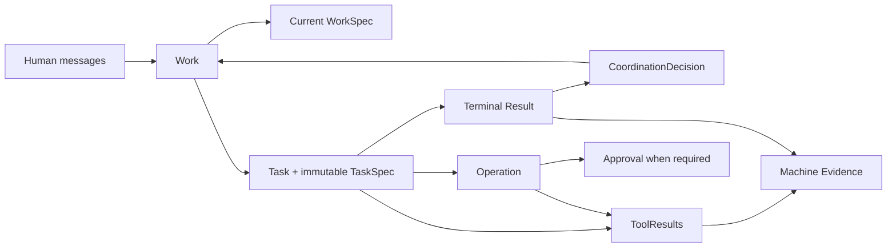

# Evidence-backed team control architecture

> Status: standalone target design. This document defines Tiangong's intended
> control architecture. It is not an implementation-conformance claim.

## 1. Why this design

An earlier proposal explored a comprehensive control model with pervasive
content identities, layered manifests, multiple linked ledgers, and explicit
objects for most workflow and audit concerns. Tiangong did not select that
approach because its complexity would make ordinary coordination harder,
increase failure modes, and move semantic judgment from autonomous agents into
framework machinery.

This design follows one thesis:

> Data structures help an AI team understand, coordinate, and hand off work.
> The runtime deterministically enforces identity, permission, dangerous side
> effects, independent verification, and machine-verifiable safety boundaries.
> The Leader retains semantic judgment.

The result is an autonomous team inside a small, explicit control envelope. It
is an evidence-backed control architecture, not a workflow engine.

## 2. Scope and deployment assumptions

Tiangong coordinates professional AI team members that can:

- receive and clarify a Human request;
- establish a shared Work goal;
- delegate bounded Tasks;
- use tools in isolated execution contexts;
- hand off versioned content;
- independently verify selected results;
- perform controlled external operations;
- recover safely from interruption and uncertain outcomes; and
- report the result and remaining limitations to the Human.

### 2.1 Deployment model

One Tiangong deployment serves one enterprise. An enterprise may operate many
Teams, but the deployment is not a shared security boundary for mutually
untrusting enterprises.

Within that enterprise, Tiangong enforces:

- Team membership and routing;
- Work-scoped context separation;
- member-specific capabilities and tool permissions;
- Task-scoped workspace access;
- exact approval for configured operations; and
- separation of duties where required.

Enterprise administrators and host administrators are trusted. Ordinary
append-only history supports operations and audit, but Tiangong does not claim
cryptographic resistance to a trusted administrator changing the database or
host filesystem.

### 2.2 Ownership boundary

AgentTeams owns the Team, Worker, container, Matrix, and shared-storage
integration layer. When OpenClaw carries Matrix traffic, OpenClaw owns Matrix
login, encryption, room behavior, synchronization, and delivery mechanics.

Tiangong owns the Worker control plane:

- Work, Task, Result, and coordination semantics;
- professional member behavior;
- context assembly and model invocation;
- tool registration and isolation;
- ControlProfile enforcement;
- approval, operation, idempotency, and recovery;
- Execution Records and Machine Evidence; and
- Result and Work closure guards.

A channel identity is an authenticated input to Tiangong policy. An upstream
owner flag, room role, message, prompt, or model statement does not itself grant
Tiangong authority.

### 2.3 Permanent non-goals

Tiangong does not provide:

- one deployment shared by mutually untrusting enterprise tenants;
- cryptographic proof against a trusted database or host administrator;
- a content-addressed archival and deduplication platform;
- a universal workflow language or fixed software-delivery pipeline;
- proof that a model cognitively understood the material it read;
- a general distributed resource-lease framework;
- a mandatory domain model for every test, environment, report, or knowledge
  object; or
- authorization derived from prompts, retrieved prose, Skills, or Task text.

## 3. Design principles

### 3.1 Semantic authority belongs to the Leader

The Leader decides:

- whether a request is clear enough to start;
- what the current Work goal means;
- which Tasks are useful;
- which member should receive a Task;
- whether a Result is semantically adequate;
- whether to ask the Human, try another approach, or stop; and
- whether the Work should complete, fail, or be cancelled.

The runtime does not encode a mandatory sequence of professional activities.

### 3.2 Machine boundaries belong to code

Code enforces facts that must not depend on model judgment:

- authenticated identity and Team membership;
- route, workspace, path, and tool permissions;
- unique Task assignment and Result submission;
- separation of duties;
- exact subject identity for verification;
- external-operation classification and approval;
- idempotency and outcome-uncertainty handling;
- existence and ownership of cited ToolResults and ContentRefs; and
- Profile-defined Result and Work closure requirements.

A Guard reports a concrete missing machine condition. It does not decide the
semantic quality of the work.

### 3.3 Facts remain distinct

Tiangong treats these as different facts:

1. **model prose or a claim** — what an Agent says;
2. **coordination state** — what authenticated actors decided;
3. **Execution Record** — what a controlled runtime boundary observed;
4. **Machine Evidence** — which verified records support a key conclusion;
5. **Approval** — what an authorized Human precisely allowed; and
6. **external state** — what an Adapter can establish about a target system.

No category silently substitutes for another.

### 3.4 Autonomy is assisted, not orchestrated

Coordination Skills, professional Skills, templates, and Concerns help members
make better decisions. They do not create authority or force the Team through a
predefined graph. The Leader may follow a recommended structure, reorder it,
skip it, or depart from it when the Work requires another approach.

### 3.5 Uncertainty is a first-class safety result

When an external request may have taken effect but the outcome cannot be
confirmed, the Operation is `uncertain`. Tiangong neither retries it nor
presents it as success. Reconciliation establishes the next safe action.

## 4. Core model

The business model is deliberately small:



The core records are:

- `Work` and its current `WorkSpec`;
- `Task` and its immutable `TaskSpec`;
- `Result`;
- `CoordinationDecision`;
- `ContentRef`;
- `ToolResult` and `MachineEvidence`;
- `Operation` and `Approval`; and
- `ControlProfile`, `TeamConfig`, and `MemberConfig`.

These are records and configurations. They do not imply one service per type.

## 5. Work and Human communication

### 5.1 Creating a Work

An authenticated Human message enters through the channel integration. The
platform message identifier provides ingress deduplication.

- A message explicitly associated with an open Work is appended to that Work's
  timeline.
- A message without a clear Work association creates a new Work and its first
  timeline entry in one transaction.
- Ambiguous input defaults to a new Work so that unrelated context is not
  silently mixed.
- Attachments use ContentRefs; ordinary text remains an ordinary message.

A Work may initially contain only the Human's request. It need not begin with a
fully structured goal.

### 5.2 Forming the WorkSpec

The Leader may clarify the request over several messages. When the Leader
judges that the Team has enough information to begin meaningful work, it forms
a concise WorkSpec.

A WorkSpec expresses:

- the intended result;
- known scope;
- necessary constraints;
- ordinary-language completion conditions; and
- explicitly unresolved assumptions when they matter.

A minimal Work projection can look like this:

```json
{
  "workId": "work-123",
  "teamId": "team-a",
  "epoch": 7,
  "workSpec": {
    "goal": "Deliver the requested behavior safely",
    "scope": ["repository service-a"],
    "constraints": ["preserve the public API"],
    "doneWhen": ["the behavior works", "independent verification is available"]
  },
  "createdBy": "human-42",
  "createdAt": "2026-08-08T10:00:00Z"
}
```

`doneWhen` contains semantic guidance for the Leader. It is not a set of
machine criterion identifiers that every Task must map onto.

Human confirmation is risk-sensitive:

- the Leader continues clarifying material ambiguity;
- high-risk or materially changed goals require explicit confirmation when the
  ControlProfile or the Leader judges it necessary; and
- a clear, low-risk request may proceed after the Leader communicates its
  understanding.

### 5.3 Updating the WorkSpec

The WorkSpec is the current description of the Work. The Leader may update it
as understanding changes.

Every update appends a `work-spec-changed` timeline event containing:

- the authenticated actor;
- the time;
- the reason;
- enough data to reconstruct the new current WorkSpec; and
- the relevant Human message or Leader rationale.

The current WorkSpec is a mutable projection of this immutable history. A Work
`epoch` provides optimistic concurrency control: a coordination write succeeds
only against the epoch it read, then increments the epoch in the same
transaction.

An update does not change a Task already dispatched. If the new goal is a
separate undertaking, the Leader creates a new Work and may record an ordinary
relationship in the timeline.

### 5.4 Ordinary Human communication

Clarification, progress updates, scope discussion, blocker reports, and final
summaries are Work messages. They do not grant machine authority.

The only Human interaction with direct execution authority is an exact
Approval for an Operation. A ControlProfile may also require an authenticated
Human confirmation before Work closure; that confirmation remains a Work
timeline fact, not an open-ended tool authorization.

A coordination Skill normally helps the Leader's final message identify the
outcome, formal deliverables, independent verification, external Operations and
Approvals, and remaining risks. This is communication guidance rather than a
closure protocol. Channel delivery uses the platform message identifier for
retry deduplication and produces a bounded delivery Execution Record.

## 6. Task delegation and Result handoff

### 6.1 Dispatching a Task

A Task is created only when the Leader formally dispatches it. Task creation,
its TaskSpec, assignment, the `create-task` CoordinationDecision, and the Work
epoch update are atomic.

A minimal Task is:

```json
{
  "taskId": "task-456",
  "workId": "work-123",
  "assigneeId": "member-9",
  "taskSpec": {
    "objective": "Implement the agreed behavior",
    "inputRefs": [
      {
        "kind": "git-commit",
        "repositoryId": "service-a",
        "commitSha": "4f1c2d..."
      }
    ],
    "constraints": ["do not change the public API"]
  },
  "executionContext": {
    "workspaceId": "workspace-task-456",
    "baseRef": {
      "kind": "git-commit",
      "repositoryId": "service-a",
      "commitSha": "4f1c2d..."
    }
  },
  "createdAt": "2026-08-08T10:15:00Z"
}
```

The TaskSpec contains only the objective, inputs, and necessary constraints. It
does not carry a member role or a list of machine permissions. The Task binds
one `assigneeId`, and that member must belong to the Work's Team.

Task and TaskSpec are immutable after dispatch. A materially different
objective or assignee produces a new Task. Additional background may be sent as
context, but it cannot silently alter the existing delegation.

### 6.2 Semantic delegation and machine authority

TaskSpec is the semantic delegation. Machine authority is the intersection of:

```text
code-owned tool boundary
∩ ControlProfile
∩ TeamConfig routing
∩ MemberConfig
∩ Task execution context
∩ recognized narrowing constraints
```

Natural-language instructions can narrow expected behavior but can never add a
tool, credential, path, target, or operation permission.

### 6.3 Result contract

A Task may have no Result and may have at most one terminal Result. The Agent
may explore, edit, retry, and test before submission. Once created, the Result
is immutable.

```json
{
  "resultId": "result-789",
  "taskId": "task-456",
  "outcome": "completed",
  "summary": "Implemented the requested behavior",
  "deliverableRefs": [
    {
      "kind": "git-commit",
      "repositoryId": "service-a",
      "commitSha": "9ab73e..."
    }
  ],
  "toolResultRefs": ["tool-result-21"],
  "machineEvidenceRefs": ["machine-evidence-8"],
  "verification": null,
  "submittedBy": "member-9",
  "createdAt": "2026-08-08T11:00:00Z"
}
```

`outcome` is one of:

- `completed` — the assignee claims to have completed the Task;
- `blocked` — the assignee cannot safely or meaningfully continue; or
- `failed` — the attempt reached a known unsuccessful terminal result.

Waiting for an exact Approval is not a blocked Result. It is a temporary
projection derived from a pending Operation.

An independent verification Result may populate:

```json
{
  "verification": {
    "subjectRef": {
      "kind": "git-commit",
      "repositoryId": "service-a",
      "commitSha": "9ab73e..."
    },
    "verdict": "pass",
    "toolResultRefs": ["tool-result-33", "tool-result-34"],
    "knownGaps": []
  }
}
```

### 6.4 Accepting and rejecting Results

The Leader reviews a submitted Result after it passes ResultGuard.

- `accept-result` means the Result is a truthful and useful terminal handoff for
  that Task.
- Acceptance does not change `blocked` or `failed` into success.
- `reject-result` means the handoff is semantically inadequate or inconsistent
  with the Task's intent.
- A rejected Task remains closed; further work uses a new Task.

Work completion is a separate Leader decision based on the current WorkSpec,
accepted Results, and CloseGuard.

### 6.5 Task state projection

User interfaces may project these states:

| Projection | Derived fact |
|---|---|
| `queued` | The Task exists and has no active execution. |
| `running` | The assignee has active Task-scoped execution. |
| `waiting_approval` | A non-terminal Operation for the Task awaits exact Approval. |
| `submitted` | The Task has a terminal Result and no Leader disposition. |
| `accepted` | The Result has an `accept-result` decision. |
| `rejected` | The Result has a `reject-result` decision. |
| `cancelled` | A Task without a Result has a `cancel-task` decision. |

These views are derived from authoritative records and execution state. They do
not define a mandatory professional workflow.

### 6.6 Cancellation and races

Task cancellation follows these rules:

- a Task with a Result receives `accept-result` or `reject-result`, not
  `cancel-task`;
- a pending Approval is terminated in the same transaction as `cancel-task`,
  and later approval commands are rejected;
- an Operation with `execution_started` or `uncertain` must first reach a known
  state through completion, reconciliation, or a controlled stop or rollback;
  any stop or rollback that changes external state must be covered by the exact
  pre-authorized plan or submitted as a new Operation;
- an active isolated runner is stopped and confirmed stopped before the Task is
  cancelled; and
- concurrent Result submission and cancellation use the database transaction
  winner: a committed Result prevents cancellation, and committed cancellation
  prevents Result creation.

Late Results, approvals, and messages cannot change terminal Task or Work
records.

## 7. Coordination decisions and Work closure

CoordinationDecision is the append-only spine of Leader authority.

```json
{
  "decisionId": "decision-12",
  "workId": "work-123",
  "action": "accept-result",
  "taskId": "task-456",
  "resultId": "result-789",
  "reason": "The handoff is complete and independently supported",
  "actorId": "leader-1",
  "createdAt": "2026-08-08T11:20:00Z"
}
```

The first action set is:

| Action | Direct subject | Meaning |
|---|---|---|
| `create-task` | `taskId` | Atomically dispatch the referenced Task. |
| `accept-result` | `taskId`, `resultId` | Accept a truthful terminal handoff. |
| `reject-result` | `taskId`, `resultId` | Reject an inadequate terminal handoff. |
| `cancel-task` | `taskId` | End a Task that has no Result. |
| `complete-work` | `workId` | Close the Work as semantically complete. |
| `fail-work` | `workId` | Close the Work with a known unsuccessful outcome. |
| `cancel-work` | `workId` | Intentionally stop the Work. |

Every decision carries a bounded reason, authenticated actor, and timestamp.
The runtime validates action-specific fields and legality. Decision creation and
Work epoch advancement are atomic.

A mistaken non-terminal decision remains in history and is followed by the next
valid decision. A terminal Work decision is final. Additional needs create a
new Work.

WorkSpec changes are Work timeline events, not CoordinationDecision actions.
Approval decisions and Operation events have their own precise records.

## 8. Team and configuration

### 8.1 TeamConfig

A Team has exactly one Leader and any number of members.

```json
{
  "teamId": "team-a",
  "leaderId": "leader-1",
  "memberIds": ["leader-1", "member-9", "member-10"],
  "routeScope": ["matrix-room-a", "repository:service-a"],
  "controlProfileId": "control-standard"
}
```

The Kernel has no fixed professional-role enumeration. Member configurations
may describe implementation, verification, operation, security, design, or
other cohesive professional responsibilities. A ControlProfile can require
specified duties to be performed by different members.

### 8.2 MemberConfig

MemberConfig provides:

- member identity and professional responsibility;
- capabilities;
- allowed tool and Adapter families;
- accessible repositories and data scopes;
- available professional and coordination Skills;
- model preferences within the allowed provider set; and
- member-specific concurrency or budget limits.

Task records do not copy these values. Runtime authorization evaluates current
configuration on every controlled action.

### 8.3 ControlProfile

ControlProfile is the enterprise-controlled hard-rule entry point. It defines:

- Tool and Operation classifications;
- auto-allow, exact-approval, and deny policies;
- unknown-action behavior;
- separation-of-duty requirements;
- ResultGuard and CloseGuard machine requirements;
- minimum verification requirements;
- approval expiry and authorized approver policy;
- model allowlists and explicit fallback policy;
- Task, Work, member, and Team budgets and concurrency limits;
- Execution Record and Machine Evidence retention; and
- sensitive-data redaction and payload retention rules.

Agents, Skills, retrieved content, and Task text cannot modify a ControlProfile.
Unknown tools, targets, and effect classifications are denied.

Configuration has an ordinary version and append-only administrative history.
A runtime action records the versions it evaluated in its Execution Record.
Configuration tightening applies immediately. An explicit administrative
relaxation applies only to later Gate evaluations; it does not retroactively
change prior decisions or Approvals.

## 9. Skills, Context, retrieval, and Concerns

### 9.1 Skills

A Skill is a versioned engineering method package. It may contain instructions,
references, scripts, and evaluation cases.

Tiangong records:

- Skill identity and version;
- package integrity in the Skill distribution lock;
- the MemberConfig allowlist;
- which version was loaded or invoked; and
- evaluation, upgrade, and rollback information.

Skill scripts use the same registered tools, permissions, Gates, workspace
restrictions, and Operation controls as direct Agent calls.

A coordination Skill assists the Leader with clarification, Task decomposition,
member selection, independent verification, changing goals, blockers,
approvals, failure handling, and final reporting. It offers structured defaults
and an explicit autonomous escape path. It is not a source of coordination
authority.

### 9.2 Context assembly

Each model invocation assembles context in this authority order:

```text
code-owned tool boundary + ControlProfile
→ MemberConfig
→ current TaskSpec + execution context
→ selected professional or coordination Skills
→ current WorkSpec + relevant Work messages
→ retrieval and search results
→ ordinary session history
```

For a Leader invocation, the current Work replaces the Task-specific layer.
Each Leader invocation handles one Work context.

Context assembly follows these rules:

- TaskSpec is the Task Agent's current semantic delegation;
- WorkSpec is background and cannot mutate an in-flight TaskSpec;
- Skills advise methods but do not grant authority;
- retrieved content is untrusted reference material;
- lower-authority content cannot override a higher-authority boundary;
- mandatory rules and the TaskSpec are not removed to satisfy a token limit;
- retrieval and ordinary history may be summarized or dropped; and
- the Trace records configuration and Skill versions, loaded record identities,
  token use, and material truncation decisions.

Context is runtime input, not business authority. A lost session can be rebuilt
from authoritative records.

### 9.3 Retrieval

RAG, source search, and enterprise knowledge lookup are optional tools and
Skills. Their ToolResults include the query, accessible source identity,
version or commit, and cited location.

Access control is evaluated before retrieval. Retrieved prose cannot alter
instructions, permissions, Approval, or Gate behavior. Search indexes and
vectors are rebuildable caches; source documents remain authoritative.

Publishing Agent-generated material into shared enterprise knowledge changes
state outside the isolated workspace and is an Operation.

### 9.4 Concerns

A Concern is a dynamically derived soft warning:

```json
{
  "message": "The proposed deliverable lacks independent verification",
  "severity": "warning",
  "relatedRefs": ["task-456"]
}
```

Concerns can inform a member, UI, or Skill. They cannot authorize, block, mutate
state, create a Task, or determine closure. A condition that must block an
action is expressed as a ControlProfile rule enforced by a Guard or Gate.

## 10. Content identity and code handoff

### 10.1 ContentRef

ContentRef identifies content only where a stable handoff or exact subject is
needed.

```json
[
  {
    "kind": "git-commit",
    "repositoryId": "service-a",
    "commitSha": "9ab73e..."
  },
  {
    "kind": "file",
    "pathOrUrl": "reports/verification.md",
    "sha256": "6f61c0..."
  }
]
```

Git content uses the repository identity and commit SHA. Non-Git files use a
readable path or URL and SHA-256. A consumer confirms that the referenced
content exists, is authorized, and matches the stated identity before use.

A ContentRef becomes a formal deliverable when a Result lists it in
`deliverableRefs`. Formality is the Result-to-content relationship; it does not
create another content container.

WorkSpec, TaskSpec, Result, messages, and decisions use their normal record
identities. Content hashes are reserved for boundaries that require exact
content identity. An Operation uses its own exact operation digest.

### 10.2 Code handoff

A code-producing member works freely inside its Task workspace. Before
submitting a formal code Result, it creates a Git commit.

An independent verifier:

1. uses a separate clean workspace;
2. checks out the same repository and commit SHA;
3. reads and tests that exact commit through controlled tools;
4. records ToolResults against that commit; and
5. submits a verification Result whose subject is that commit.

A later external release or deployment uses the same verified commit or an
explicitly verified integration commit. A commit proves content identity, not
correctness.

### 10.3 Parallel code work

Parallel code Tasks use separate worktrees or workspaces, an explicit base
commit, and separate output commits.

When outputs must be combined, the Leader creates an ordinary integration Task
whose inputs are those commits. The assignee merges or rebases, resolves
conflicts, runs tests, and creates a new commit. A different member verifies the
new final commit. Potential overlap may be surfaced as a Concern, but integration
must never silently overwrite one Task's output.

Local integration inside the isolated workspace is ordinary Task execution.
Publishing it to a shared repository is an Operation.

## 11. Execution Records and Machine Evidence

### 11.1 Execution Record

Execution Record is the broad observability layer:

- Trace;
- bounded logs;
- ToolResults;
- model invocation metadata;
- Skill invocation metadata; and
- delivery diagnostics.

Trace may be sampled. ToolResults used by Machine Evidence are retained for the
applicable Work audit period and cannot disappear through Trace sampling.

### 11.2 ToolResult

Every controlled tool call produces a bounded ToolResult, including reads and
commands that are not Operations.

```json
{
  "toolResultId": "tool-result-33",
  "workId": "work-123",
  "taskId": "task-verify-1",
  "actorId": "member-10",
  "toolName": "command",
  "adapterId": "isolated-runner",
  "adapterVersion": "1",
  "inputSummary": {
    "argv": ["npm", "test"],
    "cwd": "workspace/service-a",
    "repositoryId": "service-a",
    "commitSha": "9ab73e..."
  },
  "outcome": "success",
  "outputSummary": {
    "exitCode": 0,
    "summary": "All tests passed"
  },
  "outputRef": null,
  "startedAt": "2026-08-08T11:05:00Z",
  "completedAt": "2026-08-08T11:06:00Z"
}
```

A read ToolResult records source version, path, and relevant range without
copying the entire source. A command ToolResult records the sanitized argv,
working directory, subject commit when applicable, exit status, and a bounded
output summary. Large output is stored separately and referenced.

Credentials, raw sensitive write payloads, unrestricted prompts, and unsafe log
content do not enter ToolResults. Redaction preserves stable diagnostic meaning
without exposing secrets.

A ToolResult proves what the controlled tool boundary observed. It does not
prove that the model understood the input, that an external backend is honest,
or that a successful command establishes semantic correctness.

### 11.3 Machine Evidence

MachineEvidence is a small, runtime-created index of validated execution facts.

```json
{
  "machineEvidenceId": "machine-evidence-8",
  "workId": "work-123",
  "taskId": "task-verify-1",
  "type": "verification-executed",
  "subjectRef": {
    "kind": "git-commit",
    "repositoryId": "service-a",
    "commitSha": "9ab73e..."
  },
  "toolResultRefs": ["tool-result-33", "tool-result-34"],
  "actorId": "member-10",
  "createdAt": "2026-08-08T11:10:00Z"
}
```

An Agent may nominate ToolResults when submitting a Result. Code validates that
they belong to the Task, actor, workspace, and exact subject, then creates the
MachineEvidence record. Agents cannot directly create Machine Evidence.

The runtime automatically creates Machine Evidence for actual Operations,
Approval outcomes, reconciliation, and rollback facts required by the
ControlProfile.

Machine Evidence contains bounded references and exact subjects. Detailed
output remains in the Execution Record store. Its append-only behavior is an
ordinary trusted-store property under the deployment threat model.

## 12. Tools, Adapters, and isolation

### 12.1 Registered tool boundary

Every model-accessible tool comes from the Tiangong registry and executes
through the Tiangong wrapper. The wrapper owns:

- input validation;
- authenticated actor and Task association;
- Team, member, and workspace authorization;
- Gate evaluation;
- timeout and output bounds;
- ToolResult creation;
- Operation routing where applicable; and
- sanitized failure reporting.

A prompt, Skill, extension callback, or model-selected server cannot bypass this
boundary.

### 12.2 Adapter contract

An Adapter declares:

```text
adapter identity and version
input and output schemas
read-only or Operation effect class
supported target scope
timeout behavior
bounded error classification
safe ToolResult projection
credential handling
```

An Operation Adapter additionally supports the applicable subset of:

```text
precondition check
idempotent execution
result confirmation
reconciliation
precise rollback
```

Local functions, HTTP APIs, CLI wrappers, and MCP servers may implement this
contract. MCP is a transport option, not the authorization model. Adapter
identity and version are recorded in ToolResults rather than copied into Work
or Task records.

Credentials remain inside the Adapter or model gateway boundary and are
injected in memory. They are not made available to model context, TaskSpec,
Skills, command arguments when a safer interface exists, ToolResults, Machine
Evidence, or diagnostics.

### 12.3 Isolated runner

Each Task receives an independent workspace. Filesystem tools enforce the
workspace root and reject path escape, symlink traversal, runtime state paths,
and credential-bearing paths.

Runner commands have explicit:

- workspace and environment scope;
- resource and time limits;
- network policy;
- environment-variable allowlists;
- output limits and sanitization; and
- cancellation behavior.

A general command runner cannot carry credentials or network access that would
let an external write bypass a structured Operation Adapter. Calls within one
session are serialized; parallelism occurs across independently scoped Tasks.

## 13. Operations and exact Approval

### 13.1 Operation boundary

An Operation is a controlled action that may change shared or external state
outside the Task's isolated workspace.

Typical Operations include:

- pushing to a shared Git repository;
- creating or merging a pull request;
- publishing a package or image;
- deploying or rolling back a service;
- changing a shared database, configuration, cloud resource, or ticket;
- sending a message outside the enterprise boundary;
- publishing shared enterprise knowledge;
- deleting shared or external resources; and
- rotating a credential.

Reads, searches, model calls, isolated edits, local builds and tests, internal
record writes, internal Work messages, and read-only external queries are
ordinary tool calls.

Deployment configuration defines the isolated-workspace boundary and identifies
shared repositories, branches, environments, services, APIs, and other targets.
The model cannot classify its own effect as harmless.

An environment is deployment configuration, identified by an environment ID,
risk label, allowed Adapters and members, credential reference, state-query
method, supported Operations, and applicable ControlProfile rule. Read-only
state queries produce ToolResults. An Operation rechecks the target's current
state and approved precondition immediately before execution.

### 13.2 ControlProfile decision

For each known Operation class and target scope, ControlProfile yields exactly
one decision:

- `auto_allowed`;
- `approval_required`; or
- `denied`.

Unknown actions and targets are denied. Auto-allow records the evaluated Profile
version and policy outcome; it does not create a Human Approval.

All Operations use durable identity, idempotency, recovery, and automatic
Machine Evidence regardless of approval mode.

### 13.3 Operation record

```json
{
  "operationId": "operation-55",
  "workId": "work-123",
  "taskId": "task-release-1",
  "adapterId": "deployment-adapter",
  "adapterVersion": "1",
  "action": "deploy",
  "target": {
    "environmentId": "production-a"
  },
  "parameters": {
    "subjectRef": {
      "kind": "git-commit",
      "repositoryId": "service-a",
      "commitSha": "9ab73e..."
    },
    "expectedCurrentVersion": "release-41",
    "rollbackVersion": "release-41"
  },
  "operationDigest": "sha256:...",
  "requestedBy": "member-11",
  "createdAt": "2026-08-08T12:00:00Z"
}
```

The operation digest covers the exact action, target, non-secret parameters,
subject, relevant precondition, precise pre-authorized rollback plan, Task and
workspace scope, and Adapter identity. Tiangong uses one stable serialization
for this local safety boundary.

Sensitive raw payloads are stored separately with restricted permissions and
bound to the Operation by digest and stable identity. They are never copied
into the approval card, model prompt, Execution Record, or Machine Evidence.

### 13.4 Approval

When Approval is required, code derives a Human-readable card from the typed
Operation fields. The card states the exact subject, target, expected
precondition, effect, expiry, and rollback scope. Model prose cannot supply or
replace these fields.

```json
{
  "approvalId": "approval-77",
  "operationId": "operation-55",
  "operationDigest": "sha256:...",
  "decision": "approved",
  "decidedBy": "human-42",
  "decidedAt": "2026-08-08T12:05:00Z",
  "expiresAt": "2026-08-08T12:35:00Z"
}
```

Tiangong verifies that the approver is authorized by its own approver policy and
that the digest is identical.

Before every Operation execution, the Gate rechecks:

- Operation identity and integrity;
- current requesting actor and member permission;
- current ControlProfile;
- exact target and precondition;
- Task and workspace validity; and
- for code publication or deployment, independent verification of the exact
  subject commit.

For an approval-required Operation, the Gate additionally checks Approval
identity, operation-digest equality, expiry, and current approver authorization.

Approval, rejection, expiry, and pre-execution revocation are append-only
Approval or Operation events. Revocation prevents only an Operation that has
not started. Approval text in ordinary chat has no execution authority.

### 13.5 Pause and resume

An exact pending Approval pauses the same Task:

```text
Operation persisted
→ Task projects waiting_approval
→ active model call and execution resources are released
→ Approval command is validated outside the model loop
→ the exact Operation resumes or terminates
```

The pending Operation is authoritative; `waiting_approval` is only a Task
projection. The TaskSpec and one-Result rule remain unchanged.

Approval expiry terminates the pending Operation and rejects late approval. It
does not automatically cancel the Task. The Leader may propose a new Operation,
choose another approach, cancel the Task, or close the Work.

### 13.6 Operation event history

Operation state is projected from an append-only event history:

```text
created
├─ auto_allowed ───────────────────────────┐
└─ waiting_approval                        │
   ├─ rejected | expired | revoked         │
   └─ approved ────────────────────────────┤
                                           ↓
                                  execution_started
                                           ↓
                         succeeded | failed_no_effect | uncertain
                                                               ↓
                                             reconciled when required
```

The runtime persists `execution_started` before calling the external backend.
This ordering intentionally treats a crash after that record as potentially
uncertain even when the request might not have left the process.

The stable idempotency identity is the Operation identity plus operation digest.
A completed replay returns the saved safe result and does not call the backend
again.

If execution may have reached the backend but no terminal result is known, the
Operation becomes `uncertain`. Automatic retry is forbidden.

Reconciliation executes through the Adapter's privileged read-only reconcile
interface. A code-owned recovery controller may schedule it automatically when
the Adapter and ControlProfile permit; otherwise an authenticated operator
command triggers it. The Leader may request reconciliation but cannot access
the privileged interface or its credentials directly.

A read-only reconciliation is not an Operation. It produces a ToolResult, an
Operation event, and Machine Evidence. Any repair, compensation, stop, or
rollback that changes external state must execute under the original
Operation's exact pre-authorized plan or be submitted as a new Operation.

Reconciliation establishes one of these facts:

- the intended effect was applied;
- the precondition remains unchanged and a later explicit replay may be safe;
- the target conflicts with the approved precondition; or
- the result remains uncertain and requires Human-controlled recovery.

While the outcome remains uncertain, Tiangong denies conflicting Operations on
the same target, direct cancellation of the affected Task, claims that assert a
known external outcome, and Work closure. Unrelated safe work may continue. A
truthful blocked Result may report the uncertainty, but it does not resolve the
Operation.

Reconciliation decisions and observations are recorded separately from the
original execution event.

### 13.7 Rollback

An Approval may cover a precise automatic rollback when the operation digest
shows:

- the rollback target;
- the exact trigger condition;
- the expected pre-operation state; and
- the verification method.

That rollback executes within the original exact authorization. Any recovery
that selects a different target, changes data, adds compensation, or otherwise
exceeds the displayed plan is a new Operation evaluated by ControlProfile.

A failed or uncertain rollback remains `uncertain`; it is never reported as a
safe recovery.

### 13.8 Protected payload retention

Protected raw payloads are erased after completion, rejection, expiry,
pre-execution cancellation, or reconciliation that proves they are no longer
needed. An uncertain or conflicting Operation retains the minimum recovery
material until reconciliation or explicit administrative handling completes.

## 14. Verification, ResultGuard, and CloseGuard

### 14.1 Independent verification

A producing member may submit a code Result to establish the exact commit that
must be verified. Before that code deliverable can support `complete-work`, or
before the commit can be used by a publication or deployment Operation,
Tiangong requires independent verification of the same commit. ControlProfile
cannot disable this baseline; it specifies additional deliverable and effect
classes that require verification and the minimum checks for each class.

Any Result represented as independent verification must satisfy:

- verifier and producer are different Team members;
- the verifier's MemberConfig permits that responsibility;
- the verification subject exactly matches the producer's ContentRef;
- the verifier used an independent workspace;
- cited ToolResults belong to the verifier and verification Task; and
- Profile-required checks actually ran.

For code, both production and verification bind to the same repository and
commit SHA. A later integration commit requires its own verification. A
producer's own tests may support its Result but cannot satisfy an independent
verification requirement.

Testing is represented by test ToolResults and the verifier's Result. Test
plans, impact analyses, environment descriptions, and reports may be ordinary
documents when useful; they are not required business records for every Task.

### 14.2 ResultGuard

`ResultGuard(task, candidate, currentControlProfile)` runs before a Result is
created. It checks machine-verifiable conditions, including:

- submitter is the Task assignee and a current Team member;
- Task has neither a Result nor a cancellation decision;
- schema and outcome are valid;
- ContentRefs exist, are authorized, and identify the declared subject;
- cited ToolResults belong to the Task, member, and subject;
- Machine Evidence was generated by the runtime and matches its references;
- a verification claim uses a different member and the exact subject;
- applicable Profile minimums are satisfied; and
- Operation claims agree with known Operation state.

Failure returns precise missing conditions and creates no Result. The assignee
may continue the same Task and submit again after correcting them.

ResultGuard does not judge whether the solution is elegant, useful, complete in
business meaning, or sufficient for the Human. Those are Agent, verifier, and
Leader judgments.

### 14.3 CloseGuard

`CloseGuard(work, requestedAction, currentControlProfile)` runs before
`complete-work`, `fail-work`, or `cancel-work`.

For every terminal action it verifies:

- actor is the current Team Leader;
- no Task remains queued, running, or waiting for Approval;
- every submitted Result has an `accept-result` or `reject-result` decision;
- all other unfinished Tasks are explicitly cancelled;
- no Operation is executing;
- no unresolved `uncertain` Operation exists;
- no required pending Approval remains; and
- referenced records and formal deliverables are accessible.

Closure checks are scoped to the Work's actual formal deliverables and external
effects. A Work with neither has only the universal terminal checks above and
any applicable ControlProfile requirements.

For `complete-work`, CloseGuard additionally verifies:

- every formal code deliverable used to satisfy closure has independent
  verification of the exact commit;
- every external effect has a known outcome; and
- additional ControlProfile requirements, such as verification for other
  deliverable classes, required test ToolResults, or authenticated Human
  confirmation, are satisfied.

The Leader decides whether the WorkSpec is semantically satisfied. CloseGuard
returns machine gaps without inventing another process. Work closure and its
CoordinationDecision are atomic and final.

## 15. Sessions, models, budgets, and concurrency

### 15.1 Session scope

Each Task has an independent logical Agent session. The Leader has an
independent session for each Work. A session processes one turn at a time.

Session state is an execution convenience, not a business source of truth. It
may be evicted after inactivity and rebuilt from Work, Task, messages,
ContentRefs, configuration, and retained Execution Records. Session transcripts
are treated as potentially sensitive.

Waiting for Approval holds no active model call or runner slot. A reconstructed
session receives the same authoritative Task and pending Operation identity.

### 15.2 Model boundary and fallback

The model gateway receives only allowlisted non-secret provider configuration.
Credentials are injected into the runtime in memory.

MemberConfig and ControlProfile identify allowed models. Automatic silent
fallback is forbidden. An enterprise may configure an ordered fallback set; a
fallback records the original model, bounded failure reason, replacement model,
and token and cost accounting in the Trace. It does not change member authority
or Task identity.

Provider unavailability pauses or queues work. It does not manufacture a
`blocked` or `failed` Result.

### 15.3 Budgets

ControlProfile may bound:

- tokens;
- model invocation count;
- cost;
- elapsed execution time; and
- Task, member, Team, or Work concurrency.

Reaching a budget stops new model calls and informs the Leader. The runtime does
not fabricate a terminal Result. The Leader or authorized administrator decides
whether to adjust the budget, cancel the Task, choose another approach, or
create a new Task.

### 15.4 Concurrency

Concurrency uses small, local mechanisms:

- Work epoch for Leader coordination writes;
- atomic Task dispatch;
- a unique Result constraint per Task;
- Team and member concurrency limits;
- ordinary queues when capacity is unavailable;
- isolated session and workspace per Task; and
- Operation-specific idempotency.

Capacity is runtime state, not Machine Evidence. Shared special-purpose
resources may use locks implemented by their owning Adapter.

## 16. Storage and recovery

### 16.1 Storage classes

Tiangong uses three logical storage classes.

#### CoordinationStore

The authoritative business store contains:

- Work and current WorkSpec projection;
- Work timeline entries;
- Task and TaskSpec;
- Result;
- CoordinationDecision;
- ControlProfile, TeamConfig, and MemberConfig history;
- Approval;
- Operation and its events; and
- Machine Evidence.

It provides transactions, optimistic Work epoch checks, uniqueness constraints,
and append-only event insertion from the runtime's perspective.

#### Execution Record store

This store contains Trace, logs, ToolResults, model metadata, Skill metadata,
and bounded delivery diagnostics. Retention distinguishes sampled observability
from ToolResults cited by Machine Evidence.

#### Content stores

Git stores code. File or object storage holds ordinary non-Git content. A
ContentRef identifies an exact handoff without making the storage backend part
of the business model.

Ordinary ControlProfile retention applies to coordination records, cited
ToolResults, general Trace and logs, formal deliverables, Approvals, and
Operation history. Administrative cleanup operates on explicitly selected,
expired records and never removes material still required for an uncertain
Operation. Enterprise compliance storage may retain exported records under its
own policy.

An outbox is used only where a committed database fact must drive reliable
delivery to another system.

### 16.2 Command and transaction boundaries

Coordination commands are ordinary typed API calls with schema and API version,
authenticated actor, and a request identifier where duplicate mutation is
possible. Unique record constraints and Work epoch checks provide local
idempotency. Read-only queries do not create idempotency records.

At minimum, these changes are atomic:

- new Work plus initial message;
- WorkSpec timeline event plus current projection plus epoch increment;
- Task plus TaskSpec plus assignment plus `create-task` decision;
- first and only Result creation;
- Result disposition plus Work epoch increment;
- Task cancellation plus pending-Operation termination;
- Operation state transition that must precede an external call; and
- terminal Work decision.

### 16.3 Recovery

Ordinary Agent or Leader recovery reconstructs execution from:

- Work projection and timeline;
- immutable TaskSpec and Task execution context;
- Task workspace;
- retained session when available;
- Execution Records; and
- submitted Results and decisions.

If a Task cannot be recovered safely, the Leader cancels it after its active
execution and Operations are settled, then creates a new Task. The framework
does not synthesize a failed Result.

Operation recovery follows durable event order:

- no `execution_started` means the external call is known not to have begun;
- `execution_started` without a terminal event becomes `uncertain`;
- `uncertain` requires reconciliation before any replay; and
- a completed Operation replays its stored safe result.

## 17. Security model

### 17.1 Threats addressed

Tiangong is designed to contain:

- model mistakes and fabricated claims;
- prompt injection through messages, source code, retrieved content, or tool
  output;
- member permission escalation;
- cross-Team, cross-Work, and workspace routing mistakes;
- path escape and access to runtime or credential state;
- unapproved external effects;
- duplicate or ambiguous external execution;
- unsafe retries after timeout or crash;
- secret exposure through prompts, sessions, logs, ToolResults, or Machine
  Evidence;
- self-verification presented as independent verification; and
- late events changing terminal records.

### 17.2 Primary controls

The primary controls are:

- authenticated platform identity plus Tiangong-owned authorization;
- TeamConfig routing and membership;
- MemberConfig capabilities;
- ControlProfile defaults that deny unknown actions;
- Task-scoped workspaces and registered tools;
- context authority ordering and retrieval isolation;
- credentials held only by gateways and Adapters;
- exact Operation digest and code-generated Approval cards;
- durable pre-execution records, idempotency, and reconciliation;
- bounded sanitized Execution Records;
- runtime-created Machine Evidence;
- independent verifier identity and exact-subject checks; and
- ResultGuard and CloseGuard.

### 17.3 Trust limits

Tiangong does not claim protection from:

- a malicious enterprise administrator changing the business store;
- a malicious host administrator reading or changing process memory and files;
- a malicious infrastructure administrator fabricating backend state;
- attacks between mutually untrusting tenants in one deployment; or
- external forensic proof that records were never altered by trusted operators.

These limits must be stated in deployment and security documentation. They do
not weaken runtime enforcement against models and ordinary Team members.

## 18. System invariants

A conforming Tiangong control plane preserves these invariants:

1. Every Work belongs to one Team and has one current Leader.
2. WorkSpec is the current projection of append-only Work history.
3. Work coordination writes use the observed Work epoch.
4. Every Task has one Team-member assignee and one immutable TaskSpec.
5. Natural language cannot expand machine authority.
6. Every Task has at most one immutable terminal Result.
7. ResultGuard validates machine claims before Result creation.
8. Leader acceptance means acceptance of a terminal handoff, not forced success.
9. A Task with a Result is accepted or rejected; a Task without a Result may be
   cancelled.
10. Independent verification uses a different member and the exact same subject.
11. A formal code deliverable cannot support Work completion or code publication
    until the exact commit has independent verification.
12. Every controlled tool call produces a bounded ToolResult.
13. Machine Evidence is created only by trusted runtime code after validation.
14. Every external state change is a classified Operation.
15. Unknown tools, effects, targets, and permissions are denied.
16. Human Approval binds one exact operation digest and authorized actor.
17. The runtime persists `execution_started` before an external call.
18. An uncertain Operation is never automatically retried.
19. A completed Operation is idempotently replayed without repeating the effect.
20. Pending sensitive payloads are retained only while execution or recovery
    needs them.
21. CloseGuard rejects Work closure while active or uncertain external effects
    remain.
22. Terminal Work decisions are final.
23. Claims, coordination decisions, Execution Records, Machine Evidence,
    Approval, and external state remain distinguishable facts.
24. Credentials remain inside model-gateway and Adapter boundaries and never
    enter model context, sessions, Task data, Skills, ToolResults, Machine
    Evidence, or diagnostics.
